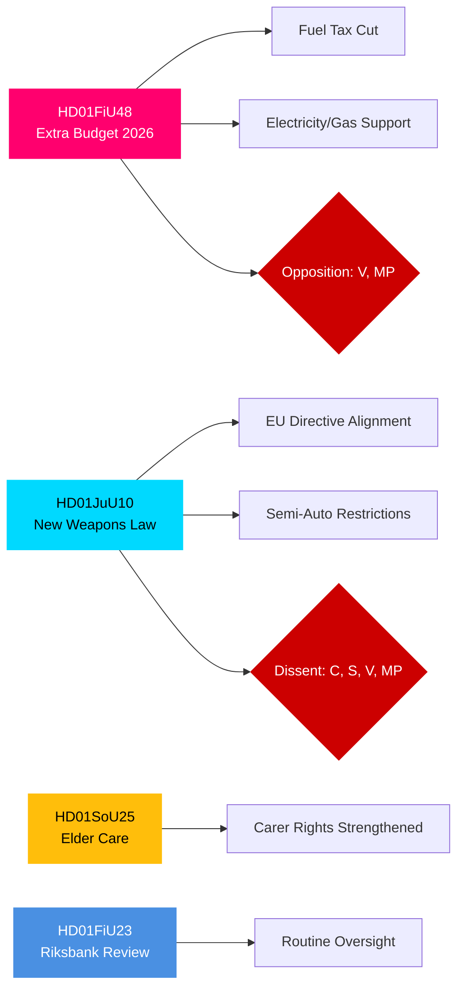

# Note de synthèse exécutive — Rapports des commissions du Riksdag suédois, 27 avril 2026

**Auteur**: James Pether Sörling | **Classification**: PUBLIC | **Degré de confiance**: HIGH | **Date**: 2026-04-27

## 🎯 BLUF

Les rapports des commissions du Riksdag datés du 24 avril 2026 présentent trois fronts législatifs d'une importance immédiate sur les plans budgétaire, pénal et social. La commission des finances (FiU) recommande l'adoption du budget supplémentaire du gouvernement réduisant la taxe sur les carburants et introduisant un soutien aux prix de l'électricité et du gaz — une mesure budgétairement expansive soutenue par la coalition Tidö (M, SD, KD, L) mais opposée par V et MP. La commission de la justice (JuU) fait avancer la réforme la plus complète de la législation sur les armes à feu depuis des décennies, mettant en œuvre l'alignement sur la directive européenne et resserrant les conditions d'obtention des licences — le Parti du Centre s'opposant aux armes de chasse semi-automatiques. La commission des affaires sociales (SoU) approuve des dispositions renforcées en matière de soins aux personnes âgées, élargissant les droits de reconnaissance des aidants. Ces décisions signalent ensemble l'activation d'une politique sur le coût de la vie, un resserrement de la sécurité et le maintien du contrat social à l'approche des élections de 2026.

## 🔑 Décisions que cette note soutient

1. **Évaluation du risque budgétaire**: Les mesures d'allègement énergétique du budget supplémentaire doivent-elles être considérées comme durables ou comme un stimulus électoral créant un risque de consolidation à moyen terme?
2. **Suivi de l'état de droit**: La nouvelle loi sur les armes représente-t-elle un vrai gain sécuritaire ou un compromis qui laisse des lacunes?
3. **Suivi du contrat social**: Les dispositions sur les soins aux personnes âgées vont-elles déplacer le soutien à la coalition Tidö parmi des segments démographiques clés avant septembre 2026?

## ⚡ Lecture des renseignements en 60 secondes

- **HD01FiU48** [B2]: Budget supplémentaire — réduction de la taxe sur les carburants + soutien aux prix de l'électricité/du gaz. V et MP ont déposé des réserves dissidentes. Impulsion budgétaire estimée: effet positif sur les revenus des ménages compensé par une régression de la politique climatique. La FiU a approuvé la recommandation de la commission.
- **HD01JuU10** [B2]: Nouvelle loi sur les armes remplaçant la législation de 1996. Met en œuvre la Directive UE 2021/555. Réserves de C (interdiction des armes de chasse semi-automatiques), S/V/MP (règles transitoires, permis de 5 ans, supervision). La majorité de la JuU a approuvé.
- **HD01SoU25** [B2]: Renforcement des dispositions relatives aux soins aux personnes âgées et au soutien aux aidants. Large soutien multipartite avec des réserves mineures.
- **HD01FiU23** [B3]: Examen du fonctionnement de la Riksbank 2025 — surveillance de routine, la FiU a globalement approuvé.

## 🔭 Principal déclencheur prospectif

**À surveiller**: Vote de la Chambre sur HD01FiU48 (attendu dans les 10 jours). Si les propositions de V ou MP obtiennent un soutien inattendu au sein de Tidö, cela signale une instabilité de la coalition à l'approche des élections de septembre 2026.

## Distribution de confiance

| Domaine | Degré de confiance | Base |
|---------|--------------------|------|
| Mesures budgétaires | HIGH | Structure de FiU48 confirmée; réserves documentées |
| Droit sur les armes | HIGH | Structure de JuU10 + partis de réserve confirmés |
| Soins aux personnes âgées | MEDIUM | Métadonnées SoU25 uniquement; pas de texte intégral récupéré |
| Supervision de la Riksbank | MEDIUM | Métadonnées FiU23 uniquement |

## Mermaid: Principaux groupes législatifs

<!-- source-sha: aaa1f5305a47d8833d5b335e4d7ccd94784487c6 -->
