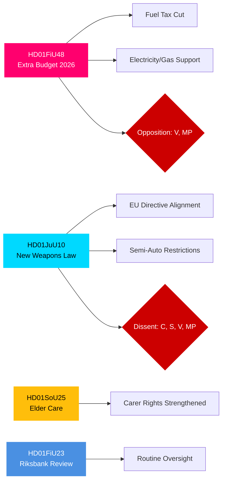

<!-- dir: rtl -->
# תקציר מנהלים — דוחות ועדות הריקסדאג השוודי, 27 באפריל 2026

**מחבר**: James Pether Sörling | **סיווג**: PUBLIC | **רמת ביטחון**: HIGH | **תאריך**: 2026-04-27

## 🎯 BLUF

דוחות ועדות הריקסדאג מתאריך 24 באפריל 2026 מציגים שלושה חזיתות חקיקתיות בעלות חשיבות מיידית פיסקלית, פלילית וחברתית. ועדת הכספים (FiU) ממליצה לאשר את תקציב ההשלמה הממשלתי המפחית את מס הדלק ומציג תמיכה במחירי חשמל וגז — צעד פיסקלי מרחיב הנתמך על ידי קואליציית טידו (M, SD, KD, L) אך מתנגדים לו V ו-MP. ועדת המשפטים (JuU) מקדמת את הרפורמה המקיפה ביותר בחקיקת כלי הנשק בעשורים, מיישמת יישור עם ה-EU ומחמירה דרישות רישוי — עם מפלגת המרכז כמתנגדת לנשק ציד חצי-אוטומטי. ועדת ענייני הרווחה (SoU) מאשרת הוראות טיפול בקשישים מחוזקות עם הרחבת זכויות הכרה במטפלים. ביחד, החלטות אלה מסמנות הפעלה של מדיניות יוקר מחיה, חיזוק ביטחון ושמירה על החוזה החברתי לקראת בחירות 2026.

## �� החלטות שתקציר זה תומך בהן

1. **הערכת סיכון פיסקלי**: האם יש לראות בצעדי הקלת האנרגיה בתקציב ההשלמה כבר-קיימא או כגירוי שנת בחירות היוצר סיכון איחוד בטווח הבינוני?
2. **מעקב שלטון החוק**: האם חוק הנשק החדש מייצג רווח ביטחוני אמיתי או פשרה שמשאירה פרצות?
3. **מעקב חוזה חברתי**: האם הוראות הטיפול בקשישים ישנו את התמיכה בקואליציית טידו בקרב מגזרים דמוגרפיים מרכזיים לפני ספטמבר 2026?

## ⚡ קריאת מודיעין של 60 שניות

- **HD01FiU48** [B2]: תקציב השלמה — הפחתת מס דלק + תמיכה במחירי חשמל/גז. V ו-MP הגישו הסתייגויות מתנגדות. דחף פיסקלי מוערך: השפעה חיובית על הכנסת משק בית מאוזנת על ידי נסיגה במדיניות האקלים. FiU אישרה את המלצת הוועדה.
- **HD01JuU10** [B2]: חוק נשק חדש המחליף את חקיקת 1996. מיישם את הנחיית האיחוד האירופי 2021/555. הסתייגויות מ-C (איסור נשק ציד חצי-אוטומטי), S/V/MP (כללי מעבר, אישורים ל-5 שנים, פיקוח). רוב JuU אישר.
- **HD01SoU25** [B2]: הוראות טיפול בקשישים ותמיכה במטפלים מחוזקות. תמיכה רחבה חוצת-מפלגות עם הסתייגויות קלות.
- **HD01FiU23** [B3]: סקירת פעילות ה-Riksbank לשנת 2025 — פיקוח שגרתי, FiU אישרה באופן כללי.

## 🔭 הטריגר העתידי המוביל

**למעקב**: הצבעת בית הנבחרים על HD01FiU48 (צפויה תוך 10 ימים). אם הצעות V או MP יזכו בתמיכה בלתי צפויה בתוך טידו, הדבר מסמן חוסר יציבות קואליציוני לפני בחירות ספטמבר 2026.

## התפלגות רמת ביטחון

| תחום | רמת ביטחון | בסיס |
|------|-----------|-----|
| צעדים פיסקליים | HIGH | מבנה FiU48 אושר; הסתייגויות מתועדות |
| חוק נשק | HIGH | מבנה JuU10 + מפלגות הסתייגות אושרו |
| טיפול בקשישים | MEDIUM | מטא-נתוני SoU25 בלבד; לא אוחזר טקסט מלא |
| פיקוח Riksbank | MEDIUM | מטא-נתוני FiU23 בלבד |

## Mermaid: אשכולות חקיקה מרכזיים

<!-- source-sha: aaa1f5305a47d8833d5b335e4d7ccd94784487c6 -->
