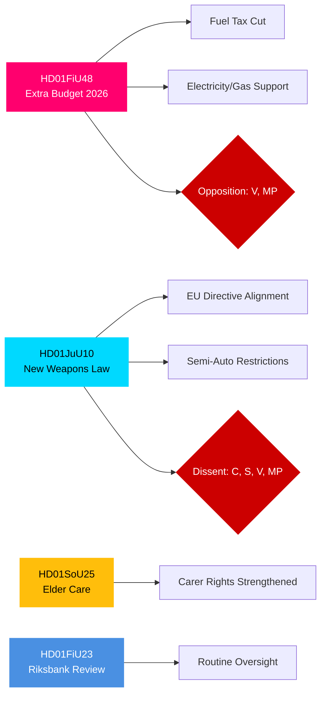

# エグゼクティブ・ブリーフ — スウェーデン議会（Riksdag）委員会報告、2026年4月27日

**著者**: James Pether Sörling | **分類**: PUBLIC | **信頼度**: HIGH | **日付**: 2026-04-27

## 🎯 BLUF

2026年4月24日付のRiksdagen委員会報告は、財政・刑事司法・社会分野において即時の重要性を持つ三つの立法課題を提示しています。財務委員会（FiU）は、燃料税の引き下げと電気・ガス価格支援を盛り込んだ政府の補正予算の承認を勧告しており、これはTidö連立（M, SD, KD, L）が支持する財政拡張的措置ですが、VとMPが反対しています。司法委員会（JuU）はEUディレクティブに沿った数十年ぶりの包括的な銃器法改革を推進し、許可要件を厳格化しています。半自動猟銃については中央党が反対しています。社会委員会（SoU）は、介護者認定権の拡大を含む高齢者介護規定の強化を承認しています。これらの決定は総じて、生活費政策の発動、安全保障の強化、2026年選挙に向けた社会契約の維持を示しています。

## 🔑 このブリーフが支援する意思決定

1. **財政リスク評価**: 補正予算のエネルギー軽減措置は持続可能な政策として評価すべきか、それとも中期的な財政健全化リスクをもたらす選挙向け景気刺激策として評価すべきか?
2. **法の支配の追跡**: 新しい銃器法は真の安全保障の向上を表しているか、それとも問題点を残す妥協案か?
3. **社会契約のモニタリング**: 高齢者介護規定は、2026年9月の選挙前に主要な人口層においてTidö連立への支持を変化させるか?

## ⚡ 60秒インテリジェンスまとめ

- **HD01FiU48** [B2]: 補正予算 — 燃料税引き下げ + 電気・ガス価格支援。VとMPが反対意見の留保を提出。推定財政インパルス: 家計所得へのプラス効果は気候政策の後退で相殺。FiUが委員会勧告を承認。
- **HD01JuU10** [B2]: 1996年法に代わる新銃器法。EU指令2021/555を実施。C（半自動猟銃禁止）、S/V/MP（移行規則、5年許可証、監督）からの留保。JuU多数が承認。
- **HD01SoU25** [B2]: 高齢者介護・介護者支援規定の強化。軽微な留保を伴う幅広い超党派支持。
- **HD01FiU23** [B3]: Riksbank運営2025年レビュー — 定期監督、FiUがおおむね承認。

## 🔭 主要な先行トリガー

**注視**: HD01FiU48に関する本議院採決（10日以内に予定）。VまたはMPの提案がTidö内で予想外に支持を得た場合、2026年9月選挙前の連立不安定を示すシグナルとなります。

## 信頼度分布

| 分野 | 信頼度 | 根拠 |
|------|--------|------|
| 財政措置 | HIGH | FiU48の構造確認済み; 留保内容文書化 |
| 銃器法 | HIGH | JuU10の構造 + 留保政党確認済み |
| 高齢者介護 | MEDIUM | SoU25メタデータのみ; 全文未取得 |
| Riksbank監督 | MEDIUM | FiU23メタデータのみ |

## Mermaid: 主要立法クラスター

<!-- source-sha: aaa1f5305a47d8833d5b335e4d7ccd94784487c6 -->
