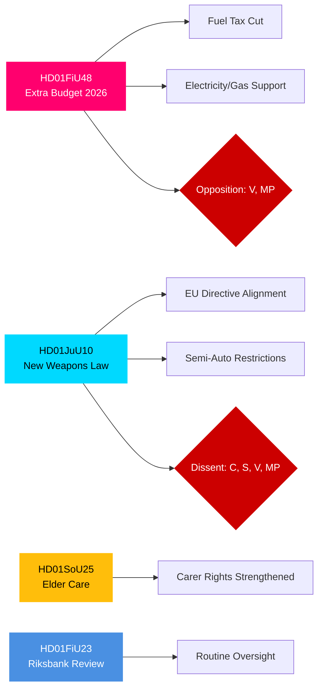

# 행정 브리핑 — 스웨덴 의회(Riksdag) 위원회 보고서, 2026년 4월 27일

**저자**: James Pether Sörling | **분류**: PUBLIC | **신뢰도**: HIGH | **날짜**: 2026-04-27

## 🎯 BLUF

2026년 4월 24일자 Riksdagen 위원회 보고서는 재정·형사사법·사회 분야에서 즉각적인 중요성을 지닌 세 가지 입법 과제를 제시합니다. 재정위원회(FiU)는 연료세 인하 및 전기·가스 가격 지원이 포함된 정부 추경예산 승인을 권고하며, 이는 Tidö 연립(M, SD, KD, L)이 지지하는 재정 확장적 조치이지만 V와 MP가 반대하고 있습니다. 사법위원회(JuU)는 EU 지침에 맞춰 수십 년 만의 포괄적인 총기법 개혁을 추진하며 면허 요건을 강화합니다. 반자동 사냥용 총기에 대해서는 중앙당이 반대했습니다. 사회위원회(SoU)는 간병인 인정권 확대를 포함한 강화된 노인 돌봄 규정을 승인합니다. 이러한 결정들은 종합적으로 생활비 정책 활성화, 안보 강화, 2026년 선거를 앞두고 사회 계약 유지를 신호합니다.

## 🔑 이 브리핑이 지원하는 결정

1. **재정 위험 평가**: 추경예산의 에너지 완화 조치는 지속 가능한 것으로 보아야 하는가, 아니면 중기적 재정 통합 위험을 초래하는 선거용 경기 부양책으로 보아야 하는가?
2. **법치주의 추적**: 새로운 총기법은 진정한 안보 이점을 나타내는가, 아니면 허점을 남기는 타협안인가?
3. **사회 계약 모니터링**: 노인 돌봄 규정은 2026년 9월 선거 전에 핵심 인구 집단에서 Tidö 연립에 대한 지지를 변화시킬 것인가?

## ⚡ 60초 인텔리전스 요약

- **HD01FiU48** [B2]: 추경예산 — 연료세 인하 + 전기/가스 가격 지원. V와 MP가 반대 유보를 제출. 추정 재정 충격: 가계 소득에 긍정적 효과가 기후 정책 후퇴로 상쇄됨. FiU가 위원회 권고를 승인.
- **HD01JuU10** [B2]: 1996년 법을 대체하는 새 총기법. EU 지침 2021/555 이행. C(반자동 사냥용 총기 금지), S/V/MP(전환 규칙, 5년 허가, 감독)로부터 유보. JuU 다수가 승인.
- **HD01SoU25** [B2]: 강화된 노인 돌봄 및 간병인 지원 규정. 경미한 유보를 가진 광범위한 초당파적 지지.
- **HD01FiU23** [B3]: Riksbank 운영 2025년 검토 — 일상적 감독, FiU가 전반적으로 승인.

## 🔭 주요 선행 트리거

**주시**: HD01FiU48에 대한 본회의 표결(10일 이내 예상). V 또는 MP의 제안이 Tidö 내에서 예상치 못한 지지를 받는다면, 2026년 9월 선거 전 연립 불안정을 신호합니다.

## 신뢰도 분포

| 분야 | 신뢰도 | 근거 |
|------|--------|------|
| 재정 조치 | HIGH | FiU48 구조 확인; 유보 내용 문서화 |
| 총기법 | HIGH | JuU10 구조 + 유보 정당 확인 |
| 노인 돌봄 | MEDIUM | SoU25 메타데이터만; 전문 미수집 |
| Riksbank 감독 | MEDIUM | FiU23 메타데이터만 |

## Mermaid: 주요 입법 클러스터

<!-- source-sha: aaa1f5305a47d8833d5b335e4d7ccd94784487c6 -->
