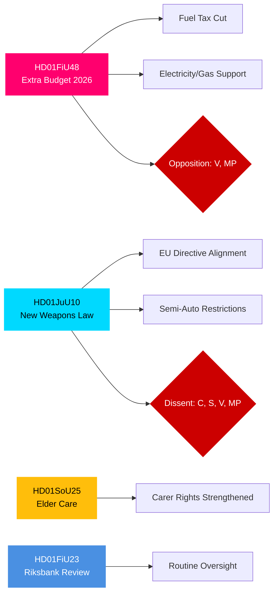

# Uitvoerend overzicht — Commissierapporten van de Zweedse Riksdag, 27 april 2026

**Auteur**: James Pether Sörling | **Classificatie**: PUBLIC | **Betrouwbaarheidsgraad**: HIGH | **Datum**: 2026-04-27

## 🎯 BLUF

De commissierapporten van de Riksdag gedateerd 24 april 2026 presenteren drie wetgevende fronten van onmiddellijk fiscaal, strafrechtelijk en sociaal belang. De Financiële Commissie (FiU) beveelt aan de aanvullende begroting van de regering goed te keuren met verlaging van de brandstofbelasting en ondersteuning van elektriciteits- en gasprijzen — een fiscaal expansieve maatregel gesteund door de Tidö-coalitie (M, SD, KD, L) maar tegengesteld door V en MP. De Justitiecommissie (JuU) bevordert de meest uitgebreide hervorming van de vuurwapenwetgeving in decennia, implementeert EU-richtlijnafstemming en verscherpt licentievereisten — met de Centrumpartij als dissident over semi-automatische jachtgeweren. De Sociale Commissie (SoU) keurt versterkte ouderenzorgbepalingen goed met uitgebreide mantelzorgerkennungsrechten. Samen signaleren deze beslissingen de activering van levenskostenbeleid, aanscherping van de veiligheid en onderhoud van het sociaal contract in aanloop naar de verkiezingen van 2026.

## 🔑 Beslissingen die dit overzicht ondersteunt

1. **Fiscale risicobeoordeling**: Moeten de energiesteunmaatregelen van de aanvullende begroting worden gezien als duurzaam of als electorale stimulus die een consolidatierisico op middellange termijn creëert?
2. **Rechtsstaat-monitoring**: Vertegenwoordigt de nieuwe wapenwet een echte veiligheidswinst of een compromis dat lacunes laat?
3. **Sociaalcontract-monitoring**: Zullen de ouderenzorgbepalingen de steun voor de Tidö-coalitie verschuiven bij belangrijke demografische segmenten vóór september 2026?

## ⚡ 60-seconden inlichtingenoverzicht

- **HD01FiU48** [B2]: Aanvullende begroting — brandstofbelastingverlaging + elektriciteits-/gassteun. V en MP dienden afwijkende bezwaren in. Geschatte fiscale impuls: positief huishoudinkomeneffect gecompenseerd door klimaatbeleidsregressie. FiU keurde de commissieaanbeveling goed.
- **HD01JuU10** [B2]: Nieuwe wapenwet ter vervanging van de wetgeving uit 1996. Implementeert EU-Richtlijn 2021/555. Bezwaren van C (verbod op semi-automatische jachtgeweren), S/V/MP (overgangsregels, 5-jarige vergunningen, toezicht). JuU-meerderheid keurde goed.
- **HD01SoU25** [B2]: Versterkte ouderenzorg- en mantelzorgondersteuningsbepalingen. Brede partijoverschrijdende steun met kleine bezwaren.
- **HD01FiU23** [B3]: Beoordeling van de Riksbank-activiteiten 2025 — routinetoezicht, FiU keurde grotendeels goed.

## 🔭 Belangrijkste vooruitkijkende trigger

**Let op**: Kamerstemming over HD01FiU48 (verwacht binnen 10 dagen). Als V- of MP-voorstellen onverwacht steun krijgen binnen Tidö, signaleert dat coalitie-instabiliteit voor de verkiezingen van september 2026.

## Betrouwbaarheidsverdeling

| Domein | Betrouwbaarheidsgraad | Basis |
|--------|-----------------------|-------|
| Fiscale maatregelen | HIGH | FiU48-structuur bevestigd; bezwaren gedocumenteerd |
| Wapenwet | HIGH | JuU10-structuur + bezwaarspartijen bevestigd |
| Ouderenzorg | MEDIUM | Alleen SoU25-metadata; geen volledige tekst opgehaald |
| Riksbank-toezicht | MEDIUM | Alleen FiU23-metadata |

## Mermaid: Belangrijke wetgevingsclusters

<!-- source-sha: aaa1f5305a47d8833d5b335e4d7ccd94784487c6 -->
