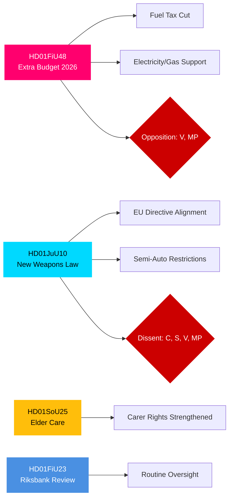

# Eksekutiv oversikt — Det svenske Riksdags utvalgsrapporter, 27. april 2026

**Forfatter**: James Pether Sörling | **Klassifisering**: PUBLIC | **Konfidensgrad**: HIGH | **Dato**: 2026-04-27

## 🎯 BLUF

Riksdagens utvalgsrapporter datert 24. april 2026 presenterer tre lovgivningsfronter av umiddelbar fiskal, strafferettslig og sosial betydning. Finanskomiteen (FiU) anbefaler godkjenning av regjeringens tilleggsbudsjett med redusert drivstoffavgift og støtte til strøm- og gasspriser — et finansekspansivt tiltak støttet av Tidö-koalisjonen (M, SD, KD, L), men motarbeidet av V og MP. Justiskomiteen (JuU) fremmer den mest omfattende reformen av våpenlovgivningen på tiår, implementerer EU-direktiv og strammer inn lisenskravene — med Centerpartiet som dissidenter når det gjelder halvautomatiske jaktvåpen. Sosialutvalget (SoU) godkjenner styrkede eldre­omsorgsbestemmelser med utvidede rettigheter for pårørende­omsorgsgivere. Samlet signaliserer disse beslutningene aktivering av levekostnadspolitikk, skjerpet sikkerhet og vedlikehold av den sosiale kontrakten foran valget i 2026.

## 🔑 Beslutninger denne oversikten støtter

1. **Fiskal risikovurdering**: Bør tilleggsbudsjettets energiavlastingstiltak sees som bærekraftige eller som valgårsstimuli som skaper konsolideringsrisiko på mellomlang sikt?
2. **Rettsstatssporing**: Representerer den nye våpenloven en reell sikkerhetsgevinst eller et kompromiss som etterlater hull?
3. **Velferdskontraktovervåking**: Vil eldre­omsorgsbestemmelsene forskyve støtten til Tidö-koalisjonen blant viktige demografiske segmenter før september 2026?

## ⚡ 60-sekunders etterretningslesing

- **HD01FiU48** [B2]: Tilleggsbudsjett — redusert drivstoffavgift + støtte til strøm- og gasspriser. V og MP inngav avvikende merknader. Estimert fiskal impuls: positiv husholdningsinntektseffekt motveiet av klimapolitisk tilbakegang. FiU godkjente utvalgets anbefaling.
- **HD01JuU10** [B2]: Ny våpenlov som erstatter 1996-lovgivningen. Implementerer EU-direktiv 2021/555. Merknader fra C (halvautomatisk jaktvåpenforbud), S/V/MP (overgangsregler, 5-årstillatelser, tilsyn). JuU-flertallet godkjente.
- **HD01SoU25** [B2]: Styrkede bestemmelser om eldreomsorg og pårørendestøtte. Bred tverrpartilig støtte med mindre merknader.
- **HD01FiU23** [B3]: Gjennomgang av Riksbankens virksomhet 2025 — rutinemessig tilsyn, FiU godkjente i stor grad.

## 🔭 Viktigste fremoverskuende utløser

**Følg med**: Kammervotering om HD01FiU48 (forventet innen 10 dager). Hvis V's eller MP's forslag uventet vinner støtte på tvers av Tidö, signaliserer det koalisjonsinstabilitet foran september 2026-valget.

## Konfidensfordeling

| Domene | Konfidensgrad | Grunnlag |
|--------|---------------|---------|
| Finansielle tiltak | HIGH | FiU48-struktur bekreftet; merknader dokumentert |
| Våpenlovgivning | HIGH | JuU10-struktur + reservasjonspartier bekreftet |
| Eldreomsorg | MEDIUM | Kun SoU25-metadata; ingen fulltext hentet |
| Riksbank-tilsyn | MEDIUM | Kun FiU23-metadata |

## Mermaid: Viktige lovgivningsklynger

<!-- source-sha: aaa1f5305a47d8833d5b335e4d7ccd94784487c6 -->
