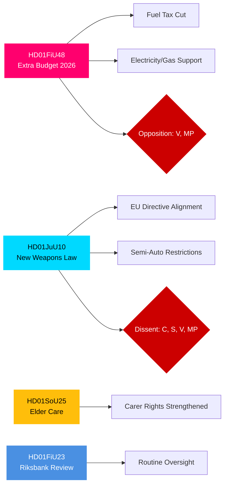

# Exekutiv sammanfattning — Svenska riksdagens utskottsbetänkanden, 27 april 2026

**Författare**: James Pether Sörling | **Klassificering**: PUBLIC | **Konfidensgrad**: HIGH | **Datum**: 2026-04-27

## 🎯 BLUF

Riksdagens utskottsbetänkanden daterade den 24 april 2026 presenterar tre lagstiftningsfronter av omedelbar fiskal, straffrättslig och social betydelse. Finansutskottet (FiU) rekommenderar godkännande av regeringens tilläggsbudget med sänkt drivmedelsskatt och stöd för el- och gaspriserna — en finansexpansiv åtgärd som stöds av Tidökoalitionen (M, SD, KD, L) men som möter motstånd från V och MP. Justitieutskottet (JuU) driver igenom den mest omfattande reformen av vapenlagstiftningen på decennier, i linje med EU-direktiv och med skärpta licenskrav — med Centerpartiet som dissidenter i fråga om halvautomatiska jaktvapen. Socialutskottet (SoU) tillstyrker stärkta äldreomsorgsbestämmelser med utökade rättigheter för anhörigvårdare. Sammantaget signalerar dessa beslut aktivering av levnadskostnadspolitik, skärpt säkerhet och underhåll av det sociala kontraktet inför valet 2026.

## 🔑 Beslut som sammanfattningen stöder

1. **Fiskal riskbedömning**: Bör tilläggsbudgetens energiavlastningsåtgärder ses som hållbara eller som en valårsimpuls som skapar konsolideringsrisk på medellång sikt?
2. **Rättsstatsspårning**: Innebär den nya vapenlagen en verklig säkerhetsvinst eller är det ett kompromissresultat som lämnar luckor?
3. **Välfärdsmonitoring**: Kommer äldreomsorgsbestämmelserna att förskjuta stödet för Tidökoalitionen bland viktiga demografiska segment inför september 2026?

## ⚡ 60-sekunders underrättelseläsning

- **HD01FiU48** [B2]: Tilläggsbudget — sänkt drivmedelsskatt + stöd för el- och gaspriser. V och MP lämnade avvikande reservationer. Uppskattad fiskal impuls: positiv effekt på hushållsinkomst motvägs av klimatpolitisk tillbakagång. FiU godkände utskottets rekommendation.
- **HD01JuU10** [B2]: Ny vapenlag som ersätter 1996 års lagstiftning. Implementerar EU-direktiv 2021/555. Reservationer från C (förbud mot halvautomatiska jaktvapen), S/V/MP (övergångsregler, 5-årstillstånd, tillsyn). JuU-majoriteten godkände.
- **HD01SoU25** [B2]: Stärkta bestämmelser om äldreomsorg och anhörigstöd. Brett partistöd med mindre reservationer.
- **HD01FiU23** [B3]: Granskning av Riksbankens verksamhet 2025 — rutinmässig tillsyn, FiU tillstyrkte i stort.

## 🔭 Viktigaste framåtriktat trigger

**Bevaka**: Kammarvotering om HD01FiU48 (förväntas inom 10 dagar). Om V:s eller MP:s förslag mot förmodan vinner stöd inom Tidökoalitionen signalerar det koalitionsinstabilitet inför valet i september 2026.

## Konfidensfördelning

| Domän | Konfidensgrad | Underlag |
|-------|---------------|---------|
| Finansiella åtgärder | HIGH | FiU48:s struktur bekräftad; reservationer dokumenterade |
| Vapenlagstiftning | HIGH | JuU10:s struktur + reservationspartier bekräftade |
| Äldreomsorg | MEDIUM | Enbart SoU25-metadata; inget fulltext hämtat |
| Riksbankstillsyn | MEDIUM | Enbart FiU23-metadata |

## Mermaid: Viktiga lagstiftningskluster

<!-- source-sha: aaa1f5305a47d8833d5b335e4d7ccd94784487c6 -->
