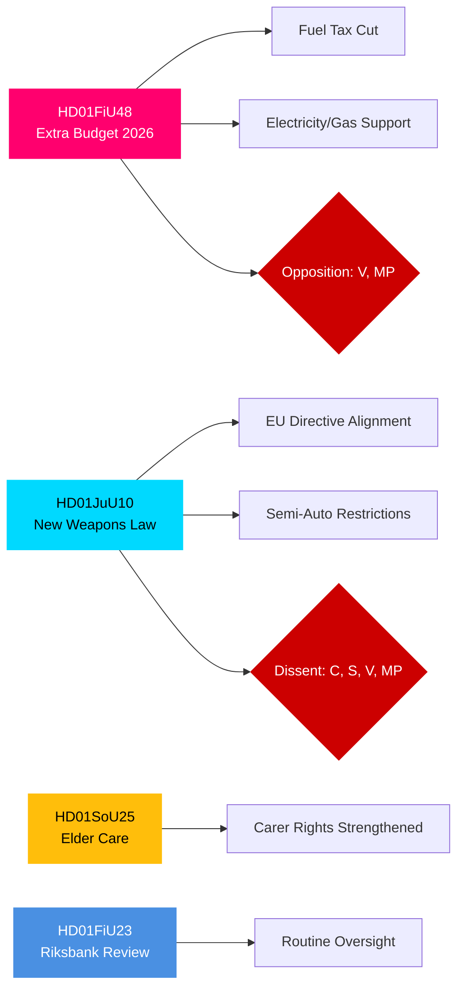

# 执行摘要 — 瑞典议会（Riksdag）委员会报告，2026年4月27日

**作者**：James Pether Sörling | **分类**：PUBLIC | **可信度**：HIGH | **日期**：2026-04-27

## 🎯 BLUF

日期为2026年4月24日的Riksdagen委员会报告呈现了三个具有直接财政、刑事司法和社会重要性的立法战线。财政委员会（FiU）建议批准政府的补充预算，该预算削减燃油税并对电力和天然气价格提供支持——这是一项得到Tidö联合政府（M, SD, KD, L）支持但受到V和MP反对的财政扩张性措施。司法委员会（JuU）推进数十年来最全面的枪支立法改革，实施欧盟指令协调并严格许可要求——中央党就半自动猎枪问题持异议。社会事务委员会（SoU）批准加强老年护理规定，扩大护理人员认可权利。这些决定综合来看标志着生活成本政策激活、安全收紧以及迈向2026年选举的社会契约维护。

## 🔑 本摘要支持的决策

1. **财政风险评估**：补充预算的能源减负措施应被视为可持续的，还是会带来中期整合风险的选举年刺激措施？
2. **法治追踪**：新枪支法是否代表真正的安全收益，还是留有漏洞的妥协方案？
3. **社会契约监测**：老年护理规定是否会在2026年9月选举前改变关键人口群体中Tidö联合政府的支持？

## ⚡ 60秒情报摘要

- **HD01FiU48** [B2]：补充预算——燃油税削减+电力/天然气价格支持。V和MP提交了异议性保留意见。预计财政冲击：家庭收入正效应被气候政策倒退抵消。FiU批准了委员会建议。
- **HD01JuU10** [B2]：取代1996年立法的新枪支法。实施欧盟指令2021/555。来自C（半自动猎枪禁止）、S/V/MP（过渡规则、5年许可证、监督）的保留意见。JuU多数批准。
- **HD01SoU25** [B2]：加强老年护理和护理人员支持规定。以轻微保留意见获得广泛跨党派支持。
- **HD01FiU23** [B3]：Riksbank运营2025年回顾——例行监督，FiU总体批准。

## 🔭 首要前瞻触发因素

**关注**：HD01FiU48议院表决（预计10天内）。若V或MP的提案出乎意料地获得Tidö内部支持，则预示着2026年9月选举前联合政府的不稳定性。

## 可信度分布

| 领域 | 可信度 | 依据 |
|------|--------|------|
| 财政措施 | HIGH | FiU48结构已确认；保留意见已记录 |
| 枪支法 | HIGH | JuU10结构+保留政党已确认 |
| 老年护理 | MEDIUM | 仅SoU25元数据；未获取全文 |
| Riksbank监督 | MEDIUM | 仅FiU23元数据 |

## Mermaid：主要立法集群

<!-- source-sha: aaa1f5305a47d8833d5b335e4d7ccd94784487c6 -->
