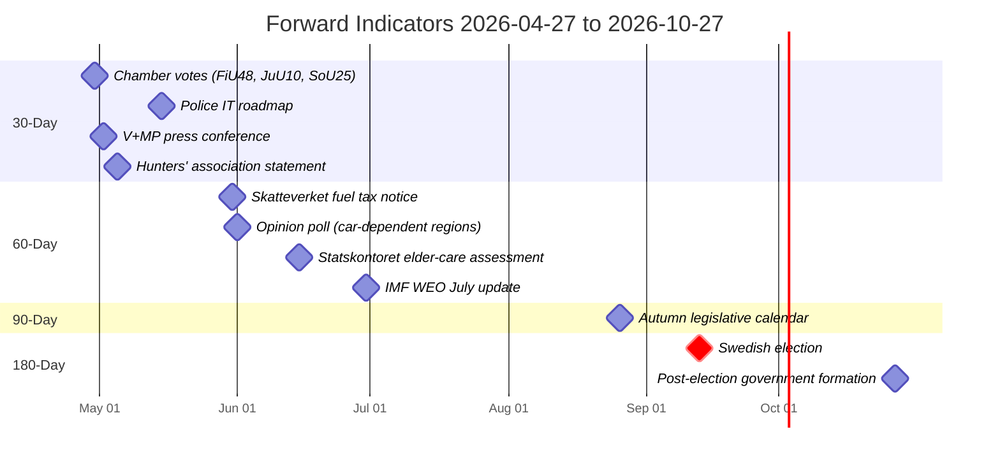

# Forward Indicators — Committee Reports 2026-04-27

**Author**: James Pether Sörling | **Date**: 2026-04-27

## 30-Day Horizon (2026-04-27 – 2026-05-27)

| # | Indicator | Expected date | Signal direction |
|---|-----------|-------------|----------------|
| 1 | Riksdagen chamber vote on HD01FiU48 (extra budget) | 2026-04-30 (or week 18) | Tidö coalition majority expected; V+MP oppose |
| 2 | Riksdagen chamber vote on HD01JuU10 (weapons law) | 2026-04-30 (or week 18) | Passage expected; hunting-community reaction to monitoring |
| 3 | Riksdagen chamber vote on HD01SoU25 (elder care) | 2026-04-30 (or week 18) | Broad support expected |
| 4 | Polismyndigheten press release on weapons registry IT roadmap | 2026-05-15 (est.) | Will reveal implementation capacity gap or readiness |
| 5 | V+MP press conference responding to FiU48 passage | 2026-05-02 (est.) | Climate campaigning escalation indicator |
| 6 | Jägarnas Riksförbund statement on JuU10 semi-auto restrictions | 2026-05-05 (est.) | Rural-identity political mobilisation indicator |

## 60-Day Horizon (2026-05-27 – 2026-06-27)

| # | Indicator | Expected date | Signal direction |
|---|-----------|-------------|----------------|
| 7 | Skatteverket implementation notice for fuel tax reduction | 2026-05-31 (est.) | Signal of rapid vs. delayed implementation |
| 8 | SVT/Sifo opinion poll post-FiU48 vote (Tidö popularity in car-dependent regions) | 2026-06-01 (est.) | Polling uplift or null result in rural/northern Sweden |
| 9 | Statskontoret interim assessment of elder-care reform (SoU25) | 2026-06-15 (est.) | Implementation readiness/capacity indicator |
| 10 | IMF WEO July 2026 update: Sweden GDP growth revised (FiU48 household spending effect) | 2026-06-30 (est.) | Confirms or denies fiscal multiplier assumption |

## 90-Day Horizon (2026-06-27 – 2026-07-27)

| # | Indicator | Expected date | Signal direction |
|---|-----------|-------------|----------------|
| 11 | Riksdagen summer recess ends; autumn legislative calendar published | 2026-08-26 | Indicates follow-on JuU legislation on weapons registry implementation |
| 12 | Election campaign formally begins (Riksdagen dissolution August/September) | 2026-08-01–09-01 (est.) | FiU48 cited in campaign? Elder care (SoU25) as campaign issue? |

## 180-Day Horizon (2026-07-27 – 2026-10-27)

| # | Indicator | Expected date | Signal direction |
|---|-----------|-------------|----------------|
| 13 | Swedish election result (September 2026) | 2026-09-13 (election day) | Tidö coalition re-elected or replaced |
| 14 | Post-election government formation: will JuU10/SoU25/FiU48 be continued or revised? | 2026-10-27 (est.) | Policy continuity or reversal depending on outcome |

## Mermaid: Timeline of Forward Indicators

