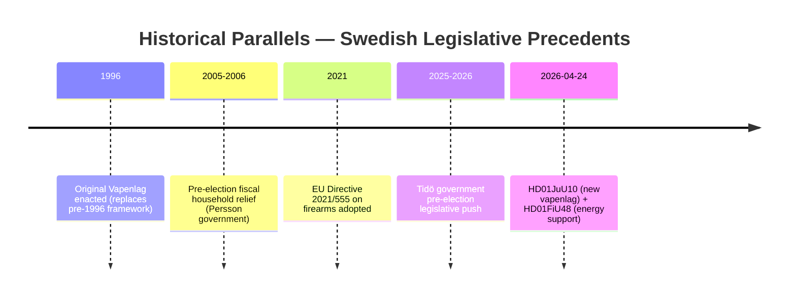

# Historical Parallels — Committee Reports 2026-04-27

**Author**: James Pether Sörling | **Date**: 2026-04-27

## Primary Parallel: 2005 Energy Support + 1996 Weapons Law

### Parallel 1: Pre-election Fiscal Stimulus (2005–2006)

**Precedent**: In 2005–2006, the Persson government (S) introduced housing allowance extensions and energy-support measures for households before the 2006 election. The measures were fiscally modest but politically visible. The 2006 election was won by Alliansen (M+KD+L+C), suggesting household-relief measures do not guarantee electoral success.

**Similarity score**: 7/10 — same pattern of pre-election fiscal household relief; same electoral calendar dynamic; different governing parties

**Lesson**: Pre-election fiscal measures can be partially effective as electoral signals but are insufficient if broader coalition narrative is unconvincing.

### Parallel 2: 1996 Firearms Legislation and Current JuU10

**Precedent**: Sweden's 1996 Vapenlag consolidated firearms regulation following the EU accession. It also faced rural hunting community resistance and required several years of implementation adjustment. C and Bondepraktikanter (predecessor rural groups) raised similar concerns about semi-automatic weapon restrictions.

**Similarity score**: 9/10 — direct parallel; JuU10 explicitly replaces 1996 legislation; same semi-auto hunting issue recurs after 30 years

**Lesson**: Hunting community resistance to semi-auto restrictions is a structurally persistent issue. C's current reservation follows the same rural-identity political logic as the 1990s resistance. Implementation delays occurred in 1996 reform and are likely again.

### Parallel 3: Riksbank Accountability Review (Recurring Pattern)

**Precedent**: Annual Riksbank accountability reviews (FiU23 pattern) have been a constitutional fixture since the 1999 Riksbank Act. Each year's review is a routine democratic accountability exercise; no major governance failures have been found since 1999.

**Similarity score**: 10/10 — exact recurring institutional pattern

**Lesson**: FiU23 follows established template; no significant deviation expected.

## No Novel Historical Precedent

**Finding**: No unique precedent within 40 years exists for the specific combination of fuel-tax reduction + weapons-law reform + elder-care legislation passing in the same weekly legislative period in an election year. The individual components all have parallels; their simultaneous occurrence is a reflection of the Tidö coalition's broad pre-election legislative agenda push.

## Mermaid: Historical Timeline

