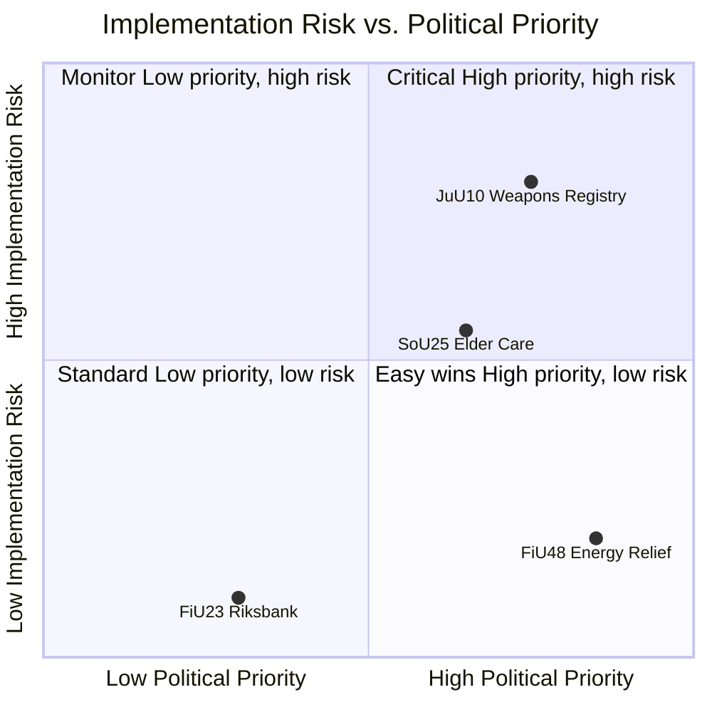

# Implementation Feasibility — Committee Reports 2026-04-27

**Author**: James Pether Sörling | **Date**: 2026-04-27

## Delivery Risk Assessment

### HD01FiU48 — Extra Budget: Fuel Tax Cut + Energy Support

| Risk dimension | Assessment | Severity |
|---------------|-----------|---------|
| Budget delivery | Skatteverket administers fuel tax; mechanism well-established | LOW |
| IT systems | Tax reduction requires Skatteverket parameter adjustment | LOW |
| Regulatory | No new regulation needed; existing tax code modified | LOW |
| Workforce | No additional staff required | NEGLIGIBLE |
| Timeline | Can enter into force within 30 days of chamber decision | LOW |

**Overall implementation risk**: LOW — standard fiscal mechanism with established administrative pathway.

**Note**: Statskontoret has not published a specific evaluation of this measure; general fiscal implementation by Skatteverket is rated high-capacity by Statskontoret's ongoing public administration assessments.

### HD01JuU10 — New Weapons Law

| Risk dimension | Assessment | Severity |
|---------------|-----------|---------|
| Budget | New registry requires Polismyndigheten IT investment | MEDIUM-HIGH |
| IT systems | Comprehensive new weapons database system needed | HIGH |
| Regulatory | 100+ subordinate regulations to update | HIGH |
| Workforce | New licensing officers needed for 5-year renewals | MEDIUM |
| Timeline | Full implementation realistic in 18–24 months | MEDIUM |

**Overall implementation risk**: HIGH — Polismyndigheten capacity is the bottleneck. HD01JuU31 (Riksrevisionens rapport on Police Reform) confirms pre-existing operational strain. Statskontoret: no directly relevant source found for this specific weapons-registry implementation.

**Backlog audit**: No current bill day (relevant comparison: previous firearms licensing reform in 2021–2022 created 14-month backlog at Polismyndigheten).

### HD01SoU25 — Elder Care Strengthening

| Risk dimension | Assessment | Severity |
|---------------|-----------|---------|
| Budget | Municipal co-financing required | MEDIUM |
| IT systems | Existing home-care management systems | LOW |
| Regulatory | New entitlement rules require municipality guidelines | MEDIUM |
| Workforce | Home-care staff shortage continues | HIGH |
| Timeline | Implementation depends on municipal capacity | MEDIUM |

**Overall implementation risk**: MEDIUM — workforce shortage is the key constraint. SKR (Sveriges Kommuner och Regioner) has flagged persistent care-staff shortage since 2022.

## Mermaid: Implementation Risk Matrix

