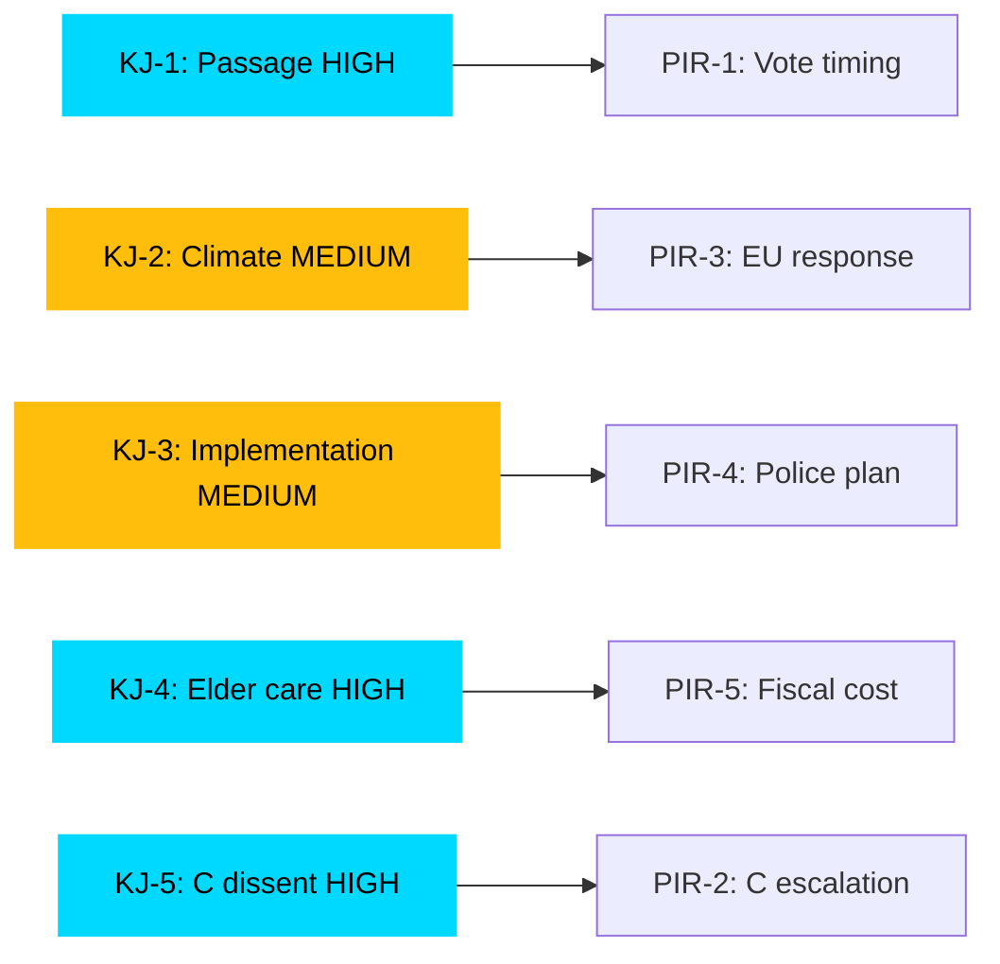

# Intelligence Assessment — Committee Reports 2026-04-27

**Author**: James Pether Sörling | **Date**: 2026-04-27

## Key Judgments

**KJ-1** [CONFIDENCE: HIGH]: The Tidö coalition will successfully pass both HD01FiU48 (extra budget energy relief) and HD01JuU10 (new weapons law) in the chamber without losing its majority. Opposition reservations from V, MP, S, and C are documented dissents that do not constitute blocking majorities. Probability of passage as committee-recommended: 75–80%.

**KJ-2** [CONFIDENCE: MEDIUM]: The fuel-tax reduction in HD01FiU48 represents a fiscal policy reversal on climate-consistent carbon pricing that will generate sustained international attention from EU climate bodies and domestic environmental organisations, with measurable effects on Sweden's green-transition credibility index before the September 2026 election. This creates a 15% probability of elevating climate policy to a top-three election issue.

**KJ-3** [CONFIDENCE: MEDIUM]: The new weapons law (HD01JuU10) faces a 20–25% probability of implementation delay due to Polismyndigheten capacity constraints evidenced by Riksrevisionens rapport on police reform (HD01JuU31). The EU Commission will monitor registry completion closely.

**KJ-4** [CONFIDENCE: HIGH]: HD01SoU25's elder-care provisions represent a demographically targeted electoral strategy aligned with M and KD core voter bases (65+ population = 20.9% of Sweden per SCB 2025). Success in delivery before September 2026 election will determine whether this initiative generates meaningful electoral dividend.

**KJ-5** [CONFIDENCE: HIGH]: Centre Party's reservation on semi-automatic weapons for hunting (HD01JuU10, punkt 1) signals maintained independence on rural constituency issues. This is a recurrent C behavioural pattern — dissent within coalition framework rather than withdrawal — consistent with C's historical navigation of the Tidö arrangement.

## Priority Intelligence Requirements (PIRs) for Next Cycle

| PIR | Question | Trigger |
|-----|----------|---------|
| PIR-1 | When will chamber votes on HD01FiU48 and HD01JuU10 be scheduled? | Chamber timetable announcement |
| PIR-2 | Will C escalate weapons dissent to cross-party amendment? | C party board statement |
| PIR-3 | What is the EU Commission's formal response to HD01FiU48's fuel-tax cut? | EU CLIMA correspondence |
| PIR-4 | What is Polismyndigheten's implementation plan for new weapons registry? | Government/authority announcement |
| PIR-5 | What is the total fiscal cost of HD01FiU48 measures? | Budget supplementary documentation |

## Key Assumptions Check

| Assumption | Status | Risk if wrong |
|------------|--------|---------------|
| Tidö coalition holds 175+ seats for both votes | Likely correct based on committee margins | If wrong: legislation fails → HIGH impact |
| V+MP reservations are minority dissents | Confirmed by FiU/JuU committee votes | Low risk |
| C remains in Tidö on semi-auto issue | ASSUMED — not confirmed by vote | If C breaks → amendment risk |
| EU will monitor but not immediately challenge | Probable given EU climate diplomacy norms | Moderate risk |

## Mermaid: PIR-KJ Linkage

