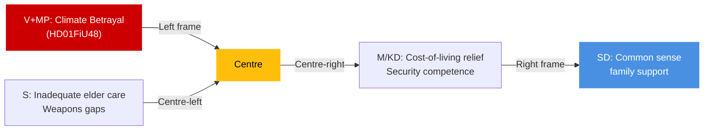

# Media Framing Analysis — Committee Reports 2026-04-27

**Author**: James Pether Sörling | **Date**: 2026-04-27

## Per-Party Framing

### Tidö Coalition (M, SD, KD, L)

**Expected frame for HD01FiU48**: "Responsible relief for Swedish families — we lower the cost of living while investing in Sweden's future." Fuel tax as "fairness" measure for those dependent on cars and home heating.

**Expected frame for HD01JuU10**: "Sweden gets modern weapons legislation that protects citizens while respecting legitimate use." Security competence narrative.

**Expected frame for HD01SoU25**: "We stand by Sweden's elderly. This government delivers on its commitment to dignified aging."

### Socialdemokraterna (S)

**Frame**: Challenge Tidö on HD01FiU48 climate regression — "Sweden cannot abandon its climate commitments for short-term electoral gain." Counter-narrative on weapons law: "The transition rules are too permissive — we wanted stronger protection." Will use HD01SoU25 as minimum position — "We support elder care but question the funding."

### Vänsterpartiet (V) + Miljöpartiet (MP)

**Frame**: HD01FiU48 is "a gift to oil companies dressed up as household relief." Climate emergency framing. Will campaign on reservation. MP specifically: "Sweden's green credibility is being sold for votes."

### Centerpartiet (C)

**Frame on JuU10**: "We protect Swedish hunters and the rural way of life. The semi-automatic weapons ban is disproportionate." Rural identity politics as election tool.

## Press Quadrant

| Outlet | Expected lean | Key message |
|--------|-------------|------------|
| Aftonbladet | Centre-left | HD01FiU48 climate critique; HD01SoU25 underfunding concern |
| Expressen | Centre-right | HD01JuU10 security gain; HD01FiU48 household relief |
| Dagens Nyheter | Liberal centre | Balanced; Riksbank HD01FiU23 monetary policy interest |
| Svenska Dagbladet | Centre-right | Coalition competence; weapons law as EU compliance success |
| SVT/SR | Public broadcaster | Balanced; hunting community reaction to JuU10 |

## Platform Framing

**Social media**: Climate activists on X/Instagram will amplify V+MP reservation on HD01FiU48; hunters' associations on Facebook will mobilise around C's JuU10 reservation.

**Manipulation risk**: Low for these legislative reports — they are published official documents. Risk of selective quotation from reservations to misrepresent majority committee position.

## Longitudinal Frame Record

**Entry 2026-04-27**: Energy/climate policy framing divergence confirmed. Security framing (weapons law) positive for Tidö. Social contract framing (elder care) broadly neutral.

## Mermaid: Media Frame Spectrum

