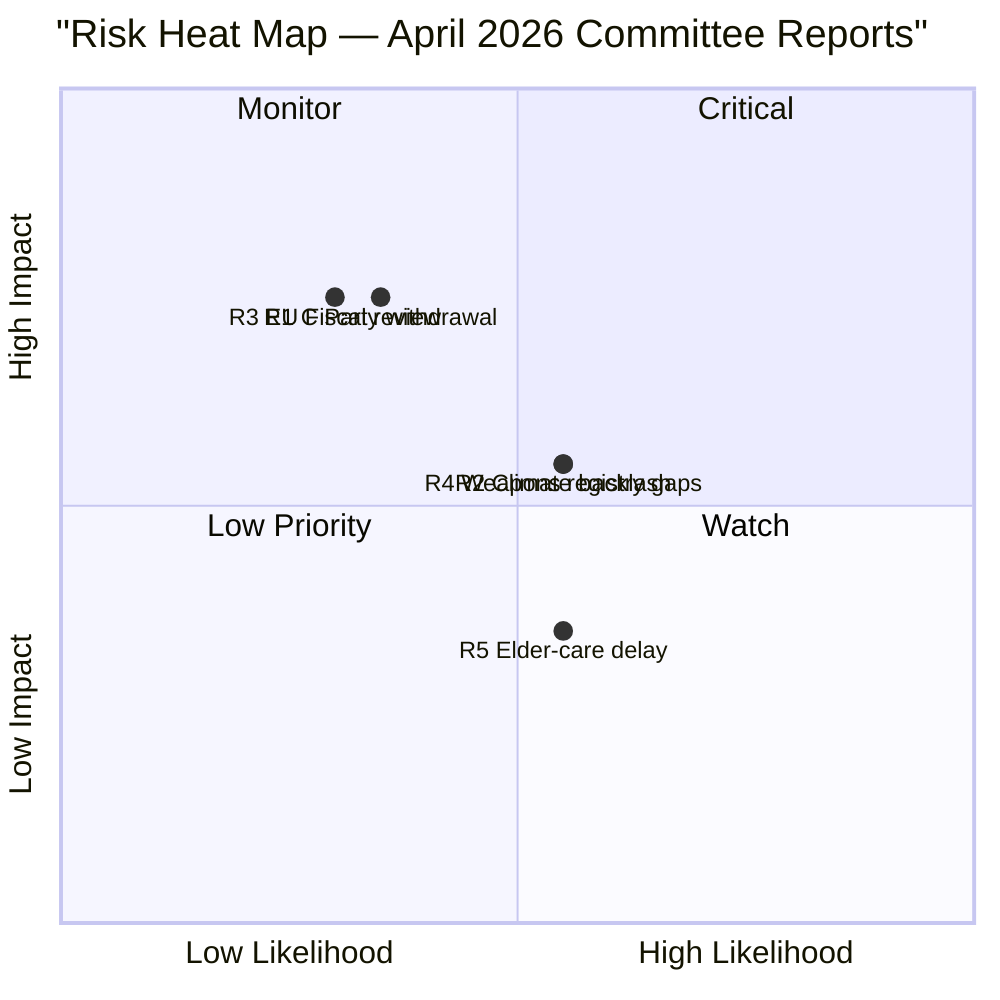

# Risk Assessment — Committee Reports 2026-04-27

**Author**: James Pether Sörling | **Date**: 2026-04-27

## Risk Register (5-Dimension)

| # | Risk | Category | Likelihood (1–5) | Impact (1–5) | L×I Score | Admiralty |
|---|------|----------|-----------------|-------------|-----------|-----------|
| R1 | Centre Party withdraws coalition support over weapons law | Political | 2 | 4 | 8 | B2 |
| R2 | Climate policy backlash damages Sweden's green reputation internationally | Reputational | 3 | 3 | 9 | B2 |
| R3 | Extra budget triggers EU Fiscal Framework review | Fiscal | 2 | 4 | 8 | B1 |
| R4 | Weapons law implementation failures (registry gaps) | Operational | 3 | 3 | 9 | B2 |
| R5 | Elder-care implementation delay at municipality level | Administrative | 3 | 2 | 6 | C2 |

## Cascading Risk Chains

**Chain 1: Political Fracture**
- C reservation on HD01JuU10 → Rural constituency pressure on C leadership → C demands renegotiation of Tidö agenda items → Coalition instability before September 2026 election
- Posterior probability: 12% (conditional on C losing 2+ points in polls, P=0.25)

**Chain 2: Fiscal Credibility**
- Extra budget (HD01FiU48) + main budget → Two-year structural deficit slightly above -1% GDP → IMF Article IV consultation flags → Market repricing of Swedish sovereign risk premium
- Posterior probability: 8% (conditional on continued energy price volatility, P=0.35)

**Chain 3: Implementation Failure (Weapons)**
- HD01JuU10 enacted → Police authority (Polismyndigheten) capacity strained → New registry not fully operational within 18 months → EU Commission raises infringement query
- Posterior probability: 22% (Riksrevisionen HD01JuU31 confirms pre-existing Polismyndigheten capacity challenges)

## Risk Heat Map

