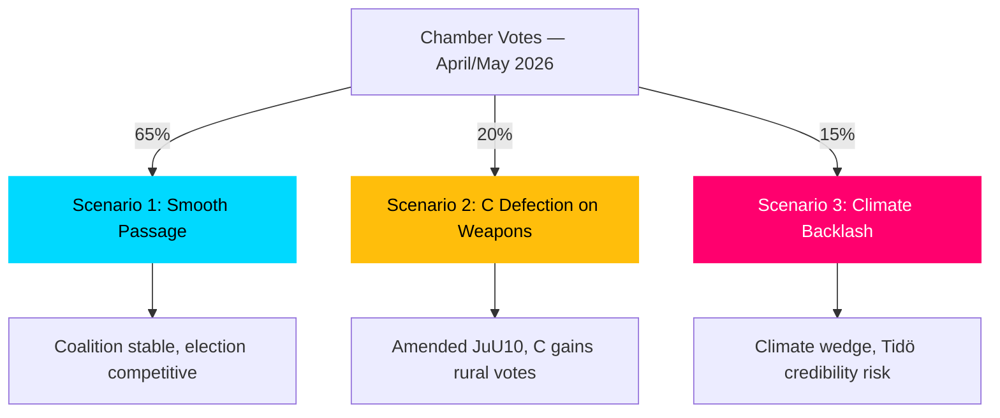

# Scenario Analysis — Committee Reports 2026-04-27

**Author**: James Pether Sörling | **Date**: 2026-04-27

## Scenario Framework

Three distinct scenarios based on passage/failure of HD01FiU48 and HD01JuU10, and the coalition dynamics around them.

## Scenario 1: Smooth Passage — Coalition Holds (Probability: 65%)

**Description**: Both HD01FiU48 and HD01JuU10 pass chamber vote as committee-recommended. V+MP and C reservations remain isolated minority dissents. Coalition maintains discipline through summer. Energy-relief measures take effect in Q3 2026, providing household income support ahead of September election.

**Leading indicator**: Chamber scheduling of HD01FiU48 and HD01JuU10 votes within 14 days; no cross-party coalition defections visible in party group declarations.

**Electoral consequence**: Tidö coalition receives modest boost in cost-of-living polling (+1–2 points M, SD); C holds rural base; election remains competitive.

## Scenario 2: Centre Party Defection on Weapons (Probability: 20%)

**Description**: Centre Party escalates semi-automatic weapons reservation into a blocking motion or cross-party amendment. S+V+MP+C form a one-vote majority on the semi-auto hunting issue. HD01JuU10 passes in amended form that preserves semi-auto hunting exemptions.

**Leading indicator**: C party congress resolution or party board statement publicly opposing weapons ban element of HD01JuU10; hunting federation lobby intensifies.

**Electoral consequence**: C gains rural hunting voters; demonstrates independence; Tidö coalition loses one headline victory but retains overall majority.

## Scenario 3: Opposition Gains Traction on Climate (Probability: 15%)

**Description**: V+MP succeed in framing HD01FiU48 fuel-tax cut as a climate betrayal. EU Commission DG CLIMA issues informal statement of concern. Green voter bloc mobilises. Social Democrats pick up the narrative, creating a pre-election climate wedge issue.

**Leading indicator**: EU Commission press statement on Swedish fuel-tax cut; polling showing >5-point movement on climate issue salience; major media editorial board criticism.

**Electoral consequence**: Tidö coalition faces credibility erosion on green issues; potential loss of 2–3% among moderate M voters who care about climate.

## Probability Summary

| Scenario | Probability | Key Uncertainty |
|----------|------------|-----------------|
| 1: Smooth Passage | 65% | C party discipline |
| 2: C Defection (weapons) | 20% | Hunting federation pressure on C |
| 3: Climate Backlash | 15% | EU Commission response speed |
| **Total** | **100%** | |

## Mermaid: Scenario Tree

