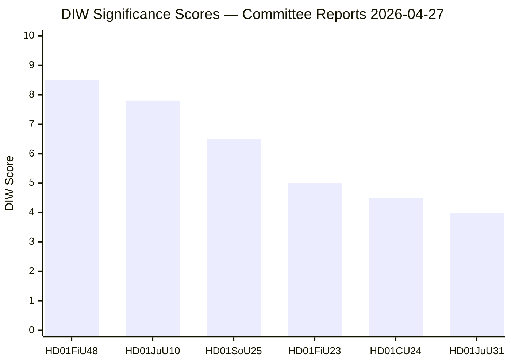

# Significance Scoring — Committee Reports 2026-04-27

**Author**: James Pether Sörling | **Date**: 2026-04-27

## DIW Scoring Methodology

Scores combine **D**emocratic impact (voting/governance weight), **I**nformational significance (news/analytical value), and **W**eight (policy salience, constituency breadth). Scale 1–10.

## Ranked Significance Table

| Rank | dok_id | D | I | W | DIW Total | Tier |
|------|--------|---|---|---|-----------|------|
| 1 | HD01FiU48 (FiU — Extra Budget 2026) | 8 | 9 | 8 | 8.5 | L2+ — Priority Analysis |
| 2 | HD01JuU10 (JuU — New Weapons Law) | 8 | 8 | 7 | 7.8 | L2+ — Priority Analysis |
| 3 | HD01SoU25 (SoU — Elder Care) | 6 | 7 | 6 | 6.5 | L2 — Strategic |
| 4 | HD01FiU23 (FiU — Riksbank Review) | 5 | 5 | 5 | 5.0 | L1 — Surface |
| 5 | HD01CU24 (CU — Building Process) | 4 | 5 | 5 | 4.5 | L1 — Surface |
| 6 | HD01JuU31 (JuU — Police Reform Review) | 4 | 4 | 4 | 4.0 | L1 — Surface |

## Sensitivity Analysis

- **If HD01FiU48 fails chamber vote** (probability: 15%): Tier jumps to L3 Intelligence-grade — coalition crisis signal
- **If HD01JuU10 passes with Centre amendment** (probability: 10%): Signals Tidö internal negotiation capability
- **HD01SoU25 scored conservatively** — if associated funding mechanisms are substantial, tier upgrades to L2+

## Mermaid: Significance Rank Diagram

