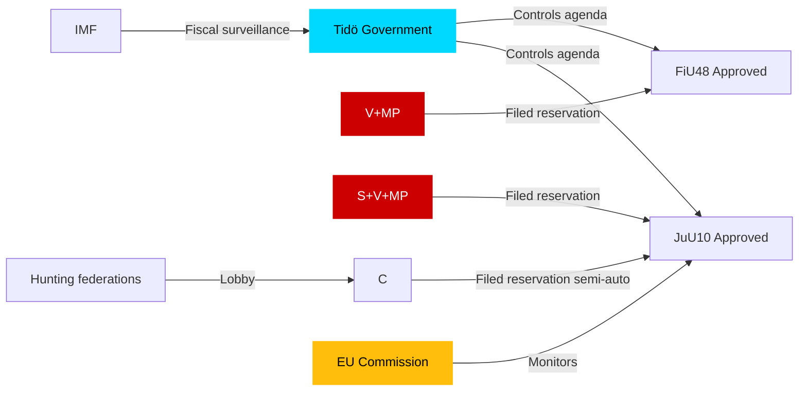

# Stakeholder Perspectives — Committee Reports 2026-04-27

**Author**: James Pether Sörling | **Date**: 2026-04-27

## 6-Lens Stakeholder Matrix

### Lens 1: Government (Tidö Coalition — M, SD, KD, L)

**Position**: Strongly supportive of all four betänkanden. HD01FiU48 is a flagship pre-election cost-of-living measure. HD01JuU10 signals security competence. HD01SoU25 demonstrates social responsibility.
**Key actors**: Finance Minister (M), Justice Minister, Social Affairs Minister
**Influence level**: High (majority in Riksdag)
**Evidence**: dok_id HD01FiU48 committee approved by FiU majority; dok_id HD01JuU10 approved by JuU majority [B2]

### Lens 2: Social Democrats (S)

**Position**: Critical on weapons law transition rules and 5-year licensing periods (HD01JuU10 reservations on points 2, 3). Likely to oppose energy-subsidy approach in HD01FiU48.
**Key actors**: S party leadership, S members of JuU and FiU
**Influence level**: Medium (largest opposition party)
**Evidence**: S filed reservations on HD01JuU10 points 2 and 3 [B2]

### Lens 3: Centre Party (C)

**Position**: Reserves specifically on semi-automatic weapons for hunting (HD01JuU10 point 1) and new supervision procedure (point 5). Represents rural hunting constituency interests.
**Influence level**: Medium — swing potential on rural issues
**Evidence**: C reservation on HD01JuU10 punkt 1 (half-auto hunting) and punkt 5 (supervision) [B2]

### Lens 4: Left (V) and Green (MP) Parties

**Position**: Filed reservation on HD01FiU48 (fuel tax cut + energy support) on climate/environmental grounds. Also reserve on HD01JuU10 licensing and transition rules.
**Key actors**: V ekonomisk-politisk talesperson, MP miljötalesperson
**Influence level**: Low in current parliament but electoral constraint on government
**Evidence**: V+MP reservation HD01FiU48 (dok_id HD01FiU48, punkt 1) [B2]

### Lens 5: Industry and Civil Society

**Position**: Hunting federations (Jägarförbundet) concerned by semi-auto restrictions; energy industry supportive of HD01FiU48's electricity relief; elder-care providers (Kommunalförbundet, Vårdföretagarna) broadly supportive of HD01SoU25
**Influence level**: Medium (lobbying capacity)
**Evidence**: Historical pattern; JuU hearing records [C2]

### Lens 6: International / EU

**Position**: EU Commission monitoring Swedish implementation of Directive 2021/555 via HD01JuU10. European climate bodies may flag fuel-tax reduction in HD01FiU48 as inconsistent with Green Deal commitments.
**Influence level**: Medium (compliance obligations)
**Evidence**: HD01JuU10 explicitly implements EU 2021/555 [B2]

## Influence Network

