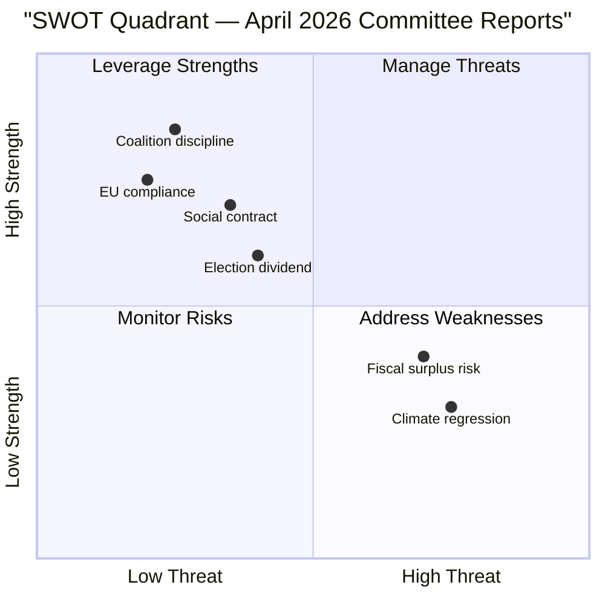

# SWOT Analysis — Swedish Committee Reports, 27 April 2026

**Author**: James Pether Sörling | **Date**: 2026-04-27

## Strengths

| Strength | Evidence | Admiralty |
|----------|----------|-----------|
| Tidö coalition maintaining legislative discipline | HD01FiU48 and HD01JuU10 passed FiU/JuU with full coalition majority; V+MP and C reservations are minority dissents | B2 |
| EU compliance delivered on time | HD01JuU10 implements EU Directive 2021/555 on firearms — reduces infringement risk before Sweden's EU Council obligations | B2 |
| Social contract maintenance before election | HD01SoU25 (dok_id HD01SoU25) addresses elderly population 20.9% of total (SCB); elder-care signal to key M/KD voter base | B2 |
| Riksbank oversight functioning | HD01FiU23 confirms parliamentary accountability mechanism operational; no material governance concerns found | B3 |

## Weaknesses

| Weakness | Evidence | Admiralty |
|----------|----------|-----------|
| Climate policy regression in HD01FiU48 | Fuel tax cut contradicts Sweden's Klimatpolitiska rådet carbon-pricing trajectory; risks EU ETS compliance questions | B2 |
| Multi-party fragmentation on weapons law | Four distinct reservation groups on HD01JuU10 (C, S, V, MP) signal implementation conflict risk | B2 |
| Fiscal sustainability of extra budget | Second supplementary budget in 2026 alongside main budget; IMF WEO Apr-2026 projects Sweden general government balance near -1.2% GDP — additional stimulus may strain medium-term targets | B1 |

## Opportunities

| Opportunity | Evidence | Admiralty |
|-------------|----------|-----------|
| Electoral dividend from energy relief | Household electricity/gas support from HD01FiU48 targets swing voters in suburban and rural constituencies — key battleground for M and SD in 2026 election | B2 |
| Consolidated weapons registry supports law enforcement | New weapons law (HD01JuU10) includes improved supervisory framework — potential to improve police intelligence on illegal weapons | B2 |
| Elder care as long-term fiscal investment | HD01SoU25 carer-support provisions may reduce costly institutionalisation; aligns with Statskontoret recommendations on community care efficiency | C2 |

## Threats

| Threat | Evidence | Admiralty |
|--------|----------|-----------|
| Opposition counter-mobilisation on climate | V+MP reservation on HD01FiU48 (dok_id HD01FiU48) provides climate opposition with a focal point for pre-election campaign | B2 |
| Centre Party defection risk | C's reservation on semi-auto weapons (HD01JuU10) signals willingness to break from coalition on rural constituency issues — potential fracture line | B2 |
| Budget credibility erosion | Two supplementary budgets in one year risks IMF/EU Fiscal Framework scrutiny; Sweden's fiscal rule credibility is a long-term AAA-rating anchor | B1 |

## TOWS Matrix

| | Strengths | Weaknesses |
|--|----------|------------|
| **Opportunities** | SO: Use energy relief to consolidate election narrative while maintaining coalition discipline | WO: Address climate regression by linking energy support to time-limited green transition fund |
| **Threats** | ST: Pre-empt climate opposition with green framing of HD01FiU48 household support | WT: Fiscal consolidation plan needed before next main budget to restore credibility |

## Mermaid: SWOT Balance

