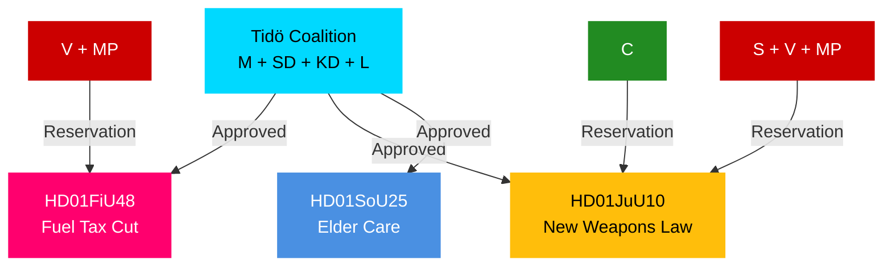

# Synthesis Summary — Swedish Committee Reports, 27 April 2026

**Author**: James Pether Sörling | **Date**: 2026-04-27 | **Riksmöte**: 2025/26

## Lead Story: Tidö Coalition Activates Cost-of-Living and Security Agenda Ahead of 2026 Election

The week of 21–24 April 2026 sees the Swedish Riksdag advance four committee betänkanden that collectively define the Tidö coalition's pre-election legislative posture. The most significant — HD01FiU48, the extra ändringsbudget — signals fiscal stimulus prioritising household energy relief at the cost of environmental consistency, while HD01JuU10 delivers Sweden's first major weapons-law overhaul in three decades. Together they reflect a coalition under electoral pressure mobilising core voter issues: cost of living and public safety.

## DIW-Weighted Priority Ranking

| Rank | dok_id | Title | DIW Weight | Tier | Rationale |
|------|--------|-------|-----------|------|-----------|
| 1 | HD01FiU48 | Extra Budget — Fuel Tax + Energy Support | 8.5 | L2+ | Fiscal, household impact, cross-party opposition, election proximity |
| 2 | HD01JuU10 | New Weapons Law | 7.8 | L2+ | Legal reform, EU compliance, multi-party reservations, security salience |
| 3 | HD01SoU25 | Stärkta insatser för äldre | 6.5 | L2 | Social contract, demographic targeting, election year |
| 4 | HD01FiU23 | Riksbankens verksamhet 2025 | 5.0 | L1 | Routine oversight, democratic accountability |
| 5 | HD01CU24 | Effektiv och säker byggprocess | 4.5 | L1 | Regulatory reform, construction sector |
| 6 | HD01JuU31 | Riksrevisionens rapport om Polisreformen | 4.0 | L1 | Audit, accountability, police reform review |

## Integrated Intelligence Picture

**Fiscal vector**: HD01FiU48 represents a secondary fiscal expansion in 2026, following the main budget. The fuel-tax reduction reverses prior green-tax policy trajectory, signalling that electoral calculus trumped climate consistency. With IMF WEO Apr-2026 projecting Sweden's general government balance at approximately -1.2% of GDP, the extra budget adds modest additional stimulus in an already near-neutral fiscal stance. V and MP filed reservations against the measure; their position aligns with climate-party constituencies but leaves them as minority opposition voices.

**Security vector**: HD01JuU10 consolidates Sweden's approach to firearms in line with EU Directive 2021/555. The Centre Party's reservation on semi-automatic hunting weapons reveals tension within the rural-urban divide of Swedish politics. S, V, and MP reservations on transition rules and licensing periods (5-year permits) suggest these parties would tighten the law further if in government. The JuU majority's approval reflects Tidö-coalition discipline on security policy.

**Social vector**: HD01SoU25's elderly-care provisions respond to demographic pressure (Sweden's population aged 65+ at 20.9% per SCB) and act as an electoral signal to older voters, a key constituency for M and KD.

**Democratic accountability vector**: HD01FiU23's Riksbank review is part of the Riksdag's constitutional obligation under the Riksbank Act to scrutinise monetary policy annually. The review found no material concerns with Riksbank governance.

## Mermaid: Coalition Alignment by Document

