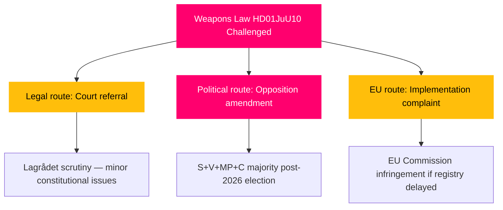

# Threat Analysis — Committee Reports 2026-04-27

**Author**: James Pether Sörling | **Date**: 2026-04-27

## Political Threat Taxonomy

### Tier 1: Immediate (0–30 days)

| Threat | Actor | Vector | Indicator | Admiralty |
|--------|-------|--------|-----------|-----------|
| Opposition filibuster on HD01FiU48 chamber vote | V, MP | Parliamentary procedure — procedural delays, extended debate | Chamber scheduling announcement | B2 |
| Centre Party escalation on weapons semi-auto issue | C | Media campaign, party congress resolutions | C party communications, hunting federation statements | B2 |

### Tier 2: Near-term (30–90 days)

| Threat | Actor | Vector | Indicator | Admiralty |
|--------|-------|--------|-----------|-----------|
| EU Commission climate policy complaint on fuel tax reduction | European Commission | EU ETS/Green Deal alignment mechanism | EU Commission DG CLIMA correspondence | B1 |
| S pre-election narrative attack on weapons-law gaps | Socialdemokraterna | Opposition press briefings, interpellations | S press releases; interpellation log | B2 |

### Tier 3: Long-term (90+ days / election)

| Threat | Actor | Vector | Indicator | Admiralty |
|--------|-------|--------|-----------|-----------|
| Post-election weapons law reversal if bloc change | S+V+MP+C post-election coalition | Legislative repeal or amendment | 2026 election outcome | B1 |
| IMF/credit-rating pressure from dual supplementary budgets | IMF, Moody's/S&P | Fiscal review, outlook change | IMF Article IV report; rating updates | B1 |

## Attack Tree: Weapons Law Challenge

## MITRE-Style TTP Mapping (Political Threat)

| Tactic | Technique | Procedure | Target |
|--------|-----------|-----------|--------|
| Influence | T-I01: Reservation filing | V+MP file reservation on HD01FiU48 (dok_id HD01FiU48) to create pre-election attack vector | Tidö coalition fiscal credibility |
| Disruption | T-D02: Procedural delay | Extended JuU debate using reservation clauses from S, V, MP on HD01JuU10 | Weapons law timeline |
| Legitimacy undermining | T-L01: Media framing | Climate organisations highlight fuel-tax cut as policy reversal | Government green credibility |
