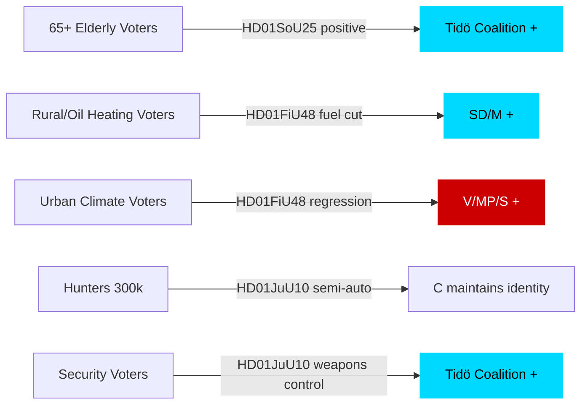

# Voter Segmentation — Committee Reports 2026-04-27

**Author**: James Pether Sörling | **Date**: 2026-04-27

## Demographic Impact Analysis

### Age Segmentation

| Segment | Key Document | Impact | Direction |
|---------|-------------|--------|-----------|
| 65+ (20.9% of population, SCB 2025) | HD01SoU25 — elder care | HIGH positive | Tidö coalition benefit |
| 40–65 (rural, oil heating) | HD01FiU48 — fuel tax cut | HIGH positive | SD/M benefit |
| 18–40 (urban, climate-aware) | HD01FiU48 — climate regression | MEDIUM negative | Green party / S benefit |
| Hunters (est. 300,000 licensed hunters, Jägarförbundet) | HD01JuU10 — semi-auto restriction | MIXED: negative C voters, positive security voters | C lose hunters; M/SD gain security voters |

### Regional Segmentation

| Region | Key Document | Impact |
|--------|-------------|--------|
| Rural Norrland, Dalarna | HD01FiU48 (oil heating) + HD01JuU10 (hunting) | HIGH positive for Tidö; C maintains rural identity |
| Suburban Stockholm, Gothenburg, Malmö | HD01FiU48 (electricity support) + HD01SoU25 | MEDIUM positive |
| Urban young voters | HD01FiU48 (climate regression) | MEDIUM negative for Tidö |

### Ideological Segmentation

| Voter type | Primary document affecting them | Likely response |
|-----------|--------------------------------|----------------|
| Security-concerned voters | HD01JuU10 (weapons control) | Positive — tighter gun laws signal security competence |
| Rural/hunting identity voters | HD01JuU10 (semi-auto restriction) | MIXED — negative on restriction; positive on general law order |
| Welfare state supporters | HD01SoU25 | Positive across party lines |
| Climate-priority voters | HD01FiU48 | Negative — fuel tax cut seen as backsliding |

## Baseline Positions — Procedural Context

This is a committee-report day, not a major policy shift. Base positions: Tidö coalition broadly ahead on security, cost-of-living, and stability narratives; opposition (S+V+MP) broadly ahead on climate and welfare quality.

## Mermaid: Voter Segment Impact

