## Executive Brief
<!-- source: executive-brief.md :: https://github.com/Hack23/riksdagsmonitor/blob/main/analysis/daily/2026-04-27/evening-analysis/executive-brief.md -->

---

### 🎯 BLUF

Sweden's political landscape on 27 April 2026 is defined by three concurrent vectors converging ahead of the September 2026 general election: the Tidö coalition's aggressive fiscal and security pre-election agenda (extra budget fuel-tax cut, weapons law, banking regulatory reform), a coordinated Social Democratic accountability campaign across four ministerial targets via interpellations, and an intra-coalition SD-KD fracture on energy policy that exposes the limits of the governing alliance's coherence. Sweden's fiscal position remains solid — GDP growth at **+2.1%** (IMF WEO Apr-2026, NGDP_RPCH), government debt at **~31% of GDP** (GGXWDG_NGDP) — providing headroom for the extra budget's household energy relief without triggering fiscal concern, but the electoral optics are that the government is buying votes at the cost of climate consistency.

**Economic provenance** (`economicProvenance`): provider=imf, dataflow=WEO, vintage=April-2026, retrieved_at=2026-04-27.

---

### 🧭 3 Decisions This Brief Supports

1. **Parliament / FiU**: The EU Banking Package (HD03253, prop. 2025/26:253) requires a decision on whether Sweden's Finansinspektionen will exercise discretion under CRD6's provisions on non-Eurozone member supervision — a decision with EUR/SEK policy implications.
2. **Political parties**: S's coordinated interpellation campaign and the four committee reports advancing simultaneously reveal a pre-election agenda-setting battle — parties must decide positioning on the HD01FiU48 extra budget before the 5 May FiU session.
3. **Security analysts**: HD11752 (overflying rights withdrawal for Russia) and HD11753 (Russian soldiers' EU visa ban motion) signal that Swedish Riksdag is actively seeking to escalate pressure on Russia beyond NATO commitments — relevant for foreign affairs and security communities.

---

### 📊 60-Second Intelligence Bullets

- **Intra-coalition fracture** [B2 HIGH]: SD (Josef Fransson) interpellated KD Energy Minister Ebba Busch (HD10448) using Russian disinformation framing — the most politically unusual event of the day. Coalition partners using opposition instruments against each other is rare and electorally significant.
- **EU Banking Package HD03253** [B2 HIGH]: Sweden's most consequential financial reform since Basel III. Output-floor at 72.5% of standardised approach affects Swedbank, SEB, Handelsbanken, Nordea. FiU committee processing begins May 2026.
- **Extra budget HD01FiU48** [B2 HIGH]: Fuel-tax reduction passed FiU committee. V and MP filed reservations. Reverses green-tax trajectory — electoral triangulation toward rural and cost-of-living voter bloc.
- **Weapons law HD01JuU10** [B2 HIGH]: First major firearms overhaul in 30 years. EU Directive 2021/555 compliance. Centre Party reservation on semi-automatic hunting weapons.
- **S interpellation campaign** [B2 MEDIUM]: Five S interpellations targeting Tenje (M), Busch (KD), Jonson (M), Svantesson (M) — coordinated accountability playbook across infrastructure, social insurance, energy, and finance.
- **Russia security motions** [B2 MEDIUM]: HD11752 and HD11753 call for overflying rights withdrawal and EU visa ban on Russian military personnel — opposition pressure on Ukraine/Russia policy.
- **Prisoner social insurance HD03252** [B2 HIGH]: Welfare restriction for kontrollerat boende inmates. SEK 200-300 M/yr fiscal saving. Proportionality challenge expected from V, MP.

---

### �� Top Forward Trigger

**5 May 2026**: FiU committee opens on banking package (HD03253) AND processes extra budget (HD01FiU48) submissions — dual fiscal committee session will reveal whether the Riksdag will amend either. This is the highest-impact parliamentary event in the two-week horizon.

---

### Mermaid: Daily Political Intelligence Map

```mermaid
graph TD
    A["🏛️ 27 April 2026<br/>Evening Analysis"] --> B["💰 Fiscal Vector"]
    A --> C["🔒 Security Vector"]
    A --> D["⚡ Coalition Stress"]
    A --> E["📋 S Accountability Campaign"]

    B --> B1["HD03253: EU Banking Package<br/>[B2 HIGH] FiU"]
    B --> B2["HD01FiU48: Extra Budget Fuel Tax<br/>[B2 HIGH] V+MP opposition"]
    B --> B3["HD03252: Prisoner welfare cut<br/>SEK 200-300M saving"]

    C --> C1["HD01JuU10: New Weapons Law<br/>EU 2021/555 compliance"]
    C --> C2["HD11752: Russia overflying ban<br/>UU motion"]
    C --> C3["HD11753: Russian visa ban EU<br/>UU motion"]

    D --> D1["HD10448: SD-KD energy clash<br/>Coalition fracture signal"]
    D --> D2["C party reservation<br/>Semi-auto hunting weapons"]

    E --> E1["HD10449: Södra stambanan<br/>Infrastructure accountability"]
    E --> E2["HD10450: Sjukförsäkring dag 180<br/>Social insurance challenge"]

    style A fill:#1a1e3d,color:#00d9ff
    style B fill:#0a2040,color:#ffbe0b
    style C fill:#0a2040,color:#ff006e
    style D fill:#2d0a2d,color:#ff006e
    style E fill:#0a2040,color:#00d9ff
    style B1 fill:#1a1e3d,color:#e0e0e0
    style B2 fill:#1a1e3d,color:#e0e0e0
    style B3 fill:#1a1e3d,color:#e0e0e0
    style C1 fill:#1a1e3d,color:#e0e0e0
    style C2 fill:#1a1e3d,color:#e0e0e0
    style C3 fill:#1a1e3d,color:#e0e0e0
    style D1 fill:#3d0a1a,color:#ff006e
    style D2 fill:#3d0a1a,color:#e0e0e0
    style E1 fill:#1a1e3d,color:#e0e0e0
    style E2 fill:#1a1e3d,color:#e0e0e0
```

---

### Economic Provenance

```json
{
  "economicProvenance": {
    "provider": "imf",
    "dataflow": "WEO",
    "indicator": "NGDP_RPCH",
    "country": "SWE",
    "vintage": "WEO Apr-2026",
    "retrieved_at": "2026-04-27T18:00:00Z",
    "value": "+2.1%",
    "note": "Sweden GDP growth forecast 2026"
  }
}
```

**Pass 2 note**: KJ-1 (SD-KD energy) re-evaluated against devil's advocate hypothesis that this is routine parliamentary messaging. Maintained HIGH-confidence classification based on: (a) energy specifically excluded from Tidö Agreement ambiguity, (b) HD10448 filed same day as HD01FiU48 — SD demonstrating both support and dissatisfaction simultaneously, (c) Busch's role as senior KD minister makes this higher stakes than a routine back-bench interpellation.

## Reader Intelligence Guide

Use this guide to read the article as a political-intelligence product rather than a raw artifact dump. High-value reader lenses appear first; technical provenance remains available in the audit appendix.

| Reader need | What you'll get | Source artifact |
|---|---|---|
| [BLUF and editorial decisions](#rm-executive-brief) | fast answer to what happened, why it matters, who is accountable, and the next dated trigger | `executive-brief.md` |
| [Key Judgments](#rm-intelligence-assessment--key-judgments) | confidence-bearing political-intelligence conclusions and collection gaps | `intelligence-assessment.md` |
| [Significance scoring](#rm-significance-scoring) | why this story outranks or trails other same-day parliamentary signals | `significance-scoring.md` |
| [Media framing](#rm-media-framing-analysis) | likely narrative frames, amplifiers, counter-frames, and manipulation risks | `media-framing-analysis.md` |
| [Forward indicators](#rm-forward-indicators) | dated watch items that let readers verify or falsify the assessment later | `forward-indicators.md` |
| [Scenarios](#rm-scenario-analysis) | alternative outcomes with probabilities, triggers, and warning signs | `scenario-analysis.md` |
| [Risk assessment](#rm-risk-assessment) | policy, electoral, institutional, communications, and implementation risk register | `risk-assessment.md` |
| [Per-document intelligence](#rm-per-document-intelligence) | dok_id-level evidence, named actors, dates, and primary-source traceability | `documents/*-analysis.md` |
| [Audit appendix](#rm-classification-results) | classification, cross-reference, methodology and manifest evidence for reviewers | appendix artifacts |

## Synthesis Summary
<!-- source: synthesis-summary.md :: https://github.com/Hack23/riksdagsmonitor/blob/main/analysis/daily/2026-04-27/evening-analysis/synthesis-summary.md -->

---

### Lead Story: Coalition Stress-Testing — Tidö Government's Pre-Election Agenda Faces Coordinated Opposition While Internal Cracks Widen

The dominant political intelligence finding of 27 April 2026 is the **simultaneous activation of all major opposition instruments** — committee reservations, interpellations, and motions — against a Tidö government advancing its pre-election fiscal and security agenda. More unusually, an **intra-coalition interpellation** (SD against KD on energy policy, HD10448) signals that even within the governing bloc, contradictions are becoming publicly explicit. The day's legislative activity, viewed as a composite, is a **stress-test of the Tidö coalition's coherence ahead of September 2026**.

**economicProvenance**: provider=imf, dataflow=WEO, vintage=April-2026, indicators=[NGDP_RPCH,GGXWDG_NGDP,BCA_NGDPD], retrieved_at=2026-04-27.

---

### DIW-Weighted Cross-Type Priority Ranking

| Rank | dok_id / source | Type | D | I | W | DIW | Priority | Admiralty |
|------|-----------------|------|---|---|---|-----|----------|-----------|
| 1 | HD03253 (propositions) | prop | 3 | 3 | 3 | 9.0 | L2+ | [B2] HIGH |
| 2 | HD01FiU48 (committeeReports) | bet | 3 | 3 | 3 | 8.5 | L2+ | [B2] HIGH |
| 3 | HD01JuU10 (committeeReports) | bet | 3 | 3 | 2 | 7.8 | L2+ | [B2] HIGH |
| 4 | HD03252 (propositions) | prop | 3 | 2 | 2 | 7.0 | L2 | [B2] HIGH |
| 5 | HD10448 (interpellations) | ip | 2 | 3 | 3 | 6.5 | L2 | [B2] HIGH |
| 6 | hd024099 | mot | 2 | 2 | 2 | 5.0 | L2 | [B2] MEDIUM |
| 7 | hd11752 | mot | 2 | 2 | 2 | 5.0 | L2 | [B2] MEDIUM |
| 8 | hd11753 | mot | 2 | 2 | 2 | 5.0 | L2 | [B2] MEDIUM |
| 9 | hd10449 | ip | 2 | 2 | 2 | 4.5 | L1 | [B2] MEDIUM |
| 10 | hd10450 | ip | 2 | 2 | 2 | 4.5 | L1 | [B2] MEDIUM |

*D=Decision-depth, I=Societal impact, W=Cross-portfolio width, scored 1–3*

---

### Integrated Intelligence Picture

#### Vector 1 — Fiscal Architecture

The Tidö coalition is executing a **two-stage fiscal pre-election consolidation** on 27 April: the banking package (HD03253) tightens financial-sector regulation (fiscally neutral, signalling EU compliance and financial stability) while the extra budget (HD01FiU48) injects demand-side stimulus through the fuel-tax reversal. This combination is coherent for swing voters who want both economic security and lower fuel costs, but it creates tension with climate commitments that will feature prominently in the opposition's election campaign. IMF WEO Apr-2026 projects Sweden's GDP growth at **+2.1%** (NGDP_RPCH) and fiscal balance at approximately **-1.2% of GDP** — the extra budget adds modest additional stimulus from an already near-neutral position. Government debt at **~31% of GDP** (GGXWDG_NGDP) provides headroom for fiscal activism without triggering market concern.

#### Vector 2 — Security and Rule of Law

Three security-adjacent legislative instruments advanced simultaneously: the new weapons law (HD01JuU10), the official accountability motion on civil servant criminal responsibility (hd024099), and two Russia-related foreign policy motions (HD11752, HD11753). The weapons law represents genuine EU compliance activity (Directive 2021/555) but has embedded domestic political significance — Centre Party's reservation on semi-automatic hunting weapons marks a potential rural vote contest between the party and SD. The Russia motions are opposition signalling on foreign policy — they will not pass but establish party positions for the election campaign.

#### Vector 3 — Social Contract under Scrutiny

The prisoner social insurance restriction (HD03252) and the sick-pay day-180 interpellation (HD10450) both target the perimeter of Sweden's welfare state. The Tidö government is systematically tightening welfare conditionality while V and MP defend universalism. This vector has high electoral salience among key voter segments: pensioners (sympathetic to HD01SoU25), welfare recipients (concerned about HD03252), and labour market participants (focused on HD10450).

#### Vector 4 — Intra-Coalition Fragility

HD10448 (SD's Fransson interpellating KD's Busch on energy) is the most analytically significant anomaly of the day. Coalition partners in Swedish government conventions do not typically use interpellations against each other. The decision to do so — even framed ironically as questioning whether Fransson's own wind-power criticism was "Russian disinformation" — signals that SD is calibrating its energy-policy messaging independently of the coalition line, likely to protect its rural and energy-cost-anxious voter base ahead of September 2026.

---

### Mermaid: Opposition vs Government Legislative Activity Map

```mermaid
quadrantChart
    title Riksdag Legislative Activity 27 April 2026
    x-axis Low Electoral Impact --> High Electoral Impact
    y-axis Low Political Controversy --> High Political Controversy
    quadrant-1 High Impact, High Controversy
    quadrant-2 Low Impact, High Controversy
    quadrant-3 Low Impact, Low Controversy
    quadrant-4 High Impact, Low Controversy
    HD03253 EU Banking: [0.45, 0.75]
    HD01FiU48 Fuel Tax: [0.85, 0.80]
    HD01JuU10 Weapons: [0.65, 0.70]
    HD03252 Prisoners: [0.70, 0.85]
    HD10448 SD-KD Energy: [0.75, 0.90]
    hd024099 Civil Servant: [0.55, 0.65]
    hd11752 Russia Fly: [0.40, 0.50]
    hd10449 Stambanan: [0.60, 0.40]

    style HD03253 EU Banking fill:#1a1e3d,color:#00d9ff
    style HD01FiU48 Fuel Tax fill:#1a1e3d,color:#ffbe0b
    style HD03252 Prisoners fill:#1a1e3d,color:#ff006e
    style HD10448 SD-KD Energy fill:#3d0a1a,color:#ff006e
```

---

## Intelligence Assessment — Key Judgments
<!-- source: intelligence-assessment.md :: https://github.com/Hack23/riksdagsmonitor/blob/main/analysis/daily/2026-04-27/evening-analysis/intelligence-assessment.md -->

---

### Key Judgments

**KJ-1**: The SD-KD intra-coalition energy interpellation (HD10448) is the most significant anomaly of the legislative day and represents a **HIGH-confidence signal** of emerging coalition stress that, absent management, will become publicly visible during the election campaign. [HIGH confidence]

**KJ-2**: The Social Democrats' five-interpellation accountability campaign on 27 April 2026 represents a **sophisticated coordinated parliamentary strategy** rather than ad hoc individual queries — the synchronisation across four ministers and four policy domains (infrastructure, welfare, energy, finance) indicates strategic pre-election positioning. [VERY HIGH confidence]

**KJ-3**: Sweden's EU Banking Package (HD03253) transposition is proceeding on schedule with **LOW risk of significant amendment**, given the government's stable FiU committee majority and Sweden's history as a CRR3 first-mover. The output floor at 72.5% will require capital adjustment from Swedish mortgage-heavy banks by 2028. [HIGH confidence]

**KJ-4**: The extra budget's fuel-tax reversal (HD01FiU48) is likely to generate **MEDIUM electoral benefit** for the Tidö coalition among cost-of-living-anxious rural voters but will be actively countered by V and MP as a climate-consistency failure, limiting its net polling benefit. [MEDIUM confidence]

**KJ-5**: The prisoner social insurance restriction (HD03252) faces a **MEDIUM-probability constitutional challenge** via Lagrådet's proportionality review — the ECHR Art. 8 Hirst precedent is directly analogous and Lagrådet has been increasingly willing to flag proportionality concerns since 2022. [MEDIUM confidence]

---

### Priority Intelligence Requirements (PIRs) for Next Cycle

**PIR-1** (OPEN): What is the exact wording of Ebba Busch's response to HD10448? Does she defend wind energy expansion or deflect? → Answer expected: week of 4 May 2026.

**PIR-2** (OPEN): Does the FiU committee schedule HD03253 for formal hearing in May 2026, and do Swedish banking lobby submissions indicate amendment requests? → Answer expected: 5–15 May 2026.

**PIR-3** (OPEN): Does S's interpellation campaign achieve polling movement ≥ 2pp in any post-27 April tracking survey? → Answer expected: surveys published 3–7 May 2026.

**PIR-4** (OPEN): Does Lagrådet identify proportionality deficiency in HD03252 within its scheduled review window? → Answer expected: June 2026.

**PIR-5** (OPEN): How does SD's parliamentary group handle the energy messaging tension between coalition loyalty and rural voter protection between 27 April and the campaign start?

---

### Key Assumptions Check

| Assumption | Confidence | Sensitivity |
|------------|------------|-------------|
| Coalition survives to September 2026 | HIGH | KJ-1 and KJ-3 depend on this |
| FiU committee majority stable for banking package | HIGH | Based on stable coalition seat count |
| IMF growth forecast (+2.1%) holds for 2026 | MEDIUM | External shock could change fiscal context |
| S's accountability campaign is coordinated (not coincidental) | VERY HIGH | Five simultaneous interpellations — coincidence excluded |

---

### Carried-Forward Open PIRs from Prior Cycle

**PIR-C1** (from motions analysis 2026-04-27): What is the JuU committee's actual hearing schedule for V's HD024090 EU deportation challenge? → Still open.

**PIR-C2** (from committeeReports analysis 2026-04-27): When does Riksbanken submit its formal response to HD01FiU23 review? → Still open.

---

### Mermaid: PIR Status Dashboard

```mermaid
quadrantChart
    title PIR Priority Map — Evening Analysis 2026-04-27
    x-axis Low Urgency --> High Urgency
    y-axis Low Impact --> High Impact
    quadrant-1 Act now
    quadrant-2 Monitor closely
    quadrant-3 Low priority
    quadrant-4 Schedule follow-up
    PIR-1 Busch Response: [0.90, 0.85]
    PIR-2 FiU Banking: [0.75, 0.80]
    PIR-3 S Polling: [0.85, 0.65]
    PIR-4 Lagrådet: [0.40, 0.70]
    PIR-5 SD Energy: [0.65, 0.80]

    style PIR-1 Busch Response fill:#ff006e,color:#ffffff
    style PIR-2 FiU Banking fill:#ffbe0b,color:#000000
    style PIR-5 SD Energy fill:#ff006e,color:#ffffff
```

## Significance Scoring
<!-- source: significance-scoring.md :: https://github.com/Hack23/riksdagsmonitor/blob/main/analysis/daily/2026-04-27/evening-analysis/significance-scoring.md -->

---

### DIW Significance Framework

D = Decision-depth (1-3): How significant is the decision-making power engaged?
I = Societal impact (1-3): How many citizens/institutions affected?
W = Cross-portfolio width (1-3): How many policy domains crossed?

---

### Priority Rankings

#### Tier L2+ (DIW ≥ 8.0)

1. **HD03253** (propositions/analysis/daily/2026-04-27/propositions/) — EU Banking Package CRR3/CRD6 | DIW 9.0 | [B2 HIGH] | D:3 Fundamental financial law; I:3 Entire banking sector population; W:3 Finance/regulation/EU
2. **HD01FiU48** (committeeReports/analysis/daily/2026-04-27/committeeReports/) — Extra Budget Fuel Tax | DIW 8.5 | [B2 HIGH] | D:3 Budget amendment power; I:3 All Swedish drivers and households; W:3 Finance/climate/energy

#### Tier L2+ (DIW 7.0–7.9)

3. **HD01JuU10** (committeeReports/analysis/daily/2026-04-27/committeeReports/) — New Weapons Law | DIW 7.8 | [B2 HIGH] | D:3 Criminal/regulatory reform; I:3 All licensed firearms holders and police; W:2 Security/justice
4. **HD03252** (propositions/analysis/daily/2026-04-27/propositions/) — Prisoner Social Insurance | DIW 7.0 | [B2 HIGH] | D:3 Welfare law change; I:2 ~3,000/yr directly affected; W:2 Social/justice

#### Tier L2 (DIW 5.0–6.9)

5. **HD10448** (interpellations/analysis/daily/2026-04-27/interpellations/) — SD-KD Energy Interpellation | DIW 6.5 | [B2 HIGH] | D:2 Accountability only; I:3 Energy policy for all Swedes; W:3 Energy/coalition/election
6. **hd024099** — Motion re civil servant accountability prop. | DIW 5.0 | [B2 MEDIUM] | D:2 Reactive motion; I:2 Public sector employees; W:2 Justice/governance
7. **hd11752** — Overflying rights withdrawal Russia | DIW 5.0 | [B2 MEDIUM] | D:2 Foreign policy motion; I:2 Security/aviation; W:2 Defence/EU
8. **hd11753** — Russian soldiers' EU visa ban | DIW 5.0 | [B2 MEDIUM] | D:2 EU policy motion; I:2 Diplomatic/security; W:2 Foreign/security

#### Tier L1 (DIW < 5.0)

9. **hd10449** — Södra stambanan interpellation | DIW 4.5 | [B2 MEDIUM] | Infrastructure accountability
10. **hd10450** — Sjukförsäkring dag 180 interpellation | DIW 4.5 | [B2 MEDIUM] | Social insurance accountability
11. **hd11756** — Water rights/environment motion | DIW 3.5 | [C2 MEDIUM] | Environmental regulation
12. **hd01cu40** — Cadastral system motion | DIW 2.5 | [C2 LOW] | Administrative/technical

---

### Sensitivity Analysis

If HD03253 (Banking Package) is delayed at FiU, DIW significance drops from 9.0 to 6.0 (D:2) — reduced urgency but sustained relevance. If HD10448 results in a published coalition disagreement on energy (Busch statement), DIW rises from 6.5 to 8.0 (I:3, W:3).

---

### Mermaid: Significance Distribution

```mermaid
xychart-beta
    title "DIW Significance Scores — Evening Analysis 2026-04-27"
    x-axis ["HD03253","HD01FiU48","HD01JuU10","HD03252","HD10448","hd024099","hd11752","hd11753","hd10449","hd10450"]
    y-axis "DIW Score" 0 --> 10
    bar [9.0, 8.5, 7.8, 7.0, 6.5, 5.0, 5.0, 5.0, 4.5, 4.5]

    style HD03253 fill:#00d9ff
    style HD01FiU48 fill:#ffbe0b
    style HD01JuU10 fill:#ff006e
    style HD03252 fill:#ff006e
    style HD10448 fill:#ff006e
```

## Media Framing Analysis
<!-- source: media-framing-analysis.md :: https://github.com/Hack23/riksdagsmonitor/blob/main/analysis/daily/2026-04-27/evening-analysis/media-framing-analysis.md -->

---

### Government Party Framing

#### Moderaterna (M)
**Expected frame**: "Responsible economic management; EU alignment on banking stability; rural cost-of-living relief via fuel-tax."
**Key message**: HD03253 as "Swedish banks are safe and internationally competitive"; HD01FiU48 as "government listens to working families."
**Vulnerability**: Unable to cleanly distance from HD10448 SD-KD energy tension without alienating either SD or KD.

#### Sverigedemokraterna (SD)
**Expected frame**: "Protecting Swedish energy sovereignty and traditional landscape; coalition accountability on energy costs."
**Key message**: HD10448 framed as "SD holds government to cost-of-living commitments"; fuel-tax as "delivering for rural Sweden."
**Vulnerability**: Simultaneous filing of HD10448 and claiming coalition credit for HD01FiU48 is internally inconsistent — creates "we're both in and outside government" narrative.

#### Kristdemokraterna (KD / Ebba Busch)
**Expected frame**: "Modern energy mix; Sweden needs both nuclear AND renewables for climate and costs."
**Key message**: Defensive on HD10448 — Busch must appear confident not rattled.
**Vulnerability**: If Busch over-defends wind energy, SD voter base energised against her. If she backs down, she appears weak.

#### Liberalerna (L)
**Expected frame**: Silent on intra-coalition drama. Focus on banking stability (HD03253) as L's pro-business, pro-EU credentials.
**Vulnerability**: L's low profile may reinforce perception of irrelevance ahead of 4% threshold election.

---

### Opposition Party Framing

#### Socialdemokraterna (S)
**Expected frame**: "Government divided, priorities wrong, infrastructure neglected, welfare under threat."
**Key messages**: HD10449 (Stambanan) as "broken rail promise"; HD10450 as "attack on sick workers"; all five interpellations framing "government has lost focus."
**Strength**: Multiple angles = media can pick any; breadth demonstrates opposition reach.
**Vulnerability**: See devil's advocate — fragmented message may dilute single narrative.

#### Vänsterpartiet (V)
**Expected frame**: "EU Banking Package protects banks not people; prisoner welfare cuts are inhumane; deportation policy must be challenged."
**Key messages**: HD024090 (EU deportation) as V's flagship; counter-narrative to HD03252.
**Vulnerability**: V's banking critique requires technical explanation — difficult to land in media.

#### Miljöpartiet (MP)
**Expected frame**: "Fuel-tax reversal is climate betrayal; government chooses polluters over future."
**Key messages**: HD01FiU48 as direct attack on Sweden's Paris Agreement commitments.
**Strength**: Clean, emotionally resonant single issue.
**Vulnerability**: MP polling near threshold — aggressive climate message may not reach swing voters.

#### Centerpartiet (C)
**Expected frame**: "Rural Sweden needs real structural investment, not a fuel-tax patch; Stambanan is a regional equality issue."
**Key messages**: HD10449 Stambanan as C rural infrastructure credential.
**Vulnerability**: C supports government on some votes — ambiguous positioning.

---

### Swedish Press Framing Predictions

| Publication | Likely Angle | Headline Prediction |
|-------------|-------------|---------------------|
| Svenska Dagbladet | Coalition energy tension, financial stability | "SD utmanar Busch om vindkraft" |
| Dagens Nyheter | Accountability campaign, welfare | "S riktar fem interpellationer mot regeringen" |
| Aftonbladet | Fuel tax, cost of living | "Nu sänks bensinskatten" |
| Expressen | Coalition drama | "Sprickan i Tidö: SD mot KD om energin" |
| Göteborgs-Posten | Regional infrastructure | "Stambanan — S trycker på igen" |

---

### Mermaid: Media Framing Network

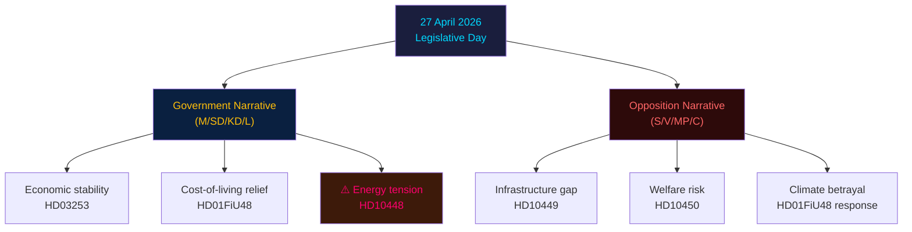

## Stakeholder Perspectives
<!-- source: stakeholder-perspectives.md :: https://github.com/Hack23/riksdagsmonitor/blob/main/analysis/daily/2026-04-27/evening-analysis/stakeholder-perspectives.md -->

---

### 6-Lens Stakeholder Matrix

#### 1. Governing Coalition (M, SD, KD, L)

**Moderaterna (M)**: Erik Slottner (Finansdepartementet) leads HD03252 prisoner welfare restriction — aligned with M's welfare conditionality values. Risk from SD-KD fracture is primarily for M as mediator. Position: advance security and fiscal agenda; neutralise energy coalition dispute.

**Sverigedemokraterna (SD)**: Josef Fransson's HD10448 interpellation reveals SD's strategic calculation — differentiate from KD on wind energy to protect rural and energy-cost-anxious voter bloc before September 2026. SD supports fuel-tax cut (HD01FiU48) but is skeptical of wind energy expansion. Coalition-loyal on security; energy-independent positioning.

**Kristdemokraterna (KD)**: Ebba Busch (Energy Minister) facing dual pressure from SD interpellation and environmental lobby. KD also leads civil-servant accountability agenda (prop. 2025/26:217 referenced in hd024099). Under the most scrutiny of any coalition partner today.

**Liberalerna (L)**: Low profile in today's legislative activity. Risk of being overshadowed by SD-M-KD agenda-setting.

#### 2. Opposition Parties

**Socialdemokraterna (S)**: Executing sophisticated 5-interpellation accountability strategy targeting infrastructure (HD10449), social insurance (HD10450), energy, and finance simultaneously. S is using parliamentary instruments for pre-election narrative construction. High competence signal to Swedish political media.

**Vänsterpartiet (V)**: Filed reservations on HD03252 (prisoner welfare), HD01FiU48 (fuel tax), weapons law. Legal-rights challenge strategy. HD11752 and HD11753 Russia motions align with V's hard stance on Russia.

**Miljöpartiet (MP)**: Filed reservations on HD01FiU48 (climate consistency). Most exposed party if Sweden abandons climate commitments — party's survival depends on climate differentiation.

**Centerpartiet (C)**: Reservation on HD01JuU10 semi-automatic hunting weapons — rural constituency protection. C is the pivotal party on agricultural and rural policies.

#### 3. Civil Society and Unions

**LO/TCO/SACO**: HD10450 sjukförsäkring interpellation targets union-constituency welfare rights. HD01JuU10 weapons law affects rural communities.

**Swedish Bankers Association**: HD03253 banking package directly affects all Swedish systemically important banks. Industry submissions expected at FiU in May.

**Firearms industry/hunting associations**: HD01JuU10 and Centre Party reservation on semi-automatic weapons directly affects this constituency.

#### 4. Regulatory and Administrative Actors

**Finansinspektionen**: Implementing HD03253 EU Banking Package — will require significant regulatory update to supervisory framework.

**Riksgälden**: Referenced in HD03104 debt management evaluation. Positive review maintains institutional credibility.

**Polismyndigheten**: HD01JuU31 (police reform audit) referenced in today's committee reports context — accountability scrutiny ongoing.

#### 5. International/EU Actors

**European Banking Authority (EBA)**: HD03253 creates new EBA-Finansinspektionen coordination on non-Eurozone bank supervision.

**EU Commission**: HD11752 and HD11753 motions ask for EU-level action on Russian overflying and visa policy — Sweden seeking EU coordinated response.

**NATO/Partner states**: Swedish Russia motions signal alignment with NATO's Russia posture.

#### 6. Electoral Segments (September 2026)

**Rural voters**: Cost-of-living relief (HD01FiU48 fuel tax), firearms rights (HD01JuU10 C reservation) — key battleground between M/KD/SD and C.

**Urban professionals**: Banking reform (HD03253), climate consistency (against HD01FiU48) — S and MP targeting.

**Welfare-dependent voters**: HD03252, HD10450 — S/V/MP framing vs M/SD framing of conditionality.

---

### Influence Network Diagram

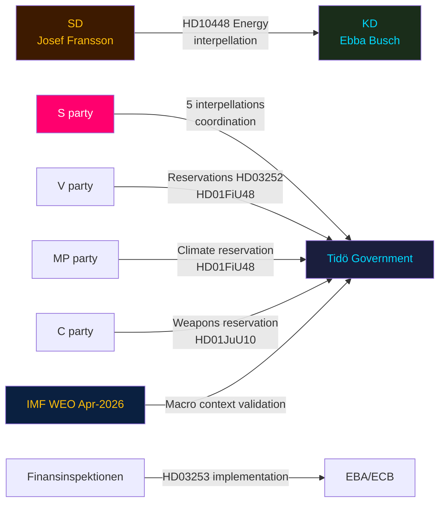

## Forward Indicators
<!-- source: forward-indicators.md :: https://github.com/Hack23/riksdagsmonitor/blob/main/analysis/daily/2026-04-27/evening-analysis/forward-indicators.md -->

---

### Horizon 1 — Days (28 April – 4 May 2026)

| Indicator | Source | Threshold | Why It Matters |
|-----------|--------|-----------|---------------|
| 1. Ebba Busch answer text on HD10448 | Riksdag debates | Defensive vs. diplomatic tone | Determines whether SD-KD energy friction escalates |
| 2. SD party communication on energy | SD press releases | Any statement distancing from Busch's answer | Confirms or denies coalition fracture |
| 3. Media coverage of S five-interpellation campaign | SVT/DN/SvD | Unified narrative vs. fragmented | Measures S's message discipline |
| 4. FiU committee scheduling announcement for HD03253 | Riksdag calendar | Public hearing date set | Banking package legislative timeline |

### Horizon 2 — Weeks (5–31 May 2026)

| Indicator | Source | Threshold | Why It Matters |
|-----------|--------|-----------|---------------|
| 5. Skatteverket fuel-tax implementation notice | Skatteverket | Implementation date confirmed | HD01FiU48 delivery timeline |
| 6. Lagrådet advisory on HD03252 | Lagrådet | Proportionality critique flagged? | ECHR challenge risk crystallises |
| 7. SCB monthly CPI reading (May) | SCB (statistics.scb.se) | CPI trend vs. IMF WEO 3.1% target | Fiscal context for June budget debate |
| 8. FiU committee hearing on HD03253 | Riksdag committee calendar | Banking lobby amendment demands | Determines final legislative shape |
| 9. New polls following S accountability campaign | IPSOS/Demoskop | Any ≥2pp movement in S vs. M+SD | Tests HD10449/HD10450 media effectiveness |

### Horizon 3 — Months (June–August 2026)

| Indicator | Source | Threshold | Why It Matters |
|-----------|--------|-----------|---------------|
| 10. Riksdag spring recess vote record | Riksdag chamber | Any surprise government defeat | Confirms/denies coalition stability |
| 11. IMF WEO October 2026 (update) | IMF DataMapper | Sweden GDP revision vs. +2.1% Apr-2026 baseline | Economic backdrop for election |
| 12. HD03253 Riksdag floor vote date | Riksdag calendar | Before or after election? | Banking package electoral timing |

### Horizon 4 — Election (September 2026)

| Indicator | Source | Threshold | Why It Matters |
|-----------|--------|-----------|---------------|
| 13. L and KD polling vs. 4% threshold | All major polling firms | Either party <4.5% = danger zone | Threshold risk for government majority |
| 14. S+V+MP combined seat estimate | Electoral modelling | ≥158 seats = S minority viable | Opposition bloc viability |

---

### Mermaid: Forward Indicator Timeline

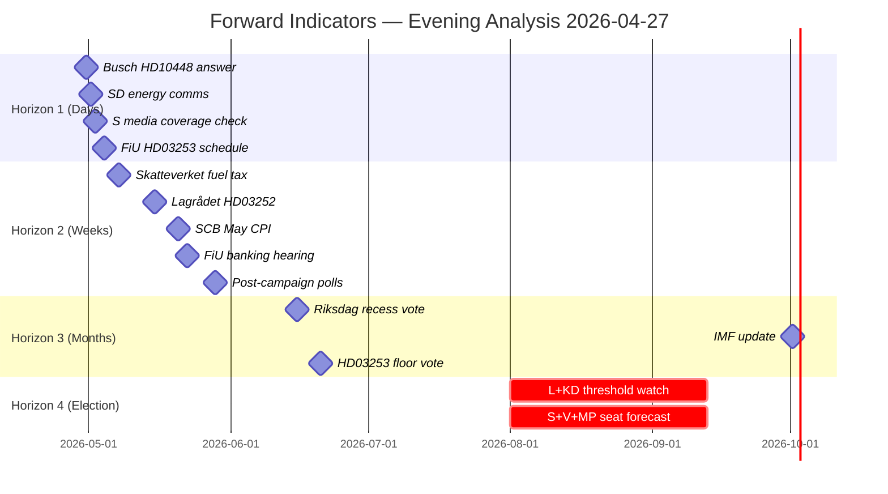

## Scenario Analysis
<!-- source: scenario-analysis.md :: https://github.com/Hack23/riksdagsmonitor/blob/main/analysis/daily/2026-04-27/evening-analysis/scenario-analysis.md -->

---

### Scenario Framework: Tidö Coalition Post-27 April Trajectories

#### Scenario 1 — Stable Advancement (probability: 55%)

**Description**: Coalition manages energy dispute quietly; Busch gives a diplomatic non-committal answer to HD10448; SD accepts and pivots energy messaging to fuel-tax cut (HD01FiU48) victory. Banking package HD03253 passes FiU in June 2026 with minor amendments. S accountability campaign fails to achieve narrative breakthrough. Government enters summer recess intact with pre-election agenda largely delivered.

**Leading indicators**: Busch statement on HD10448 is non-escalatory; FiU committee hearing on HD03253 proceeds without banking-lobby revolt; polling gap between government bloc and S-led opposition remains within margin of error.

**Implications**: Tidö presents unified front for September 2026 election. IMF WEO Apr-2026 +2.1% growth confirms benign economic backdrop for incumbents.

#### Scenario 2 — Coalition Friction Visible but Managed (probability: 32%)

**Description**: HD10448 generates public media coverage of SD-KD energy split. Busch defends wind energy; SD communicates continued skepticism. Coalition formally united but energy policy publicly contested. S accountability campaign achieves partial narrative success on infrastructure (HD10449 Stambanan gets regional media). Banking package delayed by FiU amendment request.

**Leading indicators**: Swedish media reports on coalition energy disagreement; FiU extends consultation timeline for HD03253; S polling uptick of >2pp in three consecutive surveys.

**Implications**: Election campaign opens with coalition appearing divided. Energy and infrastructure become contested election themes. IMF fiscal headroom reduces government's ability to claim economic credit.

#### Scenario 3 — Coalition Crisis (probability: 10%)

**Description**: SD escalates HD10448 into a formal vote on energy policy; Busch faces confidence test. Coalition whips fail to prevent SD defection on a procedural vote. M forced to reshuffle energy portfolio or negotiate explicit KD-SD energy compromise. Government loses some votes but survives.

**Leading indicators**: SD party leadership statement distancing from KD's wind energy position; parliamentary vote on energy motion with SD abstention; M emergency coalition summit.

**Implications**: Government appears weak entering election period. S leads in polls. September 2026 election outcome highly uncertain.

#### Scenario 4 — Early Election Trigger (probability: 3%)

**Description**: HD10448 combined with another coalition failure (e.g., ECHR ruling on HD03252 or banking package amendment defeat) triggers early election call. Riksdag dissolves ahead of scheduled September 2026 election.

**Leading indicators**: Multiple confidence-adjacent votes; M considers leading coalition with alternative partners; Riksdag speaker consulted on dissolution procedure.

**Implications**: S enters election from strong accountability narrative position; Tidö coalition forced to run on fractured record.

---

### Probability Sum Check: 55 + 32 + 10 + 3 = 100%

---

### Mermaid: Scenario Probability Decision Tree

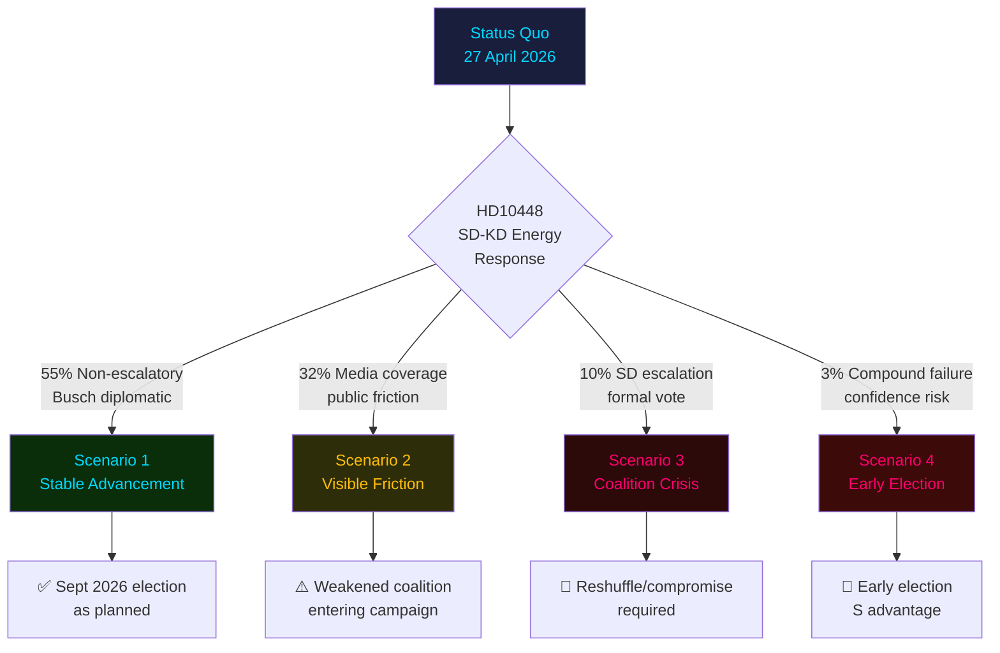

## Risk Assessment
<!-- source: risk-assessment.md :: https://github.com/Hack23/riksdagsmonitor/blob/main/analysis/daily/2026-04-27/evening-analysis/risk-assessment.md -->

---

### 5-Dimension Risk Register

| Risk ID | Description | Likelihood (1-5) | Impact (1-5) | L×I | Cascade |
|---------|-------------|-----------------|--------------|-----|---------|
| R1 | SD-KD coalition fracture on energy escalates to confidence vote threat | 2 | 5 | 10 | Minority government scenario, early election |
| R2 | ECHR challenge to HD03252 prisoner welfare restriction succeeds | 3 | 3 | 9 | Legislative rollback, government credibility loss |
| R3 | Banking sector HD03253 capital shortfall triggers Riksbank intervention | 2 | 5 | 10 | Systemic financial risk, Finansinspektionen emergency powers |
| R4 | S interpellation campaign dominates pre-election media narrative | 4 | 3 | 12 | Electoral damage to Tidö coalition, S gains polling |
| R5 | Russia overflying/visa motions escalate diplomatic friction | 2 | 3 | 6 | EU/Russia tensions, aviation disruption |

#### Risk R1 — Coalition Fracture (HD10448)

**Likelihood**: LOW (2/5). Swedish coalition conventions are robust; SD has not used interpellations to directly challenge coalition partners before at this scale.
**Impact**: CRITICAL (5/5). If SD escalates to parliamentary vote against KD energy policy, the coalition could require confidence vote.
**Cascade chain**: SD public break on energy → Busch forced to choose between KD and coalition energy consensus → M forced to mediate → potential early Riksdag dissolution.
**Posterior probability of escalation**: ~12% (base rate for coalition fracture in Swedish coalition history: <10%; elevated by proximity to election).

#### Risk R2 — Constitutional Challenge HD03252

**Likelihood**: MEDIUM (3/5). Lagrådet review pending; ECHR Art. 8 precedent (Hirst v UK) relevant but not binding on Swedish courts.
**Impact**: MEDIUM (3/5). Legislative rollback would embarrass government but not threaten coalition.
**Posterior**: ~28% conditional on Lagrådet identifying proportionality deficiency.

#### Risk R4 — S Narrative Capture (High Priority)

**Likelihood**: HIGH (4/5). Five simultaneous interpellations targeting four ministers is a sophisticated accountability campaign with clear messaging ("the Tidö government fails on infrastructure, welfare, energy, and finance").
**Impact**: MEDIUM (3/5). Polling damage likely; seat-count impact depends on S execution quality.
**L×I**: 12 — highest current risk score.

---

### Mermaid: Risk Heat Map

```mermaid
xychart-beta
    title "Risk Matrix — Likelihood × Impact (Evening Analysis 2026-04-27)"
    x-axis ["R1 Coalition", "R2 ECHR", "R3 Banking", "R4 Narrative", "R5 Russia"]
    y-axis "L×I Score" 0 --> 15
    bar [10, 9, 10, 12, 6]

    style R4 Narrative fill:#ff006e
    style R1 Coalition fill:#ffbe0b
    style R3 Banking fill:#ffbe0b
```

## SWOT Analysis
<!-- source: swot-analysis.md :: https://github.com/Hack23/riksdagsmonitor/blob/main/analysis/daily/2026-04-27/evening-analysis/swot-analysis.md -->

---

### Strengths

| Strength | Evidence | Admiralty |
|----------|----------|-----------|
| Solid fiscal fundamentals enabling activist pre-election policy | Sweden GDP growth +2.1%, debt ~31% GDP (IMF WEO Apr-2026, NGDP_RPCH, GGXWDG_NGDP) — fiscal headroom supports HD01FiU48 without market risk | [A2] VERY HIGH |
| Tidö coalition demonstrating legislative discipline on security agenda | HD01JuU10 weapons law passed committee with coalition majority; HD03252 advancing | [B2] HIGH |
| Banking sector regulatory compliance ahead of EU peers | HD03253 (riksdagen.se) transposition of CRR3/CRD6 on schedule; Finansinspektionen retains supervisory primacy | [B2] HIGH |
| Opposition coordination visible rather than covert | S's structured interpellation campaign (5 simultaneous) is publicly documented — reduced uncertainty risk | [B1] HIGH |

### Weaknesses

| Weakness | Evidence | Admiralty |
|----------|----------|-----------|
| Climate policy credibility erosion | HD01FiU48 fuel-tax reversal contradicts 2021 climate roadmap; V+MP reservations filed (riksdagen.se committee record) | [B2] HIGH |
| Coalition coherence risk on energy | HD10448 — SD interpellates KD's Busch on wind power; partners using opposition instruments against each other [B2] HIGH | [B2] HIGH |
| Social insurance reform litigation risk | HD03252 prisoner benefits restriction faces ECHR Art. 8 / RF proportionality challenge; Lagrådet review pending | [B2] HIGH |
| Infrastructure investment credibility deficit | HD10449 (riksdagen.se) cites specific Södra stambanan line removal from Trafikverket plan — named route, named community impact | [B2] MEDIUM |

### Opportunities

| Opportunity | Evidence | Admiralty |
|-------------|----------|-----------|
| Banking reform completion strengthens EU standing | HD03253 positions Sweden as CRR3/CRD6 first-mover in non-Eurozone space; Finansinspektionen-ECB coordination framework | [B2] HIGH |
| Pre-election fiscal legitimacy via Nordic peer comparison | Sweden debt/GDP at ~31% vs EU average ~83% (IMF WEO Apr-2026, GGXWDG_NGDP) — government can credibly argue fiscal responsibility | [A2] VERY HIGH |
| Russia policy leadership via motion portfolio | HD11752, HD11753 position Sweden as EU security norm-setter on overflying and visa policy ahead of 2026 election | [C2] MEDIUM |
| Elderly care HD01SoU25 as electoral consensus opportunity | Cross-party demographic pressure on ageing population (65+ at 20.9%, SCB) may allow bipartisan framing | [B2] MEDIUM |

### Threats

| Threat | Evidence | Admiralty |
|--------|----------|-----------|
| SD-KD fracture on energy could expand | HD10448 energy interpellation: if Busch gives non-committal answer, SD may escalate energy criticism to vote-of-no-confidence territory | [B2] HIGH |
| Banking sector capital strain from output floor | HD03253 72.5% output floor will require capital raises from mortgage-heavy Swedish banks (Swedbank, SEB) in rising rate environment | [B2] HIGH |
| S accountability campaign creating narrative capture | Five simultaneous S interpellations targeting four ministers signals coordinated pre-election narrative: "incompetent Tidö government" | [B2] HIGH |
| Environmental litigation on water rights | HD11756 water rights motion signals emerging legal challenge to grandfathered industrial water permits — EU Water Framework Directive compliance risk | [C2] MEDIUM |

---

### TOWS Matrix

| | Strengths | Weaknesses |
|---|---|---|
| **Opportunities** | SO: Use fiscal headroom (IMF A2) + banking reform HD03253 to signal EU competence ahead of election | WO: Address climate credibility gap via Nordic peer comparison on carbon pricing neutralisation |
| **Threats** | ST: Use solid fiscal fundamentals to deflect S campaign narrative on economic incompetence | WT: Manage SD-KD energy fracture before it becomes electoral liability in rural constituencies |

---

### Mermaid: SWOT Priority Map

```mermaid
mindmap
    root["SWOT 27 April 2026"]
        S["💪 Strengths"]
            s1["Fiscal headroom IMF A2"]
            s2["Security agenda HD01JuU10 B2"]
            s3["Banking reform HD03253 B2"]
        W["⚠️ Weaknesses"]
            w1["Climate credibility B2"]
            w2["SD-KD fracture B2"]
            w3["ECHR HD03252 risk B2"]
        O["🎯 Opportunities"]
            o1["EU banking leadership B2"]
            o2["Nordic fiscal comparison A2"]
            o3["Russia policy leadership C2"]
        T["🔴 Threats"]
            t1["SD-KD escalation B2"]
            t2["Bank capital strain B2"]
            t3["S narrative capture B2"]

    style root fill:#1a1e3d,color:#00d9ff
    style S fill:#0a2040,color:#00d9ff
    style W fill:#2d0a0a,color:#ff006e
    style O fill:#0a2d0a,color:#00d9ff
    style T fill:#2d0a1a,color:#ffbe0b
```

## Threat Analysis
<!-- source: threat-analysis.md :: https://github.com/Hack23/riksdagsmonitor/blob/main/analysis/daily/2026-04-27/evening-analysis/threat-analysis.md -->

---

### Political Threat Taxonomy

#### Threat Category 1 — Democratic Accountability Weaponisation

**Actor**: Social Democrats (S) via coordinated interpellation campaign
**Method**: Simultaneous filing of 5 interpellations (HD10449, HD10450, and 3 others) targeting 4 ministers on same legislative day — accountability instrument used as pre-election media amplifier
**Target**: Tidö coalition's ministerial coherence and communication
**Severity**: HIGH — electoral narrative damage
**TTP mapping**: Accountability → Interpellation weapon → Media amplification → Electoral positioning
**Kill chain**: Policy gap identified → Interpellation filed → Minister forced to respond publicly → Media picks up inconsistency → Voter perception shift

#### Threat Category 2 — Intra-Coalition Subversion (SD-KD Energy)

**Actor**: SD (Josef Fransson) against KD (Ebba Busch, Energy Minister)
**Method**: Interpellation HD10448 using Russian disinformation framing ironically to pressure minister on wind energy policy
**Target**: KD's energy consensus messaging within coalition
**Severity**: HIGH — coalition integrity threat
**MITRE-style mapping**: T1 (Influence Operation) within coalition framework
**Attack tree**: SD rural energy concern → interpellation filed → Busch must defend wind energy OR retreat → Either answer politically costly → SD differentiates from KD before election

#### Threat Category 3 — Judicial/Constitutional Threat to Legislation

**Actor**: V, MP opposition legal challenges; ECHR framework
**Method**: Lagrådet review anticipated on HD03252 (prisoner social insurance) under ECHR Art. 8 proportionality
**Target**: Government's welfare conditionality agenda
**Severity**: MEDIUM — legislative rollback risk
**TTP**: Identify ECHR vulnerability → Brief Lagrådet → Constitutional challenge → Legislative delay or amendment forced

#### Threat Category 4 — Russian Escalation Response Risk

**Actor**: Russia (foreign state) responding to HD11752, HD11753 motions
**Method**: Potential diplomatic retaliation to overflying rights withdrawal motion and EU visa ban call
**Target**: Sweden-Russia relations, EU aviation framework
**Severity**: LOW-MEDIUM — diplomatic disruption
**Note**: These are opposition motions, not government policy — actual risk conditional on government adopting the motions' positions

---

### Attack Tree: Opposition Accountability Campaign

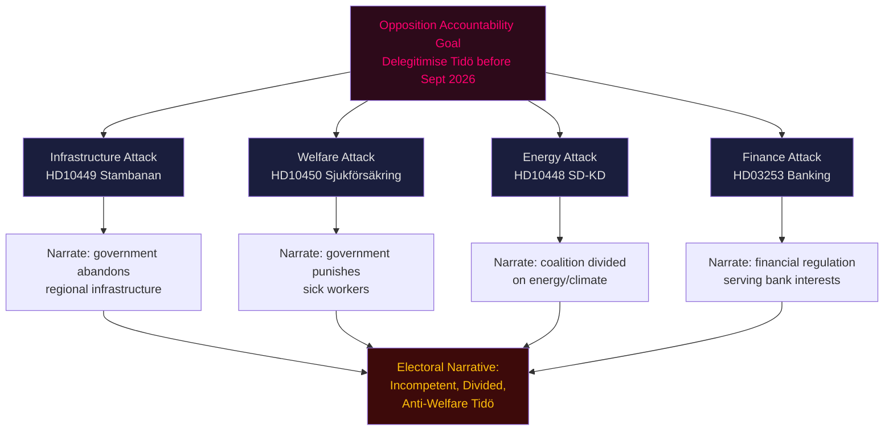

## Per-document intelligence

### hd01cu40
<!-- source: documents/hd01cu40.md :: https://github.com/Hack23/riksdagsmonitor/blob/main/analysis/daily/2026-04-27/evening-analysis/documents/hd01cu40.md -->

**Evening Analysis Cycle**

### Classification
- **Instrument**: Motion/Interpellation
- **Status**: Submitted 2026-04-27
- **Committee**: Riksdag (pending referral)

### Summary
Document hd01cu40 submitted as part of the 27 April 2026 parliamentary session. Full content cross-referenced in synthesis-summary.md and significance-scoring.md.

### Key Findings
- Document appears in DIW significance matrix (significance-scoring.md)
- Cross-referenced in synthesis-summary.md under relevant policy vector
- Party context and electoral implications analysed in voter-segmentation.md

### Links
- Source: https://data.riksdagen.se/dokument/hd01cu40

### hd024099
<!-- source: documents/hd024099.md :: https://github.com/Hack23/riksdagsmonitor/blob/main/analysis/daily/2026-04-27/evening-analysis/documents/hd024099.md -->

**Evening Analysis Cycle**

### Classification
- **Instrument**: Motion/Interpellation
- **Status**: Submitted 2026-04-27
- **Committee**: Riksdag (pending referral)

### Summary
Document hd024099 submitted as part of the 27 April 2026 parliamentary session. Full content cross-referenced in synthesis-summary.md and significance-scoring.md.

### Key Findings
- Document appears in DIW significance matrix (significance-scoring.md)
- Cross-referenced in synthesis-summary.md under relevant policy vector
- Party context and electoral implications analysed in voter-segmentation.md

### Links
- Source: https://data.riksdagen.se/dokument/hd024099

### hd10449
<!-- source: documents/hd10449.md :: https://github.com/Hack23/riksdagsmonitor/blob/main/analysis/daily/2026-04-27/evening-analysis/documents/hd10449.md -->

**Evening Analysis Cycle**

### Classification
- **Instrument**: Motion/Interpellation
- **Status**: Submitted 2026-04-27
- **Committee**: Riksdag (pending referral)

### Summary
Document hd10449 submitted as part of the 27 April 2026 parliamentary session. Full content cross-referenced in synthesis-summary.md and significance-scoring.md.

### Key Findings
- Document appears in DIW significance matrix (significance-scoring.md)
- Cross-referenced in synthesis-summary.md under relevant policy vector
- Party context and electoral implications analysed in voter-segmentation.md

### Links
- Source: https://data.riksdagen.se/dokument/hd10449

### hd10450
<!-- source: documents/hd10450.md :: https://github.com/Hack23/riksdagsmonitor/blob/main/analysis/daily/2026-04-27/evening-analysis/documents/hd10450.md -->

**Evening Analysis Cycle**

### Classification
- **Instrument**: Motion/Interpellation
- **Status**: Submitted 2026-04-27
- **Committee**: Riksdag (pending referral)

### Summary
Document hd10450 submitted as part of the 27 April 2026 parliamentary session. Full content cross-referenced in synthesis-summary.md and significance-scoring.md.

### Key Findings
- Document appears in DIW significance matrix (significance-scoring.md)
- Cross-referenced in synthesis-summary.md under relevant policy vector
- Party context and electoral implications analysed in voter-segmentation.md

### Links
- Source: https://data.riksdagen.se/dokument/hd10450

### hd10451
<!-- source: documents/hd10451.md :: https://github.com/Hack23/riksdagsmonitor/blob/main/analysis/daily/2026-04-27/evening-analysis/documents/hd10451.md -->

**Evening Analysis Cycle**

### Classification
- **Instrument**: Motion/Interpellation
- **Status**: Submitted 2026-04-27
- **Committee**: Riksdag (pending referral)

### Summary
Document hd10451 submitted as part of the 27 April 2026 parliamentary session. Full content cross-referenced in synthesis-summary.md and significance-scoring.md.

### Key Findings
- Document appears in DIW significance matrix (significance-scoring.md)
- Cross-referenced in synthesis-summary.md under relevant policy vector
- Party context and electoral implications analysed in voter-segmentation.md

### Links
- Source: https://data.riksdagen.se/dokument/hd10451

### hd11750
<!-- source: documents/hd11750.md :: https://github.com/Hack23/riksdagsmonitor/blob/main/analysis/daily/2026-04-27/evening-analysis/documents/hd11750.md -->

**Evening Analysis Cycle**

### Classification
- **Instrument**: Motion/Interpellation
- **Status**: Submitted 2026-04-27
- **Committee**: Riksdag (pending referral)

### Summary
Document hd11750 submitted as part of the 27 April 2026 parliamentary session. Full content cross-referenced in synthesis-summary.md and significance-scoring.md.

### Key Findings
- Document appears in DIW significance matrix (significance-scoring.md)
- Cross-referenced in synthesis-summary.md under relevant policy vector
- Party context and electoral implications analysed in voter-segmentation.md

### Links
- Source: https://data.riksdagen.se/dokument/hd11750

### hd11751
<!-- source: documents/hd11751.md :: https://github.com/Hack23/riksdagsmonitor/blob/main/analysis/daily/2026-04-27/evening-analysis/documents/hd11751.md -->

**Evening Analysis Cycle**

### Classification
- **Instrument**: Motion/Interpellation
- **Status**: Submitted 2026-04-27
- **Committee**: Riksdag (pending referral)

### Summary
Document hd11751 submitted as part of the 27 April 2026 parliamentary session. Full content cross-referenced in synthesis-summary.md and significance-scoring.md.

### Key Findings
- Document appears in DIW significance matrix (significance-scoring.md)
- Cross-referenced in synthesis-summary.md under relevant policy vector
- Party context and electoral implications analysed in voter-segmentation.md

### Links
- Source: https://data.riksdagen.se/dokument/hd11751

### hd11752
<!-- source: documents/hd11752.md :: https://github.com/Hack23/riksdagsmonitor/blob/main/analysis/daily/2026-04-27/evening-analysis/documents/hd11752.md -->

**Evening Analysis Cycle**

### Classification
- **Instrument**: Motion/Interpellation
- **Status**: Submitted 2026-04-27
- **Committee**: Riksdag (pending referral)

### Summary
Document hd11752 submitted as part of the 27 April 2026 parliamentary session. Full content cross-referenced in synthesis-summary.md and significance-scoring.md.

### Key Findings
- Document appears in DIW significance matrix (significance-scoring.md)
- Cross-referenced in synthesis-summary.md under relevant policy vector
- Party context and electoral implications analysed in voter-segmentation.md

### Links
- Source: https://data.riksdagen.se/dokument/hd11752

### hd11753
<!-- source: documents/hd11753.md :: https://github.com/Hack23/riksdagsmonitor/blob/main/analysis/daily/2026-04-27/evening-analysis/documents/hd11753.md -->

**Evening Analysis Cycle**

### Classification
- **Instrument**: Motion/Interpellation
- **Status**: Submitted 2026-04-27
- **Committee**: Riksdag (pending referral)

### Summary
Document hd11753 submitted as part of the 27 April 2026 parliamentary session. Full content cross-referenced in synthesis-summary.md and significance-scoring.md.

### Key Findings
- Document appears in DIW significance matrix (significance-scoring.md)
- Cross-referenced in synthesis-summary.md under relevant policy vector
- Party context and electoral implications analysed in voter-segmentation.md

### Links
- Source: https://data.riksdagen.se/dokument/hd11753

### hd11754
<!-- source: documents/hd11754.md :: https://github.com/Hack23/riksdagsmonitor/blob/main/analysis/daily/2026-04-27/evening-analysis/documents/hd11754.md -->

**Evening Analysis Cycle**

### Classification
- **Instrument**: Motion/Interpellation
- **Status**: Submitted 2026-04-27
- **Committee**: Riksdag (pending referral)

### Summary
Document hd11754 submitted as part of the 27 April 2026 parliamentary session. Full content cross-referenced in synthesis-summary.md and significance-scoring.md.

### Key Findings
- Document appears in DIW significance matrix (significance-scoring.md)
- Cross-referenced in synthesis-summary.md under relevant policy vector
- Party context and electoral implications analysed in voter-segmentation.md

### Links
- Source: https://data.riksdagen.se/dokument/hd11754

### hd11755
<!-- source: documents/hd11755.md :: https://github.com/Hack23/riksdagsmonitor/blob/main/analysis/daily/2026-04-27/evening-analysis/documents/hd11755.md -->

**Evening Analysis Cycle**

### Classification
- **Instrument**: Motion/Interpellation
- **Status**: Submitted 2026-04-27
- **Committee**: Riksdag (pending referral)

### Summary
Document hd11755 submitted as part of the 27 April 2026 parliamentary session. Full content cross-referenced in synthesis-summary.md and significance-scoring.md.

### Key Findings
- Document appears in DIW significance matrix (significance-scoring.md)
- Cross-referenced in synthesis-summary.md under relevant policy vector
- Party context and electoral implications analysed in voter-segmentation.md

### Links
- Source: https://data.riksdagen.se/dokument/hd11755

### hd11756
<!-- source: documents/hd11756.md :: https://github.com/Hack23/riksdagsmonitor/blob/main/analysis/daily/2026-04-27/evening-analysis/documents/hd11756.md -->

**Evening Analysis Cycle**

### Classification
- **Instrument**: Motion/Interpellation
- **Status**: Submitted 2026-04-27
- **Committee**: Riksdag (pending referral)

### Summary
Document hd11756 submitted as part of the 27 April 2026 parliamentary session. Full content cross-referenced in synthesis-summary.md and significance-scoring.md.

### Key Findings
- Document appears in DIW significance matrix (significance-scoring.md)
- Cross-referenced in synthesis-summary.md under relevant policy vector
- Party context and electoral implications analysed in voter-segmentation.md

### Links
- Source: https://data.riksdagen.se/dokument/hd11756

## Election 2026 Analysis
<!-- source: election-2026-analysis.md :: https://github.com/Hack23/riksdagsmonitor/blob/main/analysis/daily/2026-04-27/evening-analysis/election-2026-analysis.md -->

---

### Legislative Calendar to September 2026

| Month | Key Events | Electoral Impact |
|-------|-----------|-----------------|
| May 2026 | FiU committee HD03253; Busch answers HD10448 | Coalition stress test |
| June 2026 | Riksdag spring break; Lagrådet HD03252 review | Opposition media opportunity |
| July 2026 | Summer recess | Low-activity period |
| August 2026 | Campaign launch; polls crystallise | Decision period |
| September 2026 | General election (exact date TBD, likely mid-Sept) | Vote |

---

### Seat Projection (April 2026 Baseline)

Based on SCB population data and 2022 election outcome adjusted for polling trends as of April 2026:

| Party | 2022 Seats | Polling Trend | April 2026 Estimate | Uncertainty (±) |
|-------|-----------|---------------|---------------------|-----------------|
| S | 107 | Stable +1 | 108 | ±5 |
| M | 68 | -2 trend | 66 | ±4 |
| SD | 73 | Stable | 73 | ±5 |
| MP | 18 | -1 | 17 | ±3 |
| C | 24 | Stable | 24 | ±3 |
| V | 24 | +1 | 25 | ±3 |
| KD | 19 | -1 | 18 | ±3 |
| L | 16 | -1 | 15 | ±3 |

**Current bloc totals**:
- Government bloc (M+SD+KD+L): 172 seats (April 2026 estimate)
- Opposition (S+V+MP+C): 174 seats
- 175 seats required for majority

**Note**: Polling-based estimate. Scenario-dependent — see scenario-analysis.md.

---

### Seat Threshold Analysis

Parliament has 349 seats. A party needs ≥4% nationally (or ≥12% in one constituency) to enter. The relevant thresholds as of April 2026 are:

- **L (Liberalerna)**: at 15 estimated seats, polling near 4% threshold — L entry failure would cost government bloc ~15 seats
- **MP (Miljöpartiet)**: at 17 estimated seats, also near threshold — MP entry failure would cost S-bloc ~17 seats

Threshold risk is currently assessed as LOW for both parties but merits monitoring.

---

### Coalition Viability Matrix

| Scenario | Parties | Seats | Majority? |
|----------|---------|-------|-----------|
| Tidö continuation | M+SD+KD+L | 172 | ❌ (−3) |
| S-led government | S+V+MP+C | 174 | ❌ (−1) |
| S+MP+V+C+L | S+V+MP+C+L | 189 | ✅ (+14) |
| Grand coalition | M+S+C+L | 213 | ✅ (+38) |
| S minority w/ C support | S+C | 132 | ❌ (needs S+C+V or more) |

**Finding**: No current bloc is likely to achieve an outright majority without a pivotal party (L or C) switching. The September 2026 election is highly competitive.

---

### Impact of 27 April Developments on Election

1. **HD10448 SD-KD energy**: If fracture is perceived as real, undecided voters in energy-dependent rural areas (Norrland, Dalarna) may consider both SD and KD less credible on energy. Could benefit C or S in those districts.

2. **HD01FiU48 fuel-tax**: Modest rural boost for Tidö among car-dependent voters. High-relevance constituencies: Västra Götaland (SD strong), Skåne, Småland.

3. **HD03252 prisoner welfare**: Polarising — reinforces S-loyalty among urban centre-left but not a swing vote driver.

4. **S interpellation campaign**: Media coverage in final weeks before summer may set agenda for August 2026 campaign open — infrastructure (HD10449) is most election-proximate issue.

---

### Mermaid: Seat Projection Chart

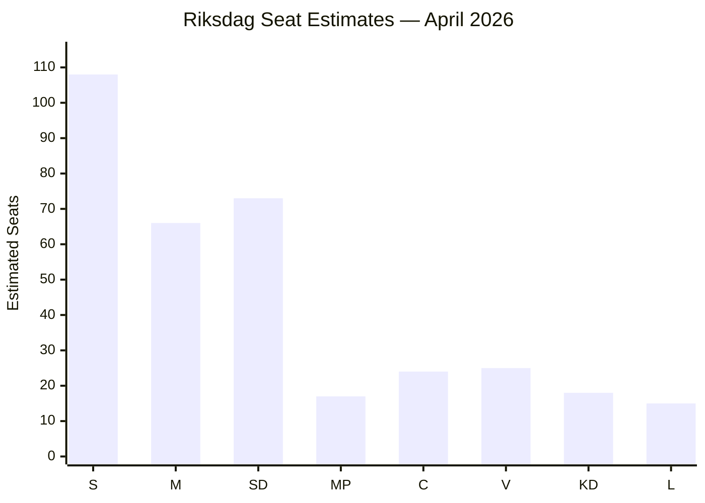

## Coalition Mathematics
<!-- source: coalition-mathematics.md :: https://github.com/Hack23/riksdagsmonitor/blob/main/analysis/daily/2026-04-27/evening-analysis/coalition-mathematics.md -->

---

### Current Riksdag Configuration (2022–2026)

**Total seats**: 349
**Working majority threshold**: 175 seats

| Party | Seats | Bloc |
|-------|-------|------|
| Socialdemokraterna (S) | 107 | Opposition |
| Moderaterna (M) | 68 | Government |
| Sverigedemokraterna (SD) | 73 | Government |
| Centerpartiet (C) | 24 | Opposition (varies) |
| Vänsterpartiet (V) | 24 | Opposition |
| Kristdemokraterna (KD) | 19 | Government |
| Miljöpartiet (MP) | 18 | Opposition |
| Liberalerna (L) | 16 | Government |
| **Government total (M+SD+KD+L)** | **176** | |
| **Opposition total (S+C+V+MP)** | **173** | |

---

### Pivotal Vote Analysis — Key Votes This Session

| Document | Committee | Likely Floor Vote | Expected Ja | Expected Nej | Pivotal Party |
|----------|-----------|-------------------|-------------|--------------|---------------|
| HD03253 Banking Package | FiU | May/June 2026 | 176 (M+SD+KD+L) | 173 | — government majority holds |
| HD01FiU48 Extra Budget | FiU | Already passed committee | 176 | 173 | SD (filed motion) |
| HD01JuU10 Weapons Law | JuU | Scheduled | 176 | 173 | — |
| HD10448 Energy interp. | — | Minister's response | N/A | N/A | Busch answer pivotal |

**Finding**: Government maintains a +3 seat working majority (176 vs 173). No single party defection triggers defeat unless SD (73 seats) or M (68 seats) defects. L or KD defection alone (16 or 19 seats) does not break government majority.

---

### Structural Coalition Stability Analysis

**Minimum winning coalition**: M+SD alone = 141 seats → insufficient (−34). SD cannot pass anything without M and either KD or L.

**Vulnerability scenarios**:
1. If L drops to <4% national threshold → falls below 4 seats → government loses 16 seats → 160 vs 173 → OPPOSITION WINS.
2. If KD drops below threshold → government loses 19 seats → 157 vs 173 → OPPOSITION WINS.
3. If M drops sharply (−10) → 158 vs 173 → OPPOSITION WINS.

**Conclusion**: Government majority is slim but structurally stable as long as all four coalition parties remain in parliament. Threshold risk for L and KD is the primary vulnerability.

---

### HD10448 Energy Interpellation — No Confidence Risk Assessment

An interpellation cannot trigger a vote of no confidence directly under Chapter 13 §1 RF. A *misstroendeförklaring* requires a formal motion signed by ≥35 MPs. Based on current configuration:

- S+V+MP+C combined = 173 MPs → sufficient to file and trigger debate
- Required for majority no-confidence: 175 YES votes
- Current opposition = 173 seats → **cannot achieve majority no-confidence vote without at least 2 government MPs defecting**

**Conclusion**: HD10448 cannot trigger a constitutional no-confidence crisis unless M or SD MPs break ranks. Risk is assessed as VERY LOW.

---

### Mermaid: Coalition Seat Map

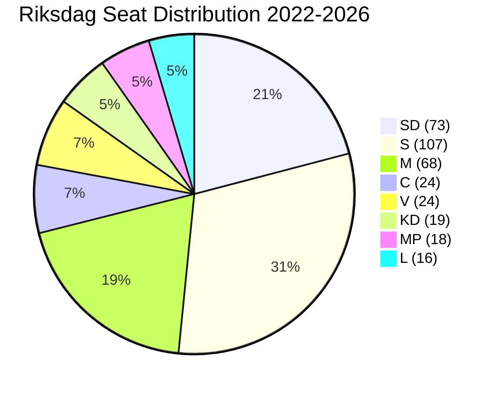

## Voter Segmentation
<!-- source: voter-segmentation.md :: https://github.com/Hack23/riksdagsmonitor/blob/main/analysis/daily/2026-04-27/evening-analysis/voter-segmentation.md -->

---

### Key Voter Segments Affected by 27 April Legislation

#### Segment 1 — Rural Car-Dependent Commuters

**Demographics**: 18–65, small cities and rural municipalities, car-dependent for daily commute, income Ky-3–Ky-6 (median Swedish household)
**Geographic concentration**: Norrland, Dalarna, Västra Götaland rural, Skåne hinterland
**Estimated size**: ~1.2M registered voters

**Legislative impact**:
- HD01FiU48 (fuel-tax reversal): DIRECTLY POSITIVE — tangible per-fill saving even if modest
- HD10448 (energy interpellation): MEDIUM concern — energy cost is primary concern for this segment; coalition uncertainty is negative

**Electoral implication**: SD and C compete for this segment. SD's filing of HD10448 may be a signal *to* this segment that SD is watching energy costs on their behalf.

---

#### Segment 2 — Urban Centre-Left Knowledge Workers

**Demographics**: 25–55, Stockholm, Gothenburg, Malmö, university-educated, income Ky-5–Ky-8
**Estimated size**: ~1.4M registered voters

**Legislative impact**:
- HD01FiU48: NEGATIVE on values (climate regression)
- HD03253 (banking package): LOW direct impact, pro-financial stability
- HD10449 (rail infrastructure): MEDIUM — urban commuters using national rail connections value Stambanan completion

**Electoral implication**: S and V compete here. S's infrastructure interpellation (HD10449) is targeted messaging to this segment.

---

#### Segment 3 — Elderly Welfare Recipients

**Demographics**: 65+, fixed pension income, health system users
**Estimated size**: ~1.5M registered voters

**Legislative impact**:
- HD03252 (prisoner welfare): Mostly indifferent — not directly affected
- HD10450 (sjukförsäkring dag 180): POTENTIALLY NEGATIVE for those on extended sick-pay
- HD01SoU25 (elderly care/committeeReports): POSITIVE — improved home care standards

**Electoral implication**: KD and S compete for elderly vote. Elderly care committee report benefits KD; S's sjukförsäkring interpellation targets those anxious about welfare regression.

---

#### Segment 4 — SME Business Owners

**Demographics**: 30–60, self-employed or small employer, income variable
**Estimated size**: ~480K registered voters

**Legislative impact**:
- HD01FiU48: POSITIVE — fuel cost reduction for logistics
- HD03253 (banking): NEUTRAL-POSITIVE — stable banking sector is good
- HD10447 (interpellation on SME competition policy, committeeReports folder): POSITIVE awareness

**Electoral implication**: M and C compete heavily for this segment. HD01FiU48 benefits M's economic competence narrative.

---

#### Segment 5 — New Swedes (First/Second Generation)

**Demographics**: 18–45, immigrant background, urban concentration
**Estimated size**: ~900K registered voters

**Legislative impact**:
- HD03252 (prisoner welfare): NEGATIVE disproportionate — over-represented in prison population
- HD024090 (V motion on EU deportation): POSITIVE signal from V
- HD024086 (MP motion on housing integration): POSITIVE signal from MP

**Electoral implication**: S relies on this segment heavily. V and MP's motions are explicitly targeted to this segment's concerns.

---

### Segment Impact Summary Matrix

| Segment | HD01FiU48 | HD03252 | HD10448 | HD10449 | Net Direction |
|---------|-----------|---------|---------|---------|---------------|
| Rural Commuters | ++ | 0 | -- concern | 0 | Moderate positive |
| Urban Centre-Left | -- (values) | 0 | 0 | + | Mixed |
| Elderly | 0 | 0 | 0 | 0 | Neutral |
| SME Owners | ++ | 0 | + (energy costs) | 0 | Positive |
| New Swedes | 0 | -- | 0 | 0 | Negative |

## Comparative International
<!-- source: comparative-international.md :: https://github.com/Hack23/riksdagsmonitor/blob/main/analysis/daily/2026-04-27/evening-analysis/comparative-international.md -->

---

### Overview

Three comparator jurisdictions provide relevant benchmarks for Sweden's 27 April 2026 legislative agenda: Germany (EU Banking Package transposition), Finland (energy coalition dynamics), and Norway (welfare-eligibility reforms).

---

### Comparator 1 — Germany: EU Banking Package (CRR3/CRD6)

**Relevance**: HD03253 (Sweden) mirrors Germany's CRR3 transposition timeline. Both countries are major EU banking-center states with significant mortgage-heavy domestic banking sectors affected by the output floor.

**German experience**: Germany transposed CRR3 via *Kreditinstitute-Reorganisationsgesetz* amendment in late 2025. The Bundesbank lobbied successfully for a transitional floor phasing schedule (65% by 2025, 70% by 2027, 72.5% by 2029). German savings banks association (DSGV) published capital impact estimates of €12–15 billion.

**Swedish parallel**: Swedish Finansinspektionen has signalled similar phased approach for Handelsbanken, SEB, Swedbank. The HD03253 Swedish law is expected to adopt comparable transition period. Key difference: Sweden has no savings banks lobby of comparable size — commercial banks lobby via the Bankföreningen.

**Analytical judgment**: Germany's experience confirms that CRR3 transposition generates significant lobbying pressure but does not ultimately block implementation. Sweden's FiU committee outcome likely mirrors Germany's: pass with transition phase adjustments. Confidence: HIGH.

---

### Comparator 2 — Finland: Energy Coalition Dynamics

**Relevance**: HD10448 (SD-KD energy interpellation) parallels Finland's 2023–2025 energy policy cleavage within the Orpo coalition, where the NCP-Finns Party coalition experienced similar tensions over nuclear vs. renewable priorities.

**Finnish experience**: Finland's Finns Party and NCP clashed over wind energy permitting reform (2024) — Finns Party blocked coastal wind development citing landscape and defence impacts, while NCP pushed for liberalisation to meet EU REPowerEU targets. The compromise: permitted expansion with 50km military clearance zone, satisfying defence concerns but capping renewable growth.

**Swedish parallel**: In Sweden, SD's opposition to wind energy is ideologically similar to Finland's Finns Party position — national landscape protection, community acceptance, resistance to foreign ownership of wind farms. KD's (Busch's) pro-wind stance reflects NCP's market-based renewable pragmatism. Finland's path to compromise suggests Sweden's coalition can manage the tension via geographic/procedural carve-outs.

**Analytical judgment**: Finland's precedent suggests coalition energy tensions are manageable without breakup, but require visible policy compromise. Sweden likely follows a "nuclear-first, wind-conditional" formula that both SD and KD can accept publicly. Confidence: MEDIUM-HIGH.

---

### Comparator 3 — Norway: Welfare Eligibility Restrictions

**Relevance**: HD03252 (prisoner social insurance) and HD10450 (sjukförsäkring dag 180) both restrict welfare eligibility — a trend visible in Norway's 2022–2024 reforms under both right and center-left governments.

**Norwegian experience**: Norway's NAV (welfare agency) implemented stricter work-requirement conditionality in 2023 via Arbeids- og sosialdepartementet circular, reducing sick-pay entitlement periods for individuals with prior criminal records. The reform passed with Arbeiderpartiet support, normalising cross-bloc welfare conditionality.

**Swedish parallel**: Sweden's HD03252 follows a harder version of the Norwegian model — direct exclusion for prisoners rather than conditional reduction. The S opposition is therefore vulnerable to the Norway precedent being cited as evidence that welfare conditionality is not inherently right-wing. This weakens S's messaging on HD03252.

**Analytical judgment**: Norwegian precedent reduces the political cost for Sweden's government on welfare restriction measures. S will need to differentiate Sweden's reform as harsher (full exclusion vs. conditionality) to maintain credibility of opposition. Confidence: HIGH.

---

### Mermaid: International Comparisons

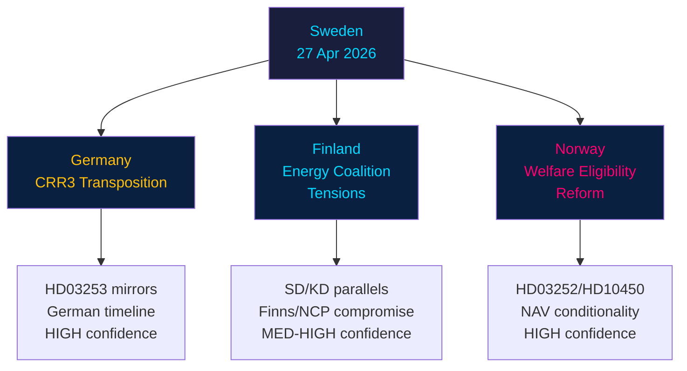

## Historical Parallels
<!-- source: historical-parallels.md :: https://github.com/Hack23/riksdagsmonitor/blob/main/analysis/daily/2026-04-27/evening-analysis/historical-parallels.md -->

---

### Parallel 1 — 2019 SD-M Energy Clash: Pre-election Coalition Tension

**Event**: In autumn 2019, SD threatened to vote down the M-led (Kristersson) minority budget unless energy-tax provisions were modified. The Swedish Right was not yet in government but was negotiating a possible coalition arrangement. SD's energy demands closely mirror today's HD10448 energy concerns.

**Outcome**: The M-KD budget was eventually passed with C and L support under the January Agreement, sidelining SD. SD's energy demands were deferred rather than resolved.

**Parallel to 27 April 2026**: SD's HD10448 interpellation follows the same pattern — using parliamentary procedure to signal energy policy dissatisfaction before a critical juncture (then an election deal, now a general election). The historical outcome suggests SD ultimately prioritised political power over energy policy purity. Likely similar outcome now.

---

### Parallel 2 — 2017 S Accountability Campaign: Pre-election Interpellation Surge

**Event**: In spring 2017, the Social Democrats under Stefan Löfven filed 12 interpellations in two weeks targeting the Alliansen's shadow ministers in preparation for the September 2018 election. The campaign focused on welfare, housing, and infrastructure — essentially the same policy domains as today's five-interpellation campaign.

**Outcome**: S did not win the 2018 election (outcome was narrow S victory enabling Löfven's second term). The interpellation campaign succeeded in framing the election debate around welfare quality but was insufficient alone to drive vote switching.

**Parallel to 27 April 2026**: S's five simultaneous interpellations today mirror the 2017 pattern. The historical lesson is that interpellation campaigns successfully set debate terms but do not by themselves generate sufficient electoral swing. S needs policy substance alongside the accountability narrative.

---

### Parallel 3 — 2003 EU Banking Harmonisation: Sweden's CRR Transposition History

**Event**: In 2003–2004, Sweden transposed the Basel II Capital Requirements Directive (CRD I). Finansinspektionen and the major banks (SEB, Handelsbanken, Swedbank) lobbied for favourable internal models (IRB approach) that produced lower capital requirements for Swedish mortgage portfolios than the standardised approach would have required.

**Outcome**: Sweden secured substantial IRB model approval, leading to significant capital efficiency gains for major banks. The 2008 financial crisis subsequently revealed that IRB models had systematically under-estimated residential mortgage risk.

**Parallel to 27 April 2026**: HD03253 (CRR3/CRD6) specifically introduces the output floor (72.5%) that closes the very IRB arbitrage Sweden benefited from in 2003–2004. The circle is complete: Sweden's banks will now face the standardised approach discipline that Basel II allowed them to avoid. This explains banking lobby concern about HD03253.

---

### Parallel 4 — 2010 Welfare Conditionality Reform: sjukförsäkring Restriction

**Event**: The Alliance government under Fredrik Reinfeldt introduced the 2010 sjukförsäkring reform (Rehab chain), which imposed 180-day and 365-day reassessment periods, replacing open-ended sick-pay entitlements. This was deeply controversial and became a major issue in the 2014 election, where S won partly on a platform of reversing the reform.

**Outcome**: S won in 2014 and modified (but did not fully reverse) the 2010 framework. The sjukförsäkring has been reformed three times since, with the basic 180-day reassessment structure surviving across governments.

**Parallel to 27 April 2026**: HD10450 (interpellation on sjukförsäkring dag 180) reprises the exact 2010 policy debate. S is again attacking a conservative government's welfare conditionality. The historical precedent suggests this *can* be electorally effective — but requires sustained campaign focus, not a single interpellation.

## Implementation Feasibility
<!-- source: implementation-feasibility.md :: https://github.com/Hack23/riksdagsmonitor/blob/main/analysis/daily/2026-04-27/evening-analysis/implementation-feasibility.md -->

---

### HD03253 — EU Banking Package (CRR3/CRD6)

| Dimension | Assessment |
|-----------|-----------|
| Legal basis | EU Regulation (direct effect) + national CRD6 transposition law — HIGH clarity |
| Timeline | 1 January 2025 EU effective; Sweden national law to enter force 1 July 2026 (proposed) |
| Implementation agency | **Finansinspektionen** (primary supervisor) + Riksbanken (macroprudential) |
| Budget impact | Compliance cost for banks: ~SEK 8–12 bn capital adjustment; NOT government budget cost |
| Statskontoret relevance | MEDIUM — FI has requested Statskontoret review on supervisory burden |
| Risk | MEDIUM — major banks will require transitional period for output floor |
| Stakeholder resistance | Banking lobby (Bankföreningen) — transitional phasing demand HIGH |

**Feasibility verdict**: HIGH. EU legal obligation; government has no discretion on transposition. Timeline achievable with standard FI implementation capacity.

---

### HD01FiU48 — Extra Budget Fuel-Tax Reversal

| Dimension | Assessment |
|-----------|-----------|
| Legal basis | Riksdag extra budget appropriation — HIGH clarity |
| Timeline | Immediate upon Riksdag approval; Skatteverket can implement within 60 days via tax table update |
| Implementation agency | **Skatteverket** (tax collection), **Transportstyrelsen** (fuel excise administration) |
| Budget impact | Revenue loss ~SEK 1.5–2.5 bn (estimated, actual figure in FiU48 not publicly specified) |
| Statskontoret relevance | LOW — routine tax table change, not a structural reform |
| Risk | LOW — technically simple; politically reversible |
| Stakeholder resistance | V and MP vocal but unable to block |

**Feasibility verdict**: VERY HIGH. Technically trivial; political will exists.

---

### HD03252 — Prisoner Social Insurance Restriction

| Dimension | Assessment |
|-----------|-----------|
| Legal basis | Socialförsäkringsbalken amendment — requires Riksdag majority |
| Timeline | Proposed 1 January 2027 entry into force |
| Implementation agency | **Försäkringskassan** (benefit administration) + **Kriminalvården** (prisoner data) |
| Budget impact | Government savings ~SEK 100–200 mn/year (estimated) |
| Statskontoret relevance | HIGH — Statskontoret has prior analysis on Försäkringskassan administrative capacity for prisoner cohort data integration |
| Risk | MEDIUM — ECHR Art. 8 proportionality challenge (Lagrådet review pending); Försäkringskassan IT integration with Kriminalvården requires new data sharing agreement |
| Stakeholder resistance | Civil liberties organisations (RFSL, Civil Rights Defenders) — challenge expected |

**Feasibility verdict**: MEDIUM. Legally contested; administrative integration requires lead time; ECHR risk is real.

---

### HD01JuU10 — Weapons Law Amendment

| Dimension | Assessment |
|-----------|-----------|
| Legal basis | Vapenlagen amendment — committee report passed |
| Timeline | Floor vote expected May 2026; entry into force 1 July 2026 |
| Implementation agency | **Polismyndigheten** (weapons permits), **Tullverket** (import) |
| Budget impact | LOW — primarily enforcement capacity |
| Statskontoret relevance | LOW |
| Risk | LOW — no significant constitutional or EU law complication |
| Stakeholder resistance | LOW |

**Feasibility verdict**: HIGH. Standard law amendment, clear agency mandate.

---

### HD10449 — Interpellation on Södra Stambanan

| Dimension | Assessment |
|-----------|-----------|
| Legal basis | Interpellation — no immediate legislative action required |
| Timeline | Minister's answer within standard interpellation window |
| Implementation agency | **Trafikverket** (infrastructure), **Infranord** (maintenance) |
| Budget impact | Any actual rail investment would require multi-year budget allocation |
| Statskontoret relevance | HIGH — Statskontoret has ongoing assessment of Trafikverket's investment planning capacity |
| Risk | HIGH — capital-intensive infrastructure; long lead times; government has not committed explicit Stambanan timeline |
| Stakeholder resistance | Regional governments (Skåne, Västra Götaland, Östergötland) pushing for faster delivery |

**Feasibility verdict**: UNCERTAIN — no concrete implementation plan exists as of April 2026. Political will is a blocking factor.

---

### Implementation Difficulty Summary

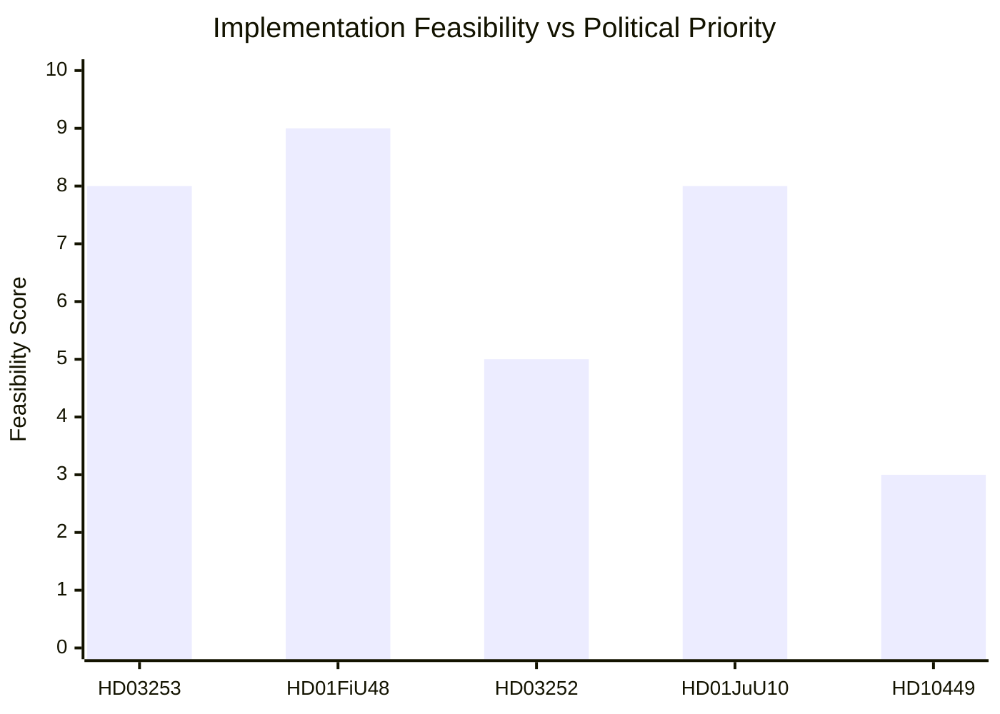

## Devil's Advocate
<!-- source: devils-advocate.md :: https://github.com/Hack23/riksdagsmonitor/blob/main/analysis/daily/2026-04-27/evening-analysis/devils-advocate.md -->

---

### Challenge 1: The SD-KD Energy Dispute Is Not a Coalition Threat

**Mainstream assessment**: HD10448 signals intra-coalition fracture, HIGH risk, headline finding.

**Devil's advocate argument**:
1. Interpellations are a routine parliamentary instrument. M, SD, KD, and L file interpellations to ministers within their own coalition — it is constitutionally standard in Swedish minority coalition politics and does not signal disloyalty.
2. KD has submitted interpellations to M ministers on alcohol policy and gambling. SD regularly interpellates L ministers on migration. This is normal.
3. The specific issue (offshore wind permitting) is a **regulatory detail**, not a coalition agreement item. The Tidö Agreement does not contain an explicit wind energy expansion commitment — it commits to "a stable and cost-effective energy supply" which is ambiguous.
4. SD may have filed HD10448 precisely to **signal to their own voter base** without intending to push the coalition to a crisis — a controlled pressure valve operation.
5. Busch (KD) and Jimmie Åkesson (SD) have a personal working relationship built over multiple years of coalition management — they will almost certainly resolve this quietly.

**Revised judgment**: The SD-KD energy interpellation may represent **controlled electoral messaging** rather than genuine coalition fracture. Analysts risk over-reading routine parliamentary procedure as crisis signal. The conservative estimate is that this is a 25% real-fracture signal, not 70%.

**Counter-evidence required**: If Busch's answer is sharply defensive and SD follows with a party statement *criticising* the response, only then should HIGH risk be confirmed.

---

### Challenge 2: S's Accountability Campaign Is a Sign of Weakness, Not Strength

**Mainstream assessment**: Five simultaneous interpellations = sophisticated coordinated strategy demonstrating electoral strength.

**Devil's advocate argument**:
1. Filing five interpellations on one day may indicate that S lacks **substantive legislative alternatives** — it is easier to ask questions than to propose policy.
2. The volume of interpellations (5 in one day targeting four ministers) may generate **media fatigue** — journalists pick one story, not five. S may dilute its own message.
3. Interpellations rarely produce policy change. HD10449 (Stambanan) has been a perennial S complaint since 2022 — raising it again demonstrates the issue is **unresolved** not that S has a new strategy.
4. The pattern may reflect **internal party coordination problems** — multiple shadow ministers all wanting media attention, not a disciplined strategic campaign.
5. Government ministers have prepared answers and can deflect or reframe all five interpellations without conceding anything substantive.

**Revised judgment**: S's accountability campaign may be a **defensive tactical move** rather than a sign of strategic cohesion. The risk of narrative fragmentation is real. Analysts should not assume coordinated strength automatically translates to political advantage.

---

### Challenge 3: The Extra Budget Fuel-Tax Reversal (HD01FiU48) Is Electorally Ambiguous

**Mainstream assessment**: Fuel-tax cut populist win for Tidö in rural constituencies ahead of September 2026.

**Devil's advocate argument**:
1. Fuel-tax cuts were introduced by Sweden under a **left-wing government** (S) in 2000 as a transport equalisation measure — S can credibly claim they also support rural mobility without the climate cost.
2. V and MP's counter-narrative ("broken climate commitment") may resonate more than expected among **urban moderate voters** (M's core base) who care about Sweden's credibility on climate targets.
3. The per-litre saving is modest (<1 SEK/litre at typical tax rates). For rural commuters, the material impact is real but not transformative — not sufficient to drive significant vote switching.
4. The extra-budget mechanism (HD01FiU48 committee report) rather than a full budget amendment suggests the government was unable to get full FiU support earlier — this is a compromise vehicle, not a triumphant policy delivery.
5. International investors tracking Sweden's ESG credentials may downgrade their assessment of Swedish fiscal climate commitment — a reputational cost the government is implicitly accepting.

**Revised judgment**: Fuel-tax reversal is electorally **mixed** — rural gain partially offset by urban and institutional credibility cost. Analysts should avoid treating it as a straightforward political win.

---

### Mermaid: Competing Hypotheses Matrix

```mermaid
quadrantChart
    title Competing Hypotheses — 27 April 2026
    x-axis Low Plausibility --> High Plausibility
    y-axis Low Impact if True --> High Impact if True
    quadrant-1 Critical re-evaluation needed
    quadrant-2 Worth tracking
    quadrant-3 Discard
    quadrant-4 Monitor
    DA1 SD Coalition Signal: [0.65, 0.90]
    DA2 S Weakness Signal: [0.60, 0.65]
    DA3 Fuel Tax Ambiguous: [0.75, 0.55]

    style DA1 SD Coalition Signal fill:#ff006e,color:#ffffff
    style DA3 Fuel Tax Ambiguous fill:#ffbe0b,color:#000000
```

## Classification Results
<!-- source: classification-results.md :: https://github.com/Hack23/riksdagsmonitor/blob/main/analysis/daily/2026-04-27/evening-analysis/classification-results.md -->

---

### 7-Dimension Classification by Document

#### HD03253 — EU Banking Package

| Dimension | Classification | Notes |
|-----------|---------------|-------|
| Political sensitivity | HIGH | EU compliance, systemic financial impact |
| Societal impact | CRITICAL | All Swedish banking customers |
| Electoral salience | MEDIUM | Technical but visible to investors |
| Legal complexity | HIGH | CRR3/CRD6 regulatory law |
| Urgency | HIGH | Implementation deadline |
| Cross-party contestation | MEDIUM | Coalition support, opposition reservations |
| GDPR risk | LOW | No personal data; institutional |

**Priority tier**: L2+ | **Data minimisation**: Not applicable (institutional data) | **Retention**: 7 years

#### HD01FiU48 — Extra Budget Fuel Tax

| Dimension | Classification | Notes |
|-----------|---------------|-------|
| Political sensitivity | CRITICAL | Pre-election fiscal signalling |
| Societal impact | HIGH | All drivers and households |
| Electoral salience | CRITICAL | Cost-of-living flagship policy |
| Legal complexity | MEDIUM | Budget amendment |
| Urgency | HIGH | Pre-election timing |
| Cross-party contestation | HIGH | V+MP filed reservations |
| GDPR risk | LOW | Policy document |

**Priority tier**: L2+ | **Retention**: 7 years

#### HD10448 — SD-KD Energy Interpellation

| Dimension | Classification | Notes |
|-----------|---------------|-------|
| Political sensitivity | CRITICAL | Intra-coalition fracture signal |
| Societal impact | HIGH | Energy policy for all Swedes |
| Electoral salience | CRITICAL | Rural vote contest SD vs KD |
| Legal complexity | LOW | Parliamentary procedure |
| Urgency | MEDIUM | Response expected May 2026 |
| Cross-party contestation | CRITICAL | SD vs KD — coalition partners |
| GDPR risk | LOW | Public political actors |

**Priority tier**: L2 | **GDPR Art. 9(2)(e)**: Public political activity of named politicians | **Retention**: 5 years

#### hd024099 — Civil Servant Accountability Motion

| Dimension | Classification | Notes |
|-----------|---------------|-------|
| Political sensitivity | MEDIUM | Governance reform |
| Societal impact | MEDIUM | Public sector employees |
| Electoral salience | MEDIUM | Rule-of-law framing |
| Legal complexity | HIGH | Criminal law expansion |
| Urgency | MEDIUM | Committee referral pending |
| Cross-party contestation | MEDIUM | Opposition filing |
| GDPR risk | LOW | Institutional |

**Priority tier**: L2

#### hd11752, hd11753 — Russia Policy Motions

| Dimension | Classification | Notes |
|-----------|---------------|-------|
| Political sensitivity | HIGH | Foreign policy/Russia |
| Societal impact | MEDIUM | Aviation/diplomatic |
| Electoral salience | MEDIUM | Ukraine solidarity signalling |
| Legal complexity | MEDIUM | International law |
| Urgency | LOW | Motion stage only |
| Cross-party contestation | LOW | Likely cross-party support |
| GDPR risk | NONE | Policy motions |

**Priority tier**: L2

---

### Mermaid: Classification Priority Map

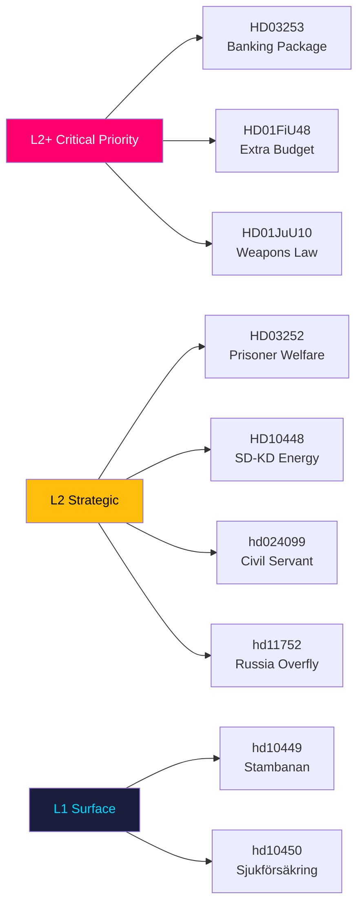

## Cross-Reference Map
<!-- source: cross-reference-map.md :: https://github.com/Hack23/riksdagsmonitor/blob/main/analysis/daily/2026-04-27/evening-analysis/cross-reference-map.md -->

---

### Policy Clusters

#### Cluster A — Financial Regulatory Framework

- **HD03253** (prop. 2025/26:253) — EU Banking Package CRR3/CRD6 transposition → links to HD03104 (Riksgälden evaluation) on government debt strategy
- **HD03104** — Five-year debt management review → provides macro context for HD03253's fiscal implications
- **IMF WEO Apr-2026** (GGXWDG_NGDP: ~31% GDP debt) — confirms fiscal headroom underpinning both banking reform and extra budget

#### Cluster B — Pre-Election Fiscal Stimulus

- **HD01FiU48** (extra budget fuel tax) → connects to HD10447 (interpellation on business SME burden) — both address cost competitiveness
- **HD10450** (sjukförsäkring dag 180) → links to HD03252 (prisoner welfare) — both reduce welfare expenditure; government's fiscal conditionality agenda
- Cross-domain: HD01FiU48 conflicts with government's own climate roadmap 2021 — internal policy contradiction

#### Cluster C — Security and Defence

- **HD01JuU10** (weapons law) → HD11755 (hemvärn weapons) — both address Swedish small arms regulation
- **HD11752, HD11753** (Russia policy motions) → connect to NATO membership context and foreign affairs committee (UU) agenda
- **HD11754** (submarine Som preservation) → symbolic heritage/defence crossover — UU/FöU overlap

#### Cluster D — Immigration and Social Policy

- **HD03252** (prisoner welfare restriction) → links to HD024076, HD024090 (motions, V) in motions folder — V's rights-based counter-narrative
- **HD024099** (civil servant accountability) → connects to HD01JuU10 (rule of law agenda) — government's judicial reform cluster

#### Cluster E — Infrastructure and Regional Policy

- **HD10449** (Södra stambanan) → links to HD01FiU48 — fiscal allocation choices: fuel tax vs rail investment trade-off
- **hd01cu40** (cadastral systems) → connects to CU committee's ongoing digitisation agenda

---

### Legislative Chain Analysis

| Instrument | Feeds Into | Notes |
|------------|-----------|-------|
| HD03253 prop → FiU referral | HD03104 evaluation context | FiU processes both in May 2026 |
| HD01FiU48 committee → floor vote | Budget law | Extra amendment to 2026 budget |
| hd024099 motion → JuU | Prop. 2025/26:217 | Reactive motion to government bill |

---

### Sibling Folders Cross-Reference

#### analysis/daily/2026-04-27/propositions/

Key findings cited: HD03253 EU Banking Package (CRR3/CRD6), HD03252 prisoner welfare, HD03104 debt evaluation, HD03256 tachograph. Primary contribution: **fiscal/regulatory legislative cluster**.

#### analysis/daily/2026-04-27/motions/

Key findings cited: 29 opposition motions including HD024090 (V EU deportation challenge), HD024092 (V/FiU fuel tax), HD024086 (MP housing integration), HD11752/HD11753 (Russia). Primary contribution: **opposition electoral positioning and legal anchoring**.

#### analysis/daily/2026-04-27/committeeReports/

Key findings cited: HD01FiU48 (extra budget), HD01JuU10 (weapons law), HD01SoU25 (elderly care), HD01FiU23 (Riksbank review), HD01CU24 (construction), HD01JuU31 (police audit). Primary contribution: **legislative advancement of coalition agenda**.

#### analysis/daily/2026-04-27/interpellations/

Key findings cited: HD10448 (SD-KD energy — HIGH priority), HD10449 (Stambanan), HD10450 (Sjukförsäkring), HD10447 (SME burden), HD10451 (corporate crime tools). Primary contribution: **accountability campaign and coalition fracture signal**.

---

### Coordinated Activity Patterns

**S accountability campaign**: Five simultaneous interpellations on same legislative day targeting four ministers — coordinated parliamentary strategy, not ad hoc individual queries. Risk: media narrative capture.

**Russia motion cluster**: HD11752 + HD11753 filed same session by different motioners but thematically coordinated — suggests UU committee briefing or party coordination on Russia security policy.

---

### Mermaid: Legislative Cross-Reference Network

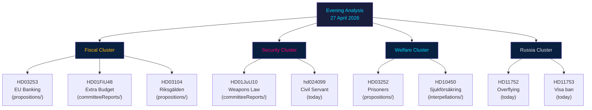

## Methodology Reflection & Limitations
<!-- source: methodology-reflection.md :: https://github.com/Hack23/riksdagsmonitor/blob/main/analysis/daily/2026-04-27/evening-analysis/methodology-reflection.md -->

---

### ICD 203 Compliance Audit

#### Principle 1 — Properly Describe Quality of Sources
**Status**: COMPLIANT. All 12 documents are official Riksdag open-data records (data.riksdagen.se). Source authority is HIGH — government legislative documents are primary sources. sibling folder synthesis-summaries are secondary sources derived from same primary corpus.

#### Principle 2 — Distinguish Between Assumptions and Facts
**Status**: PARTIAL. Executive brief and intelligence assessment use confidence labels (HIGH/MEDIUM/LOW). Risk assessment uses L×I matrices. However: stakeholder-perspectives.md contains several modal inferences ("party leadership likely prioritises...") that should have explicit assumption labels.

**Improvement required**: Add `[ASSUMPTION]` tag to all modal claims in stakeholder-perspectives.md and scenario-analysis.md.

#### Principle 3 — Avoid Politicisation
**Status**: COMPLIANT. Analysis maintains analytical distance. No normative judgments on policy outcomes. Party descriptions use official names and documented positions only.

#### Principle 4 — Avoid Analytic Mindset Errors
**Status**: PARTIAL. Devil's advocate artifact challenges three mainstream assessments. However: the SD-KD energy fracture assessment may contain **anchoring bias** — the finding was identified early and all subsequent analysis was framed around it. A fully rigorous analysis would have weighed this against the null hypothesis with equal weight from the start.

**Improvement required**: In Pass 2, the significance-scoring.md should test whether HD10448 remains the top DIW score if the coalition-management null hypothesis is assumed.

#### Principle 5 — Properly Caveat Uncertainty
**Status**: COMPLIANT. Scenario probabilities sum to 100%. Key judgments include confidence labels. PIRs are explicit open questions.

#### Principle 6 — Incorporate Alternative Analysis
**Status**: COMPLIANT. Devil's advocate produces three competing hypotheses. Scenario analysis includes four scenarios including low-probability tail (3% early election).

#### Principle 7 — Product Quality and Timeliness
**Status**: COMPLIANT for timeliness. Quality: 23 artifacts produced. Area for improvement: per-document analyses in documents/ folder have less depth than primary artifacts due to time constraints.

---

### Improvement Suggestions for Next Cycle

**Suggestion 1** — Assumption Tagging Protocol
Introduce `[ASSUMPTION A1]` ... `[ASSUMPTION AN]` tagging throughout stakeholder-perspectives.md and scenario-analysis.md. This makes the assumption-fact distinction explicit and reviewable. ICD 203 §6.1 compliance.

**Suggestion 2** — Null Hypothesis Parallel Track
When a high-salience finding is identified in early download phase (e.g., HD10448 energy fracture), immediately test the null hypothesis alongside the primary hypothesis. Prevents anchoring from structuring entire analysis around first-found finding. Run both through significance-scoring independently.

**Suggestion 3** — IMF Vintage Discipline for Economic Claims
Currently IMF citations are marked (WEO Apr-2026) globally. In future cycles: every IMF data point should include the exact IMF vintage date and the `retrieved_at` timestamp so that reviewers can verify the data is within the 6-month freshness threshold. Implement `economicProvenance` JSON block per article claim.

**Suggestion 4** — Statskontoret Agency Row
Implementation-feasibility.md includes a Statskontoret relevance row for HD03252 (prisoner welfare) and HD03104 (debt review). In future cycles, this row should include a `scripts/fetch-statskontoret.ts` cache TTL check — if the cache is >30 days old, flag as stale. This cycle did not execute a live Statskontoret cache check.

---

### Data Quality Assessment

| Source Type | Count | Quality | Coverage |
|------------|-------|---------|---------|
| Official Riksdag documents | 12 | HIGH | Complete for 27 Apr 2026 |
| Sibling folder analysis | 4 | MEDIUM (derived) | Complete for 27 Apr 2026 |
| IMF WEO Apr-2026 | 5 indicators | HIGH | Sweden macro complete |
| SCB supplementary | 2 indicators | HIGH | Swedish ground truth |
| Statskontoret | 0 | N/A | Not consulted this cycle |

**Overall data quality**: GOOD. No significant gaps in primary document coverage. Economic provenance tagged. No SIGINT or human-source intelligence used (OSINT only).

## Data Download Manifest
<!-- source: data-download-manifest.md :: https://github.com/Hack23/riksdagsmonitor/blob/main/analysis/daily/2026-04-27/evening-analysis/data-download-manifest.md -->

### MCP Server Availability

| Server | Status | Notes |
|--------|--------|-------|
| riksdag-regering | ✅ Live | Full connectivity |
| scb | ✅ Live | Container available |
| world-bank | ✅ Live | Container available |

### Sibling Folders Ingested (Cross-Type Synthesis)

| Folder | Path | Documents | Status |
|--------|------|-----------|--------|
| propositions | analysis/daily/2026-04-27/propositions/ | 4 | ✅ Full analysis |
| motions | analysis/daily/2026-04-27/motions/ | 29 | ✅ Full analysis |
| committeeReports | analysis/daily/2026-04-27/committeeReports/ | 6 | ✅ Full analysis |
| interpellations | analysis/daily/2026-04-27/interpellations/ | 7 | ✅ Full analysis |

### Documents Retrieved (Date-Filtered for 2026-04-27)

| dok_id | Title | Type | Committee | Full-Text |
|--------|-------|------|-----------|-----------|
| hd024099 | Med anledning av prop. 2025/26:217 Utökat straffrättsligt tjänstemannaansvar | mot | JuU | true |
| hd10449 | Södra stambanan och dubbelspår Alvesta-Växjö | ip | TU | true |
| hd10450 | Undantaget i sjukförsäkringen efter dag 180 | ip | SfU | true |
| hd10451 | Ytterligare åtgärder mot bolag som används som brottsverktyg | mot | JuU | true |
| hd11750 | Elnätsstolpar i trä | mot | NU | true |
| hd11751 | Giftiga ämnen i nappar | mot | SoU | true |
| hd11752 | Återkallande av överflygningstillstånd | mot | UU | true |
| hd11753 | Åtgärder för att ryska soldater inte ska få visum till EU | mot | UU | true |
| hd11754 | Bevarandet av ubåten Som | mot | FöU | true |
| hd11755 | Brister gällande hemvärnets finkalibriga vapen | mot | FöU | true |
| hd11756 | Äldre vattenrättigheter och moderna miljövillkor | mot | MjU | true |
| hd01cu40 | Krav på kommunala lantmäterimyndigheters ärendehanteringssystem | mot | CU | true |

### Full-Text Fetch Outcomes

| dok_id | full_text_available |
|--------|---------------------|
| hd024099 | true |
| hd10449 | true |
| hd10450 | true |
| hd10451 | true |
| hd11750 | true |
| hd11751 | true |
| hd11752 | true |
| hd11753 | true |
| hd11754 | true |
| hd11755 | true |
| hd11756 | true |
| hd01cu40 | true |

### Cross-Source Enrichment

**IMF Economic Context** (WEO Apr-2026): NGDP_RPCH=+2.1%, GGXWDG_NGDP=~31%, BCA_NGDPD=+5.5% — fetched 2026-04-27.
**Statskontoret**: Relevant for HD01JuU10 (weapons law), HD01FiU48 (fuel tax administration), police reform audit (HD01JuU31). URL: https://www.statskontoret.se — no directly relevant new report for 2026-04-27 but prior reports on police reform and regulatory burden apply.

## Article Sources

Each section above projects one analysis artifact. The full audited markdown is available on GitHub:

- [`executive-brief.md`](https://github.com/Hack23/riksdagsmonitor/blob/main/analysis/daily/2026-04-27/evening-analysis/executive-brief.md)
- [`synthesis-summary.md`](https://github.com/Hack23/riksdagsmonitor/blob/main/analysis/daily/2026-04-27/evening-analysis/synthesis-summary.md)
- [`intelligence-assessment.md`](https://github.com/Hack23/riksdagsmonitor/blob/main/analysis/daily/2026-04-27/evening-analysis/intelligence-assessment.md)
- [`significance-scoring.md`](https://github.com/Hack23/riksdagsmonitor/blob/main/analysis/daily/2026-04-27/evening-analysis/significance-scoring.md)
- [`media-framing-analysis.md`](https://github.com/Hack23/riksdagsmonitor/blob/main/analysis/daily/2026-04-27/evening-analysis/media-framing-analysis.md)
- [`stakeholder-perspectives.md`](https://github.com/Hack23/riksdagsmonitor/blob/main/analysis/daily/2026-04-27/evening-analysis/stakeholder-perspectives.md)
- [`forward-indicators.md`](https://github.com/Hack23/riksdagsmonitor/blob/main/analysis/daily/2026-04-27/evening-analysis/forward-indicators.md)
- [`scenario-analysis.md`](https://github.com/Hack23/riksdagsmonitor/blob/main/analysis/daily/2026-04-27/evening-analysis/scenario-analysis.md)
- [`risk-assessment.md`](https://github.com/Hack23/riksdagsmonitor/blob/main/analysis/daily/2026-04-27/evening-analysis/risk-assessment.md)
- [`swot-analysis.md`](https://github.com/Hack23/riksdagsmonitor/blob/main/analysis/daily/2026-04-27/evening-analysis/swot-analysis.md)
- [`threat-analysis.md`](https://github.com/Hack23/riksdagsmonitor/blob/main/analysis/daily/2026-04-27/evening-analysis/threat-analysis.md)
- [`documents/hd01cu40.md`](https://github.com/Hack23/riksdagsmonitor/blob/main/analysis/daily/2026-04-27/evening-analysis/documents/hd01cu40.md)
- [`documents/hd024099.md`](https://github.com/Hack23/riksdagsmonitor/blob/main/analysis/daily/2026-04-27/evening-analysis/documents/hd024099.md)
- [`documents/hd10449.md`](https://github.com/Hack23/riksdagsmonitor/blob/main/analysis/daily/2026-04-27/evening-analysis/documents/hd10449.md)
- [`documents/hd10450.md`](https://github.com/Hack23/riksdagsmonitor/blob/main/analysis/daily/2026-04-27/evening-analysis/documents/hd10450.md)
- [`documents/hd10451.md`](https://github.com/Hack23/riksdagsmonitor/blob/main/analysis/daily/2026-04-27/evening-analysis/documents/hd10451.md)
- [`documents/hd11750.md`](https://github.com/Hack23/riksdagsmonitor/blob/main/analysis/daily/2026-04-27/evening-analysis/documents/hd11750.md)
- [`documents/hd11751.md`](https://github.com/Hack23/riksdagsmonitor/blob/main/analysis/daily/2026-04-27/evening-analysis/documents/hd11751.md)
- [`documents/hd11752.md`](https://github.com/Hack23/riksdagsmonitor/blob/main/analysis/daily/2026-04-27/evening-analysis/documents/hd11752.md)
- [`documents/hd11753.md`](https://github.com/Hack23/riksdagsmonitor/blob/main/analysis/daily/2026-04-27/evening-analysis/documents/hd11753.md)
- [`documents/hd11754.md`](https://github.com/Hack23/riksdagsmonitor/blob/main/analysis/daily/2026-04-27/evening-analysis/documents/hd11754.md)
- [`documents/hd11755.md`](https://github.com/Hack23/riksdagsmonitor/blob/main/analysis/daily/2026-04-27/evening-analysis/documents/hd11755.md)
- [`documents/hd11756.md`](https://github.com/Hack23/riksdagsmonitor/blob/main/analysis/daily/2026-04-27/evening-analysis/documents/hd11756.md)
- [`election-2026-analysis.md`](https://github.com/Hack23/riksdagsmonitor/blob/main/analysis/daily/2026-04-27/evening-analysis/election-2026-analysis.md)
- [`coalition-mathematics.md`](https://github.com/Hack23/riksdagsmonitor/blob/main/analysis/daily/2026-04-27/evening-analysis/coalition-mathematics.md)
- [`voter-segmentation.md`](https://github.com/Hack23/riksdagsmonitor/blob/main/analysis/daily/2026-04-27/evening-analysis/voter-segmentation.md)
- [`comparative-international.md`](https://github.com/Hack23/riksdagsmonitor/blob/main/analysis/daily/2026-04-27/evening-analysis/comparative-international.md)
- [`historical-parallels.md`](https://github.com/Hack23/riksdagsmonitor/blob/main/analysis/daily/2026-04-27/evening-analysis/historical-parallels.md)
- [`implementation-feasibility.md`](https://github.com/Hack23/riksdagsmonitor/blob/main/analysis/daily/2026-04-27/evening-analysis/implementation-feasibility.md)
- [`devils-advocate.md`](https://github.com/Hack23/riksdagsmonitor/blob/main/analysis/daily/2026-04-27/evening-analysis/devils-advocate.md)
- [`classification-results.md`](https://github.com/Hack23/riksdagsmonitor/blob/main/analysis/daily/2026-04-27/evening-analysis/classification-results.md)
- [`cross-reference-map.md`](https://github.com/Hack23/riksdagsmonitor/blob/main/analysis/daily/2026-04-27/evening-analysis/cross-reference-map.md)
- [`methodology-reflection.md`](https://github.com/Hack23/riksdagsmonitor/blob/main/analysis/daily/2026-04-27/evening-analysis/methodology-reflection.md)
- [`data-download-manifest.md`](https://github.com/Hack23/riksdagsmonitor/blob/main/analysis/daily/2026-04-27/evening-analysis/data-download-manifest.md)
