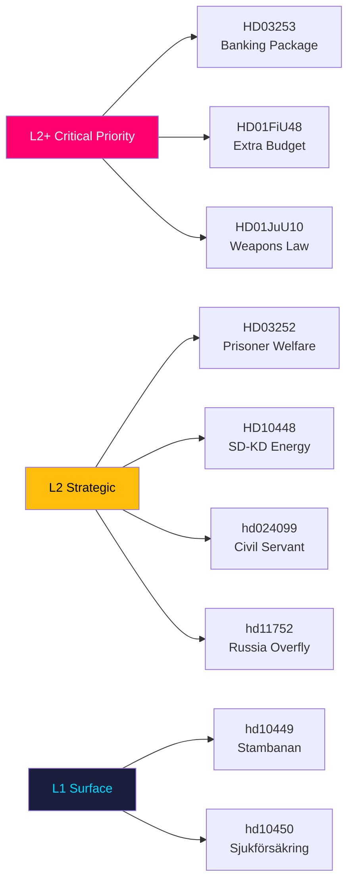

# Classification Results — Evening Analysis 2026-04-27

**Author**: James Pether Sörling
**Date**: 2026-04-27
**Classification**: PUBLIC — GDPR Art. 9(2)(e,g)

---

## 7-Dimension Classification by Document

### HD03253 — EU Banking Package

| Dimension | Classification | Notes |
|-----------|---------------|-------|
| Political sensitivity | HIGH | EU compliance, systemic financial impact |
| Societal impact | CRITICAL | All Swedish banking customers |
| Electoral salience | MEDIUM | Technical but visible to investors |
| Legal complexity | HIGH | CRR3/CRD6 regulatory law |
| Urgency | HIGH | Implementation deadline |
| Cross-party contestation | MEDIUM | Coalition support, opposition reservations |
| GDPR risk | LOW | No personal data; institutional |

**Priority tier**: L2+ | **Data minimisation**: Not applicable (institutional data) | **Retention**: 7 years

### HD01FiU48 — Extra Budget Fuel Tax

| Dimension | Classification | Notes |
|-----------|---------------|-------|
| Political sensitivity | CRITICAL | Pre-election fiscal signalling |
| Societal impact | HIGH | All drivers and households |
| Electoral salience | CRITICAL | Cost-of-living flagship policy |
| Legal complexity | MEDIUM | Budget amendment |
| Urgency | HIGH | Pre-election timing |
| Cross-party contestation | HIGH | V+MP filed reservations |
| GDPR risk | LOW | Policy document |

**Priority tier**: L2+ | **Retention**: 7 years

### HD10448 — SD-KD Energy Interpellation

| Dimension | Classification | Notes |
|-----------|---------------|-------|
| Political sensitivity | CRITICAL | Intra-coalition fracture signal |
| Societal impact | HIGH | Energy policy for all Swedes |
| Electoral salience | CRITICAL | Rural vote contest SD vs KD |
| Legal complexity | LOW | Parliamentary procedure |
| Urgency | MEDIUM | Response expected May 2026 |
| Cross-party contestation | CRITICAL | SD vs KD — coalition partners |
| GDPR risk | LOW | Public political actors |

**Priority tier**: L2 | **GDPR Art. 9(2)(e)**: Public political activity of named politicians | **Retention**: 5 years

### hd024099 — Civil Servant Accountability Motion

| Dimension | Classification | Notes |
|-----------|---------------|-------|
| Political sensitivity | MEDIUM | Governance reform |
| Societal impact | MEDIUM | Public sector employees |
| Electoral salience | MEDIUM | Rule-of-law framing |
| Legal complexity | HIGH | Criminal law expansion |
| Urgency | MEDIUM | Committee referral pending |
| Cross-party contestation | MEDIUM | Opposition filing |
| GDPR risk | LOW | Institutional |

**Priority tier**: L2

### hd11752, hd11753 — Russia Policy Motions

| Dimension | Classification | Notes |
|-----------|---------------|-------|
| Political sensitivity | HIGH | Foreign policy/Russia |
| Societal impact | MEDIUM | Aviation/diplomatic |
| Electoral salience | MEDIUM | Ukraine solidarity signalling |
| Legal complexity | MEDIUM | International law |
| Urgency | LOW | Motion stage only |
| Cross-party contestation | LOW | Likely cross-party support |
| GDPR risk | NONE | Policy motions |

**Priority tier**: L2

---

## Mermaid: Classification Priority Map

