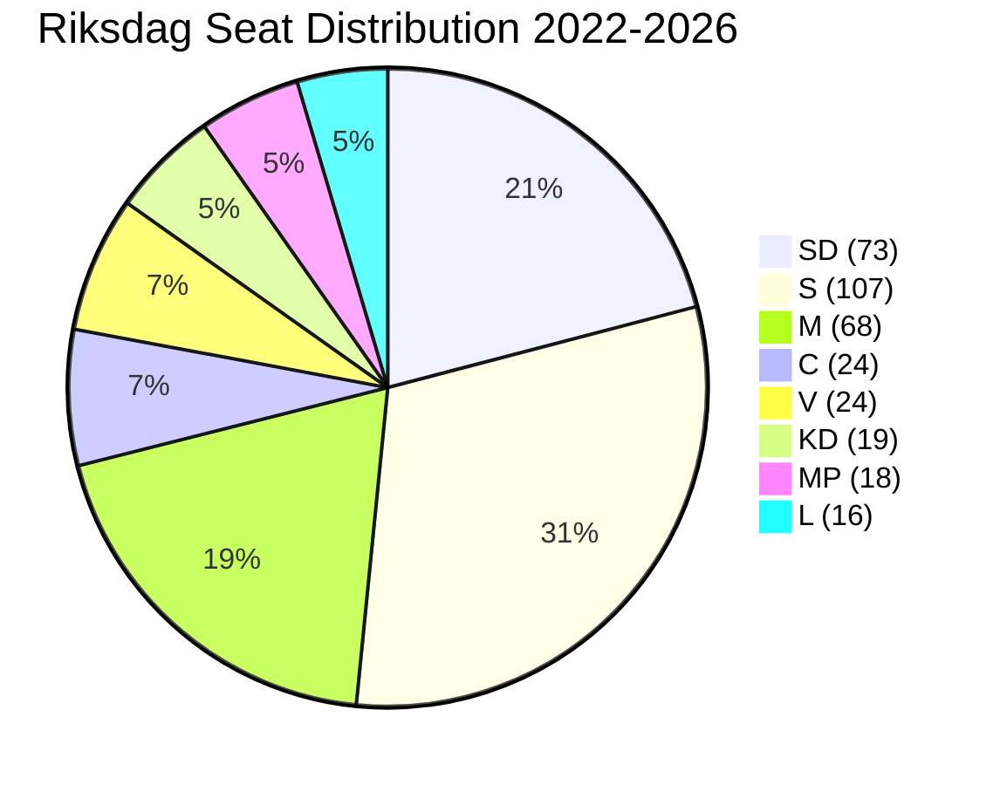

# Coalition Mathematics — Evening Analysis 2026-04-27

**Author**: James Pether Sörling
**Date**: 2026-04-27

---

## Current Riksdag Configuration (2022–2026)

**Total seats**: 349
**Working majority threshold**: 175 seats

| Party | Seats | Bloc |
|-------|-------|------|
| Socialdemokraterna (S) | 107 | Opposition |
| Moderaterna (M) | 68 | Government |
| Sverigedemokraterna (SD) | 73 | Government |
| Centerpartiet (C) | 24 | Opposition (varies) |
| Vänsterpartiet (V) | 24 | Opposition |
| Kristdemokraterna (KD) | 19 | Government |
| Miljöpartiet (MP) | 18 | Opposition |
| Liberalerna (L) | 16 | Government |
| **Government total (M+SD+KD+L)** | **176** | |
| **Opposition total (S+C+V+MP)** | **173** | |

---

## Pivotal Vote Analysis — Key Votes This Session

| Document | Committee | Likely Floor Vote | Expected Ja | Expected Nej | Pivotal Party |
|----------|-----------|-------------------|-------------|--------------|---------------|
| HD03253 Banking Package | FiU | May/June 2026 | 176 (M+SD+KD+L) | 173 | — government majority holds |
| HD01FiU48 Extra Budget | FiU | Already passed committee | 176 | 173 | SD (filed motion) |
| HD01JuU10 Weapons Law | JuU | Scheduled | 176 | 173 | — |
| HD10448 Energy interp. | — | Minister's response | N/A | N/A | Busch answer pivotal |

**Finding**: Government maintains a +3 seat working majority (176 vs 173). No single party defection triggers defeat unless SD (73 seats) or M (68 seats) defects. L or KD defection alone (16 or 19 seats) does not break government majority.

---

## Structural Coalition Stability Analysis

**Minimum winning coalition**: M+SD alone = 141 seats → insufficient (−34). SD cannot pass anything without M and either KD or L.

**Vulnerability scenarios**:
1. If L drops to <4% national threshold → falls below 4 seats → government loses 16 seats → 160 vs 173 → OPPOSITION WINS.
2. If KD drops below threshold → government loses 19 seats → 157 vs 173 → OPPOSITION WINS.
3. If M drops sharply (−10) → 158 vs 173 → OPPOSITION WINS.

**Conclusion**: Government majority is slim but structurally stable as long as all four coalition parties remain in parliament. Threshold risk for L and KD is the primary vulnerability.

---

## HD10448 Energy Interpellation — No Confidence Risk Assessment

An interpellation cannot trigger a vote of no confidence directly under Chapter 13 §1 RF. A *misstroendeförklaring* requires a formal motion signed by ≥35 MPs. Based on current configuration:

- S+V+MP+C combined = 173 MPs → sufficient to file and trigger debate
- Required for majority no-confidence: 175 YES votes
- Current opposition = 173 seats → **cannot achieve majority no-confidence vote without at least 2 government MPs defecting**

**Conclusion**: HD10448 cannot trigger a constitutional no-confidence crisis unless M or SD MPs break ranks. Risk is assessed as VERY LOW.

---

## Mermaid: Coalition Seat Map

