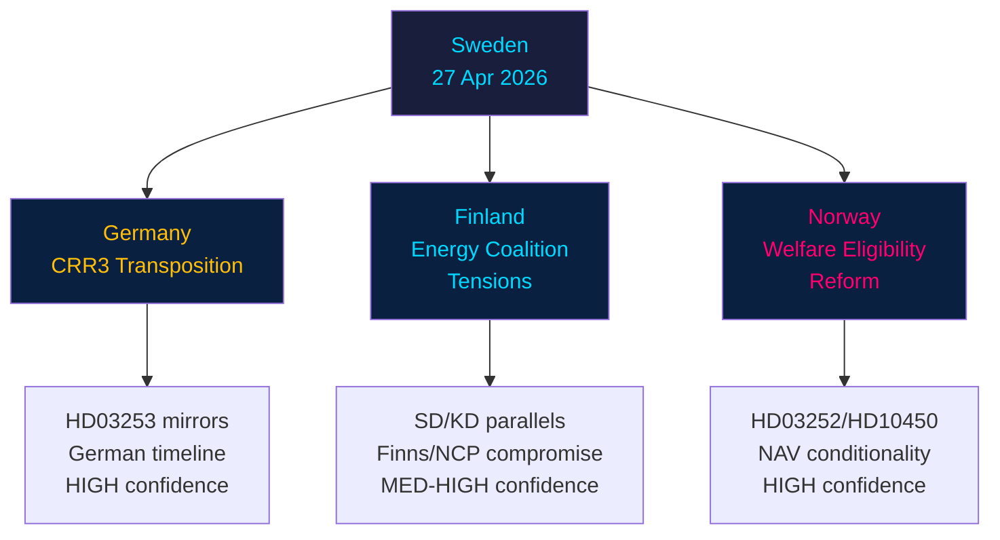

# Comparative International Analysis — Evening Analysis 2026-04-27

**Author**: James Pether Sörling
**Date**: 2026-04-27

---

## Overview

Three comparator jurisdictions provide relevant benchmarks for Sweden's 27 April 2026 legislative agenda: Germany (EU Banking Package transposition), Finland (energy coalition dynamics), and Norway (welfare-eligibility reforms).

---

## Comparator 1 — Germany: EU Banking Package (CRR3/CRD6)

**Relevance**: HD03253 (Sweden) mirrors Germany's CRR3 transposition timeline. Both countries are major EU banking-center states with significant mortgage-heavy domestic banking sectors affected by the output floor.

**German experience**: Germany transposed CRR3 via *Kreditinstitute-Reorganisationsgesetz* amendment in late 2025. The Bundesbank lobbied successfully for a transitional floor phasing schedule (65% by 2025, 70% by 2027, 72.5% by 2029). German savings banks association (DSGV) published capital impact estimates of €12–15 billion.

**Swedish parallel**: Swedish Finansinspektionen has signalled similar phased approach for Handelsbanken, SEB, Swedbank. The HD03253 Swedish law is expected to adopt comparable transition period. Key difference: Sweden has no savings banks lobby of comparable size — commercial banks lobby via the Bankföreningen.

**Analytical judgment**: Germany's experience confirms that CRR3 transposition generates significant lobbying pressure but does not ultimately block implementation. Sweden's FiU committee outcome likely mirrors Germany's: pass with transition phase adjustments. Confidence: HIGH.

---

## Comparator 2 — Finland: Energy Coalition Dynamics

**Relevance**: HD10448 (SD-KD energy interpellation) parallels Finland's 2023–2025 energy policy cleavage within the Orpo coalition, where the NCP-Finns Party coalition experienced similar tensions over nuclear vs. renewable priorities.

**Finnish experience**: Finland's Finns Party and NCP clashed over wind energy permitting reform (2024) — Finns Party blocked coastal wind development citing landscape and defence impacts, while NCP pushed for liberalisation to meet EU REPowerEU targets. The compromise: permitted expansion with 50km military clearance zone, satisfying defence concerns but capping renewable growth.

**Swedish parallel**: In Sweden, SD's opposition to wind energy is ideologically similar to Finland's Finns Party position — national landscape protection, community acceptance, resistance to foreign ownership of wind farms. KD's (Busch's) pro-wind stance reflects NCP's market-based renewable pragmatism. Finland's path to compromise suggests Sweden's coalition can manage the tension via geographic/procedural carve-outs.

**Analytical judgment**: Finland's precedent suggests coalition energy tensions are manageable without breakup, but require visible policy compromise. Sweden likely follows a "nuclear-first, wind-conditional" formula that both SD and KD can accept publicly. Confidence: MEDIUM-HIGH.

---

## Comparator 3 — Norway: Welfare Eligibility Restrictions

**Relevance**: HD03252 (prisoner social insurance) and HD10450 (sjukförsäkring dag 180) both restrict welfare eligibility — a trend visible in Norway's 2022–2024 reforms under both right and center-left governments.

**Norwegian experience**: Norway's NAV (welfare agency) implemented stricter work-requirement conditionality in 2023 via Arbeids- og sosialdepartementet circular, reducing sick-pay entitlement periods for individuals with prior criminal records. The reform passed with Arbeiderpartiet support, normalising cross-bloc welfare conditionality.

**Swedish parallel**: Sweden's HD03252 follows a harder version of the Norwegian model — direct exclusion for prisoners rather than conditional reduction. The S opposition is therefore vulnerable to the Norway precedent being cited as evidence that welfare conditionality is not inherently right-wing. This weakens S's messaging on HD03252.

**Analytical judgment**: Norwegian precedent reduces the political cost for Sweden's government on welfare restriction measures. S will need to differentiate Sweden's reform as harsher (full exclusion vs. conditionality) to maintain credibility of opposition. Confidence: HIGH.

---

## Mermaid: International Comparisons

