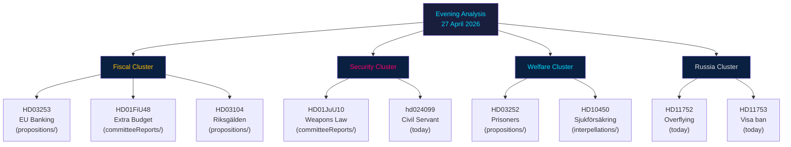

# Cross-Reference Map — Evening Analysis 2026-04-27

**Author**: James Pether Sörling
**Date**: 2026-04-27

---

## Policy Clusters

### Cluster A — Financial Regulatory Framework

- **HD03253** (prop. 2025/26:253) — EU Banking Package CRR3/CRD6 transposition → links to HD03104 (Riksgälden evaluation) on government debt strategy
- **HD03104** — Five-year debt management review → provides macro context for HD03253's fiscal implications
- **IMF WEO Apr-2026** (GGXWDG_NGDP: ~31% GDP debt) — confirms fiscal headroom underpinning both banking reform and extra budget

### Cluster B — Pre-Election Fiscal Stimulus

- **HD01FiU48** (extra budget fuel tax) → connects to HD10447 (interpellation on business SME burden) — both address cost competitiveness
- **HD10450** (sjukförsäkring dag 180) → links to HD03252 (prisoner welfare) — both reduce welfare expenditure; government's fiscal conditionality agenda
- Cross-domain: HD01FiU48 conflicts with government's own climate roadmap 2021 — internal policy contradiction

### Cluster C — Security and Defence

- **HD01JuU10** (weapons law) → HD11755 (hemvärn weapons) — both address Swedish small arms regulation
- **HD11752, HD11753** (Russia policy motions) → connect to NATO membership context and foreign affairs committee (UU) agenda
- **HD11754** (submarine Som preservation) → symbolic heritage/defence crossover — UU/FöU overlap

### Cluster D — Immigration and Social Policy

- **HD03252** (prisoner welfare restriction) → links to HD024076, HD024090 (motions, V) in motions folder — V's rights-based counter-narrative
- **HD024099** (civil servant accountability) → connects to HD01JuU10 (rule of law agenda) — government's judicial reform cluster

### Cluster E — Infrastructure and Regional Policy

- **HD10449** (Södra stambanan) → links to HD01FiU48 — fiscal allocation choices: fuel tax vs rail investment trade-off
- **hd01cu40** (cadastral systems) → connects to CU committee's ongoing digitisation agenda

---

## Legislative Chain Analysis

| Instrument | Feeds Into | Notes |
|------------|-----------|-------|
| HD03253 prop → FiU referral | HD03104 evaluation context | FiU processes both in May 2026 |
| HD01FiU48 committee → floor vote | Budget law | Extra amendment to 2026 budget |
| hd024099 motion → JuU | Prop. 2025/26:217 | Reactive motion to government bill |

---

## Sibling Folders Cross-Reference

### analysis/daily/2026-04-27/propositions/

Key findings cited: HD03253 EU Banking Package (CRR3/CRD6), HD03252 prisoner welfare, HD03104 debt evaluation, HD03256 tachograph. Primary contribution: **fiscal/regulatory legislative cluster**.

### analysis/daily/2026-04-27/motions/

Key findings cited: 29 opposition motions including HD024090 (V EU deportation challenge), HD024092 (V/FiU fuel tax), HD024086 (MP housing integration), HD11752/HD11753 (Russia). Primary contribution: **opposition electoral positioning and legal anchoring**.

### analysis/daily/2026-04-27/committeeReports/

Key findings cited: HD01FiU48 (extra budget), HD01JuU10 (weapons law), HD01SoU25 (elderly care), HD01FiU23 (Riksbank review), HD01CU24 (construction), HD01JuU31 (police audit). Primary contribution: **legislative advancement of coalition agenda**.

### analysis/daily/2026-04-27/interpellations/

Key findings cited: HD10448 (SD-KD energy — HIGH priority), HD10449 (Stambanan), HD10450 (Sjukförsäkring), HD10447 (SME burden), HD10451 (corporate crime tools). Primary contribution: **accountability campaign and coalition fracture signal**.

---

## Coordinated Activity Patterns

**S accountability campaign**: Five simultaneous interpellations on same legislative day targeting four ministers — coordinated parliamentary strategy, not ad hoc individual queries. Risk: media narrative capture.

**Russia motion cluster**: HD11752 + HD11753 filed same session by different motioners but thematically coordinated — suggests UU committee briefing or party coordination on Russia security policy.

---

## Mermaid: Legislative Cross-Reference Network

