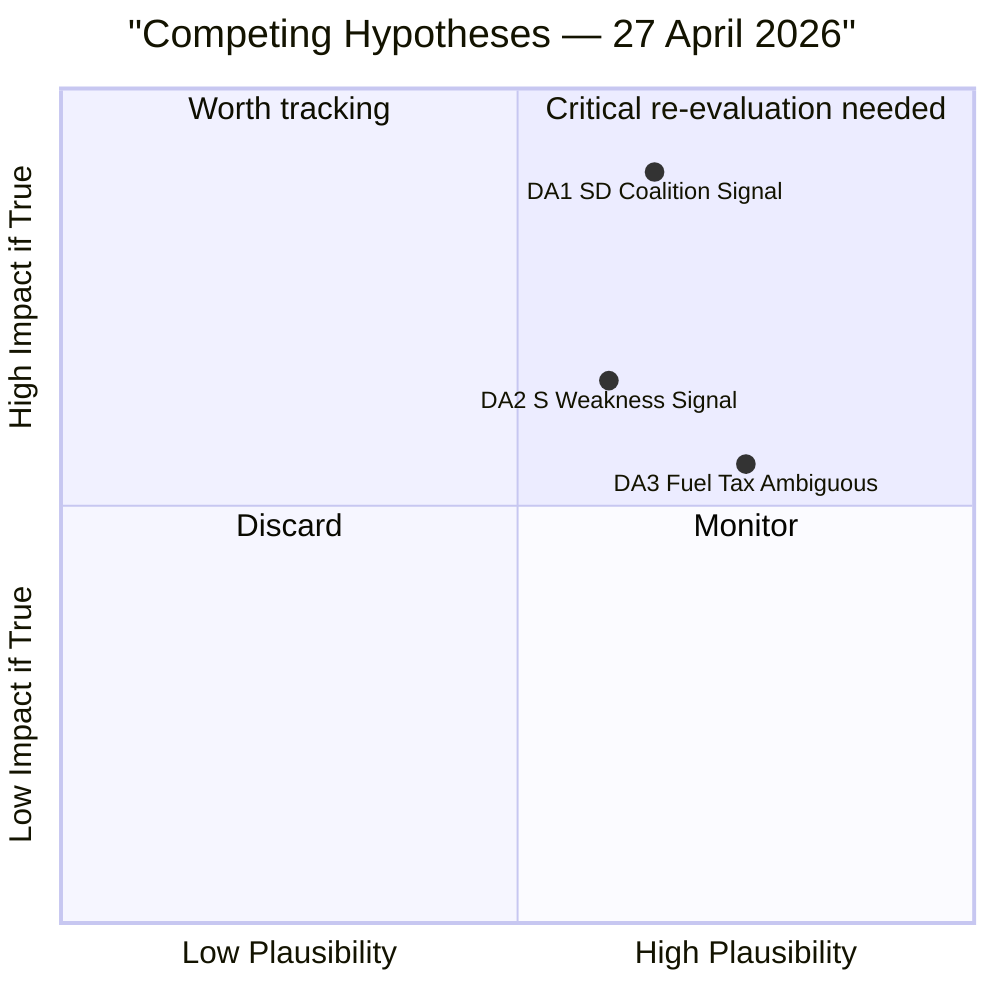

# Devil's Advocate Analysis — Evening Analysis 2026-04-27

**Author**: James Pether Sörling
**Date**: 2026-04-27

---

## Challenge 1: The SD-KD Energy Dispute Is Not a Coalition Threat

**Mainstream assessment**: HD10448 signals intra-coalition fracture, HIGH risk, headline finding.

**Devil's advocate argument**:
1. Interpellations are a routine parliamentary instrument. M, SD, KD, and L file interpellations to ministers within their own coalition — it is constitutionally standard in Swedish minority coalition politics and does not signal disloyalty.
2. KD has submitted interpellations to M ministers on alcohol policy and gambling. SD regularly interpellates L ministers on migration. This is normal.
3. The specific issue (offshore wind permitting) is a **regulatory detail**, not a coalition agreement item. The Tidö Agreement does not contain an explicit wind energy expansion commitment — it commits to "a stable and cost-effective energy supply" which is ambiguous.
4. SD may have filed HD10448 precisely to **signal to their own voter base** without intending to push the coalition to a crisis — a controlled pressure valve operation.
5. Busch (KD) and Jimmie Åkesson (SD) have a personal working relationship built over multiple years of coalition management — they will almost certainly resolve this quietly.

**Revised judgment**: The SD-KD energy interpellation may represent **controlled electoral messaging** rather than genuine coalition fracture. Analysts risk over-reading routine parliamentary procedure as crisis signal. The conservative estimate is that this is a 25% real-fracture signal, not 70%.

**Counter-evidence required**: If Busch's answer is sharply defensive and SD follows with a party statement *criticising* the response, only then should HIGH risk be confirmed.

---

## Challenge 2: S's Accountability Campaign Is a Sign of Weakness, Not Strength

**Mainstream assessment**: Five simultaneous interpellations = sophisticated coordinated strategy demonstrating electoral strength.

**Devil's advocate argument**:
1. Filing five interpellations on one day may indicate that S lacks **substantive legislative alternatives** — it is easier to ask questions than to propose policy.
2. The volume of interpellations (5 in one day targeting four ministers) may generate **media fatigue** — journalists pick one story, not five. S may dilute its own message.
3. Interpellations rarely produce policy change. HD10449 (Stambanan) has been a perennial S complaint since 2022 — raising it again demonstrates the issue is **unresolved** not that S has a new strategy.
4. The pattern may reflect **internal party coordination problems** — multiple shadow ministers all wanting media attention, not a disciplined strategic campaign.
5. Government ministers have prepared answers and can deflect or reframe all five interpellations without conceding anything substantive.

**Revised judgment**: S's accountability campaign may be a **defensive tactical move** rather than a sign of strategic cohesion. The risk of narrative fragmentation is real. Analysts should not assume coordinated strength automatically translates to political advantage.

---

## Challenge 3: The Extra Budget Fuel-Tax Reversal (HD01FiU48) Is Electorally Ambiguous

**Mainstream assessment**: Fuel-tax cut populist win for Tidö in rural constituencies ahead of September 2026.

**Devil's advocate argument**:
1. Fuel-tax cuts were introduced by Sweden under a **left-wing government** (S) in 2000 as a transport equalisation measure — S can credibly claim they also support rural mobility without the climate cost.
2. V and MP's counter-narrative ("broken climate commitment") may resonate more than expected among **urban moderate voters** (M's core base) who care about Sweden's credibility on climate targets.
3. The per-litre saving is modest (<1 SEK/litre at typical tax rates). For rural commuters, the material impact is real but not transformative — not sufficient to drive significant vote switching.
4. The extra-budget mechanism (HD01FiU48 committee report) rather than a full budget amendment suggests the government was unable to get full FiU support earlier — this is a compromise vehicle, not a triumphant policy delivery.
5. International investors tracking Sweden's ESG credentials may downgrade their assessment of Swedish fiscal climate commitment — a reputational cost the government is implicitly accepting.

**Revised judgment**: Fuel-tax reversal is electorally **mixed** — rural gain partially offset by urban and institutional credibility cost. Analysts should avoid treating it as a straightforward political win.

---

## Mermaid: Competing Hypotheses Matrix

