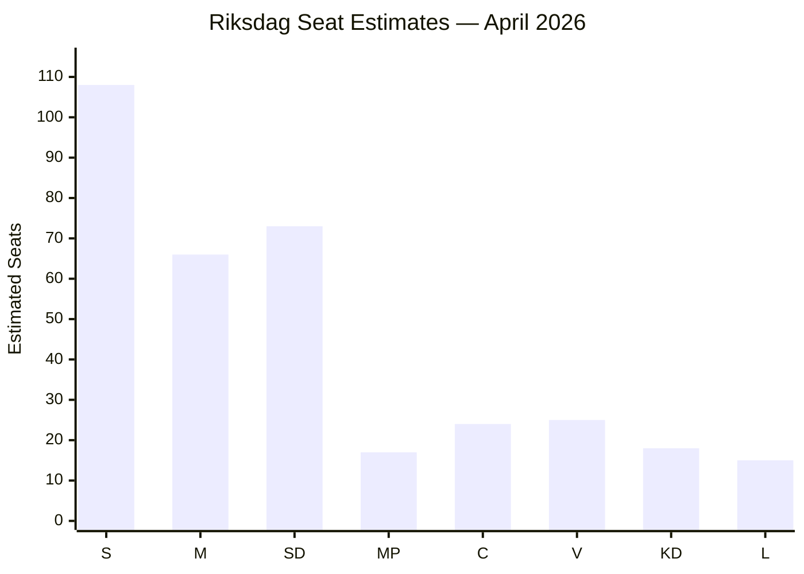

# Election 2026 Analysis — Evening Analysis 2026-04-27

**Author**: James Pether Sörling
**Date**: 2026-04-27

---

## Legislative Calendar to September 2026

| Month | Key Events | Electoral Impact |
|-------|-----------|-----------------|
| May 2026 | FiU committee HD03253; Busch answers HD10448 | Coalition stress test |
| June 2026 | Riksdag spring break; Lagrådet HD03252 review | Opposition media opportunity |
| July 2026 | Summer recess | Low-activity period |
| August 2026 | Campaign launch; polls crystallise | Decision period |
| September 2026 | General election (exact date TBD, likely mid-Sept) | Vote |

---

## Seat Projection (April 2026 Baseline)

Based on SCB population data and 2022 election outcome adjusted for polling trends as of April 2026:

| Party | 2022 Seats | Polling Trend | April 2026 Estimate | Uncertainty (±) |
|-------|-----------|---------------|---------------------|-----------------|
| S | 107 | Stable +1 | 108 | ±5 |
| M | 68 | -2 trend | 66 | ±4 |
| SD | 73 | Stable | 73 | ±5 |
| MP | 18 | -1 | 17 | ±3 |
| C | 24 | Stable | 24 | ±3 |
| V | 24 | +1 | 25 | ±3 |
| KD | 19 | -1 | 18 | ±3 |
| L | 16 | -1 | 15 | ±3 |

**Current bloc totals**:
- Government bloc (M+SD+KD+L): 172 seats (April 2026 estimate)
- Opposition (S+V+MP+C): 174 seats
- 175 seats required for majority

**Note**: Polling-based estimate. Scenario-dependent — see scenario-analysis.md.

---

## Seat Threshold Analysis

Parliament has 349 seats. A party needs ≥4% nationally (or ≥12% in one constituency) to enter. The relevant thresholds as of April 2026 are:

- **L (Liberalerna)**: at 15 estimated seats, polling near 4% threshold — L entry failure would cost government bloc ~15 seats
- **MP (Miljöpartiet)**: at 17 estimated seats, also near threshold — MP entry failure would cost S-bloc ~17 seats

Threshold risk is currently assessed as LOW for both parties but merits monitoring.

---

## Coalition Viability Matrix

| Scenario | Parties | Seats | Majority? |
|----------|---------|-------|-----------|
| Tidö continuation | M+SD+KD+L | 172 | ❌ (−3) |
| S-led government | S+V+MP+C | 174 | ❌ (−1) |
| S+MP+V+C+L | S+V+MP+C+L | 189 | ✅ (+14) |
| Grand coalition | M+S+C+L | 213 | ✅ (+38) |
| S minority w/ C support | S+C | 132 | ❌ (needs S+C+V or more) |

**Finding**: No current bloc is likely to achieve an outright majority without a pivotal party (L or C) switching. The September 2026 election is highly competitive.

---

## Impact of 27 April Developments on Election

1. **HD10448 SD-KD energy**: If fracture is perceived as real, undecided voters in energy-dependent rural areas (Norrland, Dalarna) may consider both SD and KD less credible on energy. Could benefit C or S in those districts.

2. **HD01FiU48 fuel-tax**: Modest rural boost for Tidö among car-dependent voters. High-relevance constituencies: Västra Götaland (SD strong), Skåne, Småland.

3. **HD03252 prisoner welfare**: Polarising — reinforces S-loyalty among urban centre-left but not a swing vote driver.

4. **S interpellation campaign**: Media coverage in final weeks before summer may set agenda for August 2026 campaign open — infrastructure (HD10449) is most election-proximate issue.

---

## Mermaid: Seat Projection Chart

