# 📋 Executive Brief — Swedish Political Intelligence: Evening Analysis 2026-04-27

**Author**: James Pether Sörling
**Date**: 2026-04-27
**Analysis period**: 27 April 2026 — full-day Tier-C aggregation
**Confidence**: HIGH [B2]
**Classification**: PUBLIC — GDPR Art. 9(2)(e,g)
**Run ID**: 25012662853

---

## 🎯 BLUF

Sweden's political landscape on 27 April 2026 is defined by three concurrent vectors converging ahead of the September 2026 general election: the Tidö coalition's aggressive fiscal and security pre-election agenda (extra budget fuel-tax cut, weapons law, banking regulatory reform), a coordinated Social Democratic accountability campaign across four ministerial targets via interpellations, and an intra-coalition SD-KD fracture on energy policy that exposes the limits of the governing alliance's coherence. Sweden's fiscal position remains solid — GDP growth at **+2.1%** (IMF WEO Apr-2026, NGDP_RPCH), government debt at **~31% of GDP** (GGXWDG_NGDP) — providing headroom for the extra budget's household energy relief without triggering fiscal concern, but the electoral optics are that the government is buying votes at the cost of climate consistency.

**Economic provenance** (`economicProvenance`): provider=imf, dataflow=WEO, vintage=April-2026, retrieved_at=2026-04-27.

---

## 🧭 3 Decisions This Brief Supports

1. **Parliament / FiU**: The EU Banking Package (HD03253, prop. 2025/26:253) requires a decision on whether Sweden's Finansinspektionen will exercise discretion under CRD6's provisions on non-Eurozone member supervision — a decision with EUR/SEK policy implications.
2. **Political parties**: S's coordinated interpellation campaign and the four committee reports advancing simultaneously reveal a pre-election agenda-setting battle — parties must decide positioning on the HD01FiU48 extra budget before the 5 May FiU session.
3. **Security analysts**: HD11752 (overflying rights withdrawal for Russia) and HD11753 (Russian soldiers' EU visa ban motion) signal that Swedish Riksdag is actively seeking to escalate pressure on Russia beyond NATO commitments — relevant for foreign affairs and security communities.

---

## 📊 60-Second Intelligence Bullets

- **Intra-coalition fracture** [B2 HIGH]: SD (Josef Fransson) interpellated KD Energy Minister Ebba Busch (HD10448) using Russian disinformation framing — the most politically unusual event of the day. Coalition partners using opposition instruments against each other is rare and electorally significant.
- **EU Banking Package HD03253** [B2 HIGH]: Sweden's most consequential financial reform since Basel III. Output-floor at 72.5% of standardised approach affects Swedbank, SEB, Handelsbanken, Nordea. FiU committee processing begins May 2026.
- **Extra budget HD01FiU48** [B2 HIGH]: Fuel-tax reduction passed FiU committee. V and MP filed reservations. Reverses green-tax trajectory — electoral triangulation toward rural and cost-of-living voter bloc.
- **Weapons law HD01JuU10** [B2 HIGH]: First major firearms overhaul in 30 years. EU Directive 2021/555 compliance. Centre Party reservation on semi-automatic hunting weapons.
- **S interpellation campaign** [B2 MEDIUM]: Five S interpellations targeting Tenje (M), Busch (KD), Jonson (M), Svantesson (M) — coordinated accountability playbook across infrastructure, social insurance, energy, and finance.
- **Russia security motions** [B2 MEDIUM]: HD11752 and HD11753 call for overflying rights withdrawal and EU visa ban on Russian military personnel — opposition pressure on Ukraine/Russia policy.
- **Prisoner social insurance HD03252** [B2 HIGH]: Welfare restriction for kontrollerat boende inmates. SEK 200-300 M/yr fiscal saving. Proportionality challenge expected from V, MP.

---

## �� Top Forward Trigger

**5 May 2026**: FiU committee opens on banking package (HD03253) AND processes extra budget (HD01FiU48) submissions — dual fiscal committee session will reveal whether the Riksdag will amend either. This is the highest-impact parliamentary event in the two-week horizon.

---

## Mermaid: Daily Political Intelligence Map

```mermaid
graph TD
    A["🏛️ 27 April 2026<br/>Evening Analysis"] --> B["💰 Fiscal Vector"]
    A --> C["🔒 Security Vector"]
    A --> D["⚡ Coalition Stress"]
    A --> E["📋 S Accountability Campaign"]

    B --> B1["HD03253: EU Banking Package<br/>[B2 HIGH] FiU"]
    B --> B2["HD01FiU48: Extra Budget Fuel Tax<br/>[B2 HIGH] V+MP opposition"]
    B --> B3["HD03252: Prisoner welfare cut<br/>SEK 200-300M saving"]

    C --> C1["HD01JuU10: New Weapons Law<br/>EU 2021/555 compliance"]
    C --> C2["HD11752: Russia overflying ban<br/>UU motion"]
    C --> C3["HD11753: Russian visa ban EU<br/>UU motion"]

    D --> D1["HD10448: SD-KD energy clash<br/>Coalition fracture signal"]
    D --> D2["C party reservation<br/>Semi-auto hunting weapons"]

    E --> E1["HD10449: Södra stambanan<br/>Infrastructure accountability"]
    E --> E2["HD10450: Sjukförsäkring dag 180<br/>Social insurance challenge"]

    style A fill:#1a1e3d,color:#00d9ff
    style B fill:#0a2040,color:#ffbe0b
    style C fill:#0a2040,color:#ff006e
    style D fill:#2d0a2d,color:#ff006e
    style E fill:#0a2040,color:#00d9ff
    style B1 fill:#1a1e3d,color:#e0e0e0
    style B2 fill:#1a1e3d,color:#e0e0e0
    style B3 fill:#1a1e3d,color:#e0e0e0
    style C1 fill:#1a1e3d,color:#e0e0e0
    style C2 fill:#1a1e3d,color:#e0e0e0
    style C3 fill:#1a1e3d,color:#e0e0e0
    style D1 fill:#3d0a1a,color:#ff006e
    style D2 fill:#3d0a1a,color:#e0e0e0
    style E1 fill:#1a1e3d,color:#e0e0e0
    style E2 fill:#1a1e3d,color:#e0e0e0
```



---

## Economic Provenance

```json
{
  "economicProvenance": {
    "provider": "imf",
    "dataflow": "WEO",
    "indicator": "NGDP_RPCH",
    "country": "SWE",
    "vintage": "WEO Apr-2026",
    "retrieved_at": "2026-04-27T18:00:00Z",
    "value": "+2.1%",
    "note": "Sweden GDP growth forecast 2026"
  }
}
```

**Pass 2 note**: KJ-1 (SD-KD energy) re-evaluated against devil's advocate hypothesis that this is routine parliamentary messaging. Maintained HIGH-confidence classification based on: (a) energy specifically excluded from Tidö Agreement ambiguity, (b) HD10448 filed same day as HD01FiU48 — SD demonstrating both support and dissatisfaction simultaneously, (c) Busch's role as senior KD minister makes this higher stakes than a routine back-bench interpellation.
