<!-- dir: rtl -->
# 📋 الملخص التنفيذي — أخبار السياسة السويدية: تحليل المساء 2026-04-27

**المؤلف**: James Pether Sörling
**التاريخ**: 2026-04-27
**فترة التحليل**: 27 أبريل 2026 — تجميع Tier-C الكامل
**مستوى الثقة**: مرتفع [B2]
**التصنيف**: عام — المادة 9(2)(e,g) من اللائحة الأوروبية للبيانات
**معرف التشغيل**: 25012662853

---

## 🎯 الملخص

يتشكّل المشهد السياسي السويدي في 27 أبريل 2026 من خلال ثلاثة متجهات متزامنة تتقارب قبيل انتخابات سبتمبر 2026: الاستراتيجية الانتخابية العدوانية لتحالف تيدو في القضايا المالية والأمنية (ميزانية تكميلية مع تخفيض ضريبة الوقود، قانون الأسلحة، تنظيم البنوك)، وحملة محاسبة اشتراكية ديمقراطية منسقة تستهدف أربعة وزراء عبر الاستجوابات، وشقاق داخل التحالف بين SD وKD في سياسة الطاقة يكشف حدود تماسك التحالف الحاكم. يبقى الوضع المالي السويدي متيناً — نمو الناتج المحلي الإجمالي **+2.1 %** (صندوق النقد الدولي WEO أبريل 2026، NGDP_RPCH)، الدين العام **~31 % من الناتج المحلي الإجمالي** (GGXWDG_NGDP) — مما يمنح دعم الطاقة في الميزانية التكميلية هامشاً دون إثارة مخاوف مالية. غير أن الصورة الانتخابية هي أن الحكومة تشتري الأصوات على حساب الاتساق المناخي.

**المصدر الاقتصادي** (`economicProvenance`): provider=imf, dataflow=WEO, vintage=أبريل-2026, retrieved_at=2026-04-27.

---

## 🧭 3 قرارات يدعمها هذا التقرير

1. **ريكسداغ / FiU**: يستلزم حزمة البنوك الأوروبية (HD03253، Prop. 2025/26:253) قراراً بشأن ما إذا كانت Finansinspektionen السويدية ستمارس صلاحياتها التقديرية بموجب أحكام CRD6 المتعلقة بالإشراف على الأعضاء من خارج منطقة اليورو — قرار له تداعيات سياسية EUR/SEK.
2. **الأحزاب السياسية**: تكشف حملة الاستجوابات المنسقة من S والتقارير الأربعة للجان التي تتقدم في آنٍ واحد عن أجندة ما قبل الانتخابات — يجب على الأحزاب اتخاذ موقف قبل جلسة FiU في 5 مايو بشأن الميزانية التكميلية HD01FiU48.
3. **محللو الأمن**: تشير HD11752 (سحب حقوق التحليق فوق روسيا) وHD11753 (طلب حظر تأشيرات الاتحاد الأوروبي للجنود الروس) إلى أن الريكسداغ يسعى بنشاط إلى زيادة الضغط على روسيا بما يتجاوز التزامات الناتو.

---

## 📊 نقاط الأخبار في 60 ثانية

- **شقاق داخل التحالف** [B2 مرتفع]: استجوب SD (Josef Fransson) وزيرة الطاقة KD Ebba Busch (HD10448) مستنداً إلى التضليل الروسي — الحدث الأكثر استثنائية سياسياً في اليوم. شركاء التحالف الذين يستخدمون أدوات المعارضة ضد بعضهم أمر نادر ذو دلالة انتخابية.
- **حزمة البنوك الأوروبية HD03253** [B2 مرتفع]: أكبر إصلاح مالي في السويد منذ بازل الثالث. أرضية الإنتاج بنسبة 72.5% من النهج القياسي تؤثر على Swedbank وSEB وHandelsbanken وNordea. تبدأ معالجة لجنة FiU في مايو 2026.
- **الميزانية التكميلية HD01FiU48** [B2 مرتفع]: تمت الموافقة على تخفيض ضريبة الوقود في FiU. قدّمت V وMP تحفظات. يعكس مسار الضريبة الخضراء — تثليث انتخابي نحو الناخبين الريفيين وذوي الحساسية تجاه تكاليف المعيشة.
- **قانون الأسلحة HD01JuU10** [B2 مرتفع]: أول مراجعة رئيسية للأسلحة النارية منذ 30 عاماً. الامتثال لتوجيه الاتحاد الأوروبي 2021/555. تحفظ حزب الوسط على أسلحة الصيد شبه الأوتوماتيكية.
- **حملة استجوابات S** [B2 متوسط]: خمسة استجوابات S ضد Tenje (M) وBusch (KD) وJonson (M) وSvantesson (M) — خطة محاسبة منسقة في البنية التحتية والتأمين الاجتماعي والطاقة والمالية.
- **مقترحات أمن روسيا** [B2 متوسط]: تطالب HD11752 وHD11753 بسحب حقوق التحليق ووقف تأشيرات الاتحاد الأوروبي للأفراد العسكريين الروس — ضغط المعارضة على سياسة أوكرانيا/روسيا.
- **الرعاية الاجتماعية للسجناء HD03252** [B2 مرتفع]: تقييد المزايا للسجناء في الإسكان الخاضع للرقابة. توفير مالي بقيمة 200–300 مليون كرونة سويدية سنوياً. متوقع طعن في التناسب من V وMP.

---

## 🔭 أبرز المحفزات المستقبلية

**5 مايو 2026**: تفتح FiU معالجة حزمة البنوك (HD03253) وتعالج آراء حول الميزانية التكميلية (HD01FiU48) — جلسة مزدوجة للجنة المالية تكشف عما إذا كان الريكسداغ سيعدّل أياً منهما. هذا هو الحدث البرلماني الأكثر تأثيراً في أفق الأسبوعين.

---

## ميرميد: خريطة الأخبار السياسية اليومية

```mermaid
graph TD
    A["🏛️ 27 April 2026<br/>Evening Analysis"] --> B["💰 Fiscal Vector"]
    A --> C["🔒 Security Vector"]
    A --> D["⚡ Coalition Stress"]
    A --> E["📋 S Accountability Campaign"]

    B --> B1["HD03253: EU Banking Package<br/>[B2 HIGH] FiU"]
    B --> B2["HD01FiU48: Extra Budget Fuel Tax<br/>[B2 HIGH] V+MP opposition"]
    B --> B3["HD03252: Prisoner welfare cut<br/>SEK 200-300M saving"]

    C --> C1["HD01JuU10: New Weapons Law<br/>EU 2021/555 compliance"]
    C --> C2["HD11752: Russia overflying ban<br/>UU motion"]
    C --> C3["HD11753: Russian visa ban EU<br/>UU motion"]

    D --> D1["HD10448: SD-KD energy clash<br/>Coalition fracture signal"]
    D --> D2["C party reservation<br/>Semi-auto hunting weapons"]

    E --> E1["HD10449: Södra stambanan<br/>Infrastructure accountability"]
    E --> E2["HD10450: Sjukförsäkring dag 180<br/>Social insurance challenge"]

    style A fill:#1a1e3d,color:#00d9ff
    style B fill:#0a2040,color:#ffbe0b
    style C fill:#0a2040,color:#ff006e
    style D fill:#2d0a2d,color:#ff006e
    style E fill:#0a2040,color:#00d9ff
    style B1 fill:#1a1e3d,color:#e0e0e0
    style B2 fill:#1a1e3d,color:#e0e0e0
    style B3 fill:#1a1e3d,color:#e0e0e0
    style C1 fill:#1a1e3d,color:#e0e0e0
    style C2 fill:#1a1e3d,color:#e0e0e0
    style C3 fill:#1a1e3d,color:#e0e0e0
    style D1 fill:#3d0a1a,color:#ff006e
    style D2 fill:#3d0a1a,color:#e0e0e0
    style E1 fill:#1a1e3d,color:#e0e0e0
    style E2 fill:#1a1e3d,color:#e0e0e0
```



---

## المصدر الاقتصادي

```json
{
  "economicProvenance": {
    "provider": "imf",
    "dataflow": "WEO",
    "indicator": "NGDP_RPCH",
    "country": "SWE",
    "vintage": "WEO Apr-2026",
    "retrieved_at": "2026-04-27T18:00:00Z",
    "value": "+2.1%",
    "note": "Sweden GDP growth forecast 2026"
  }
}
```

**ملاحظة Pass 2**: تمت إعادة تقييم KJ-1 (طاقة SD-KD) في مقابل فرضية محامي الشيطان بأنه اتصال برلماني روتيني. تم الإبقاء على تصنيف HIGH بناءً على: (أ) الطاقة مستثناة صراحةً من غموض اتفاق تيدو، (ب) تقديم HD10448 في نفس يوم HD01FiU48 — SD يُظهر الدعم والاستياء في آنٍ واحد، (ج) دور بوش كوزيرة رئيسية في KD يجعل هذا أكثر خطورة من استجواب روتيني.

<!-- source-sha: aaa1f5305a47d8833d5b335e4d7ccd94784487c6 -->
