# 📋 Eksekutiv oversigt — Dansk politisk efterretning: Aftenanalyse 2026-04-27

**Forfatter**: James Pether Sörling
**Dato**: 2026-04-27
**Analyseperiode**: 27. april 2026 — fuld Tier-C-aggregation
**Konfidensgrad**: HIGH [B2]
**Klassificering**: PUBLIC — GDPR Art. 9(2)(e,g)
**Run ID**: 25012662853

---

## 🎯 BLUF

Det svenske politiske landskab den 27. april 2026 er defineret af tre samtidige vektorer, der konvergerer forud for parlamentsvalget i september 2026: Tidö-koalitionens aggressive forvalgsdagsorden inden for finans og sikkerhed (tillægsbudget brændstofafgiftsnedsættelse, våbenlov, bankregulering), en koordineret socialdemokratisk ansvarlighedskampagne mod fire ministermål via interpellationer, og en intrakoalitionær SD-KD-brud i energipolitikken, der eksponerer grænserne for den styrende alliances sammenhæng. Sveriges finansielle stilling forbliver solid — BNP-vækst på **+2,1 %** (IMF WEO Apr-2026, NGDP_RPCH), statsgæld på **~31 % af BNP** (GGXWDG_NGDP) — hvilket giver råderum for tillægsbudgettets husholdningsenergihjælp uden at udløse finansiel bekymring, men det valgpolitiske billede er, at regeringen køber stemmer på bekostning af klimakonsistens.

**Økonomisk proveniens** (`economicProvenance`): provider=imf, dataflow=WEO, vintage=April-2026, retrieved_at=2026-04-27.

---

## 🧭 3 beslutninger, som dette sammendrag understøtter

1. **Riksdagen / FiU**: EU-bankpakken (HD03253, prop. 2025/26:253) kræver en beslutning om, hvorvidt Sveriges Finansinspektionen vil udøve skøn under CRD6's bestemmelser om tilsyn med lande uden for eurozonen — en beslutning med EUR/SEK-politiske implikationer.
2. **Politiske partier**: S's koordinerede interpellationskampagne og de fire udvalgsrapporter, der fremskydes samtidigt, afslører en forvalgsdagsorden — partierne skal tage stilling til HD01FiU48-tillægsbudgettet inden FiU-sessionen den 5. maj.
3. **Sikkerhedsanalytikere**: HD11752 (tilbagetrækning af overflyvningsrettigheder for Rusland) og HD11753 (forbud mod EU-visa for russiske soldater) signalerer, at det svenske Riksdag aktivt søger at eskalere presset på Rusland ud over NATO-forpligtelserne.

---

## 📊 60-sekunders efterretningsbullets

- **Intrakoalitionær brud** [B2 HIGH]: SD (Josef Fransson) interpellerede KD-energiminister Ebba Busch (HD10448) med russisk desinformationshenvisning — dagens mest politisk usædvanlige begivenhed. Koalitionspartnere, der bruger oppositionsinstrumenter mod hinanden, er sjælden og valgstrategisk signifikant.
- **EU-bankpakken HD03253** [B2 HIGH]: Sveriges mest konsekvente finansreform siden Basel III. Outputgulv på 72,5 % af standardmetoden påvirker Swedbank, SEB, Handelsbanken, Nordea. FiU-behandling begynder maj 2026.
- **Tillægsbudget HD01FiU48** [B2 HIGH]: Brændstofafgiftsnedsættelse godkendt i FiU. V og MP indgav forbehold. Vender grøn skattetrajektion — elektoral triangulering mod landdistrikt og leveomkostningsvælgere.
- **Våbenloven HD01JuU10** [B2 HIGH]: Første store våbenoversyn i 30 år. Opfyldelse af EU-direktiv 2021/555. Centrumspartiets forbehold om halvautomatiske jagtvåben.
- **S's interpellationskampagne** [B2 MEDIUM]: Fem S-interpellationer mod Tenje (M), Busch (KD), Jonson (M), Svantesson (M) — koordineret ansvarlighedsplaybook inden for infrastruktur, socialforsikring, energi og finans.
- **Ruslands sikkerhedsmotioner** [B2 MEDIUM]: HD11752 og HD11753 kræver tilbagetrækning af overflyvningsrettigheder og EU-visumstopp for russisk militærpersonel — oppositionspres på Ukraine/Ruslands-politikken.
- **Frihedsberøvedes socialforsikring HD03252** [B2 HIGH]: Velfærdsbegrænsning for indsatte i kontrolleret bolig. SEK 200–300 M/år i fiskal besparelse. Proportionalitetsudfordring forventes fra V og MP.

---

## 🔭 Vigtigste fremadrettede udløser

**5. maj 2026**: FiU åbner behandling af bankpakken (HD03253) OG behandler tillægsbudgettets (HD01FiU48) ytringer — dobbelt finansudvalgssession afslører, om Riksdagen vil ændre nogen af dem. Dette er den mest impaktfulde parlamentariske begivenhed i tohorisonten.

---

## Mermaid: Dagligt politisk efterretningskort

```mermaid
graph TD
    A["🏛️ 27 April 2026<br/>Evening Analysis"] --> B["💰 Fiscal Vector"]
    A --> C["🔒 Security Vector"]
    A --> D["⚡ Coalition Stress"]
    A --> E["📋 S Accountability Campaign"]

    B --> B1["HD03253: EU Banking Package<br/>[B2 HIGH] FiU"]
    B --> B2["HD01FiU48: Extra Budget Fuel Tax<br/>[B2 HIGH] V+MP opposition"]
    B --> B3["HD03252: Prisoner welfare cut<br/>SEK 200-300M saving"]

    C --> C1["HD01JuU10: New Weapons Law<br/>EU 2021/555 compliance"]
    C --> C2["HD11752: Russia overflying ban<br/>UU motion"]
    C --> C3["HD11753: Russian visa ban EU<br/>UU motion"]

    D --> D1["HD10448: SD-KD energy clash<br/>Coalition fracture signal"]
    D --> D2["C party reservation<br/>Semi-auto hunting weapons"]

    E --> E1["HD10449: Södra stambanan<br/>Infrastructure accountability"]
    E --> E2["HD10450: Sjukförsäkring dag 180<br/>Social insurance challenge"]

    style A fill:#1a1e3d,color:#00d9ff
    style B fill:#0a2040,color:#ffbe0b
    style C fill:#0a2040,color:#ff006e
    style D fill:#2d0a2d,color:#ff006e
    style E fill:#0a2040,color:#00d9ff
    style B1 fill:#1a1e3d,color:#e0e0e0
    style B2 fill:#1a1e3d,color:#e0e0e0
    style B3 fill:#1a1e3d,color:#e0e0e0
    style C1 fill:#1a1e3d,color:#e0e0e0
    style C2 fill:#1a1e3d,color:#e0e0e0
    style C3 fill:#1a1e3d,color:#e0e0e0
    style D1 fill:#3d0a1a,color:#ff006e
    style D2 fill:#3d0a1a,color:#e0e0e0
    style E1 fill:#1a1e3d,color:#e0e0e0
    style E2 fill:#1a1e3d,color:#e0e0e0
```



---

## Økonomisk proveniens

```json
{
  "economicProvenance": {
    "provider": "imf",
    "dataflow": "WEO",
    "indicator": "NGDP_RPCH",
    "country": "SWE",
    "vintage": "WEO Apr-2026",
    "retrieved_at": "2026-04-27T18:00:00Z",
    "value": "+2.1%",
    "note": "Sweden GDP growth forecast 2026"
  }
}
```

**Pass 2-note**: KJ-1 (SD-KD energi) genovervejet mod djævelens advokat-hypotese om, at dette er rutinemæssig parlamentarisk kommunikation. HIGH-konfidensklassificering opretholdt baseret på: (a) energi specifikt ekskluderet fra Tidö-aftalens tvetydighed, (b) HD10448 indgivet samme dag som HD01FiU48 — SD demonstrerer både støtte og utilfredshed simultant, (c) Buschs rolle som senior KD-minister gør dette mere risikofyldt end en rutineinterpellation.

<!-- source-sha: aaa1f5305a47d8833d5b335e4d7ccd94784487c6 -->
