# 📋 Exekutivbericht — Schwedische politische Nachrichtenlage: Abendanalyse 2026-04-27

**Autor**: James Pether Sörling
**Datum**: 2026-04-27
**Analysezeitraum**: 27. April 2026 — vollständige Tier-C-Aggregation
**Konfidenzgrad**: HIGH [B2]
**Klassifizierung**: PUBLIC — GDPR Art. 9(2)(e,g)
**Run ID**: 25012662853

---

## 🎯 BLUF

Die schwedische politische Landschaft am 27. April 2026 wird durch drei gleichzeitige Vektoren definiert, die vor der Parlamentswahl im September 2026 konvergieren: die aggressive Vorwahlstrategie der Tidö-Koalition in Finanz- und Sicherheitsfragen (Nachtragshaushalt mit Kraftstoffsteuersenkung, Waffengesetz, Bankenregulierung), eine koordinierte sozialdemokratische Verantwortlichkeitskampagne gegen vier Ministerziele durch Interpellationen sowie ein intrakoalitionärer SD-KD-Bruch in der Energiepolitik, der die Grenzen des Zusammenhalts der regierenden Allianz aufzeigt. Schwedens Finanzlage bleibt stabil — BIP-Wachstum von **+2,1 %** (IMF WEO Apr-2026, NGDP_RPCH), Staatsverschuldung von **~31 % des BIP** (GGXWDG_NGDP) — was der Energiehilfe des Nachtragshaushalts Spielraum bietet, ohne finanzielle Bedenken auszulösen. Das Wahlbild ist jedoch, dass die Regierung Stimmen auf Kosten der Klimakonsistenz kauft.

**Wirtschaftliche Herkunft** (`economicProvenance`): provider=imf, dataflow=WEO, vintage=April-2026, retrieved_at=2026-04-27.

---

## 🧭 3 Entscheidungen, die dieser Bericht unterstützt

1. **Riksdag / FiU**: Das EU-Bankenpaket (HD03253, Prop. 2025/26:253) erfordert eine Entscheidung darüber, ob die schwedische Finansinspektionen ihr Ermessen unter den CRD6-Bestimmungen zur Aufsicht über Nicht-Eurozone-Mitglieder ausüben wird — eine Entscheidung mit EUR/SEK-politischen Implikationen.
2. **Politische Parteien**: Die koordinierte Interpellationskampagne der S und die vier gleichzeitig voranschreitenden Ausschussberichte enthüllen eine Vorwahl-Agenda — die Parteien müssen vor der FiU-Sitzung am 5. Mai zum Nachtragshaushalt HD01FiU48 Stellung nehmen.
3. **Sicherheitsanalytiker**: HD11752 (Entzug der Überflugrechte für Russland) und HD11753 (Antrag zum EU-Visaverbot für russische Soldaten) signalisieren, dass der Riksdag aktiv versucht, den Druck auf Russland über die NATO-Verpflichtungen hinaus zu erhöhen.

---

## 📊 60-Sekunden-Nachrichtenpunkte

- **Intrakoalitionärer Bruch** [B2 HIGH]: SD (Josef Fransson) interpellierte KD-Energieminister Ebba Busch (HD10448) unter Bezugnahme auf russische Desinformation — das politisch ungewöhnlichste Ereignis des Tages. Koalitionspartner, die Oppositionsinstrumente gegeneinander einsetzen, sind selten und wahlstrategisch bedeutsam.
- **EU-Bankenpaket HD03253** [B2 HIGH]: Schwedens folgenreichste Finanzreform seit Basel III. Ausgabenboden von 72,5 % des Standardansatzes betrifft Swedbank, SEB, Handelsbanken, Nordea. FiU-Ausschussbearbeitung beginnt Mai 2026.
- **Nachtragshaushalt HD01FiU48** [B2 HIGH]: Kraftstoffsteuersenkung im FiU genehmigt. V und MP reichten Vorbehalte ein. Kehrt die grüne Steuertrajektion um — wahlstrategische Triangulation zu Wählern in ländlichen Gebieten und mit Lebenshaltungskosten.
- **Waffengesetz HD01JuU10** [B2 HIGH]: Erste größere Waffenüberprüfung seit 30 Jahren. Einhaltung der EU-Richtlinie 2021/555. Vorbehalt der Zentrumspartei bei halbautomatischen Jagdwaffen.
- **Interpellationskampagne der S** [B2 MEDIUM]: Fünf S-Interpellationen gegen Tenje (M), Busch (KD), Jonson (M), Svantesson (M) — koordiniertes Verantwortlichkeits-Playbook in Infrastruktur, Sozialversicherung, Energie und Finanzen.
- **Russland-Sicherheitsmotionen** [B2 MEDIUM]: HD11752 und HD11753 fordern Entzug der Überflugrechte und EU-Visumstopp für russisches Militärpersonal — Oppositionsdruck auf die Ukraine/Russland-Politik.
- **Sozialversicherung Inhaftierter HD03252** [B2 HIGH]: Wohlfahrtsbeschränkung für kontrolliert untergebrachte Inhaftierte. SEK 200–300 Mio./Jahr Fiskal­ersparnis. Verhältnismäßigkeitsherausforderung durch V und MP erwartet.

---

## 🔭 Wichtigster vorausschauender Auslöser

**5. Mai 2026**: FiU eröffnet Behandlung des Bankenpakets (HD03253) UND behandelt Stellungnahmen zum Nachtragshaushalt (HD01FiU48) — doppelte Finanzausschusssitzung offenbart, ob der Riksdag eines von beiden ändern wird. Dies ist das einflussreichste parlamentarische Ereignis im Zwei-Wochen-Horizont.

---

## Mermaid: Tägliche politische Nachrichtenkarte

```mermaid
graph TD
    A["🏛️ 27 April 2026<br/>Evening Analysis"] --> B["💰 Fiscal Vector"]
    A --> C["🔒 Security Vector"]
    A --> D["⚡ Coalition Stress"]
    A --> E["📋 S Accountability Campaign"]

    B --> B1["HD03253: EU Banking Package<br/>[B2 HIGH] FiU"]
    B --> B2["HD01FiU48: Extra Budget Fuel Tax<br/>[B2 HIGH] V+MP opposition"]
    B --> B3["HD03252: Prisoner welfare cut<br/>SEK 200-300M saving"]

    C --> C1["HD01JuU10: New Weapons Law<br/>EU 2021/555 compliance"]
    C --> C2["HD11752: Russia overflying ban<br/>UU motion"]
    C --> C3["HD11753: Russian visa ban EU<br/>UU motion"]

    D --> D1["HD10448: SD-KD energy clash<br/>Coalition fracture signal"]
    D --> D2["C party reservation<br/>Semi-auto hunting weapons"]

    E --> E1["HD10449: Södra stambanan<br/>Infrastructure accountability"]
    E --> E2["HD10450: Sjukförsäkring dag 180<br/>Social insurance challenge"]

    style A fill:#1a1e3d,color:#00d9ff
    style B fill:#0a2040,color:#ffbe0b
    style C fill:#0a2040,color:#ff006e
    style D fill:#2d0a2d,color:#ff006e
    style E fill:#0a2040,color:#00d9ff
    style B1 fill:#1a1e3d,color:#e0e0e0
    style B2 fill:#1a1e3d,color:#e0e0e0
    style B3 fill:#1a1e3d,color:#e0e0e0
    style C1 fill:#1a1e3d,color:#e0e0e0
    style C2 fill:#1a1e3d,color:#e0e0e0
    style C3 fill:#1a1e3d,color:#e0e0e0
    style D1 fill:#3d0a1a,color:#ff006e
    style D2 fill:#3d0a1a,color:#e0e0e0
    style E1 fill:#1a1e3d,color:#e0e0e0
    style E2 fill:#1a1e3d,color:#e0e0e0
```



---

## Wirtschaftliche Herkunft

```json
{
  "economicProvenance": {
    "provider": "imf",
    "dataflow": "WEO",
    "indicator": "NGDP_RPCH",
    "country": "SWE",
    "vintage": "WEO Apr-2026",
    "retrieved_at": "2026-04-27T18:00:00Z",
    "value": "+2.1%",
    "note": "Sweden GDP growth forecast 2026"
  }
}
```

**Pass-2-Anmerkung**: KJ-1 (SD-KD Energie) wurde gegen die Advocatus-Diaboli-Hypothese neu bewertet, dass es sich um routinemäßige parlamentarische Kommunikation handelt. Die HIGH-Konfidenzklassifizierung wurde aufrechterhalten basierend auf: (a) Energie explizit von der Ambiguität des Tidö-Abkommens ausgenommen, (b) HD10448 am selben Tag wie HD01FiU48 eingereicht — SD demonstriert gleichzeitig sowohl Unterstützung als auch Unzufriedenheit, (c) Buschs Rolle als leitende KD-Ministerin macht dies risikoreicher als eine Routine-Interpellation.

<!-- source-sha: aaa1f5305a47d8833d5b335e4d7ccd94784487c6 -->
