# 📋 Informe ejecutivo — Actualidad política sueca: Análisis vespertino 2026-04-27

**Autor**: James Pether Sörling
**Fecha**: 2026-04-27
**Período de análisis**: 27 de abril de 2026 — agregación Tier-C completa
**Nivel de confianza**: HIGH [B2]
**Clasificación**: PUBLIC — RGPD Art. 9(2)(e,g)
**ID de ejecución**: 25012662853

---

## 🎯 BLUF

El panorama político sueco del 27 de abril de 2026 está definido por tres vectores simultáneos que convergen antes de las elecciones de septiembre de 2026: la estrategia preelectoral agresiva de la coalición Tidö en asuntos fiscales y de seguridad (presupuesto suplementario con reducción del impuesto al combustible, ley de armas, regulación bancaria), una campaña de rendición de cuentas coordinada de los socialdemócratas contra cuatro objetivos ministeriales mediante interpelaciones, y una fractura intracoalicionaria SD-KD en política energética que revela los límites de la cohesión de la alianza gobernante. La posición fiscal de Suecia sigue siendo sólida — crecimiento del PIB de **+2,1 %** (FMI WEO Abr-2026, NGDP_RPCH), deuda pública de **~31 % del PIB** (GGXWDG_NGDP) — lo que da margen a las ayudas energéticas del presupuesto suplementario sin generar preocupaciones fiscales. Sin embargo, la imagen electoral es la de un gobierno comprando votos a costa de la coherencia climática.

**Procedencia económica** (`economicProvenance`): provider=imf, dataflow=WEO, vintage=Abril-2026, retrieved_at=2026-04-27.

---

## 🧭 3 decisiones que apoya este informe

1. **Riksdag / FiU**: El paquete bancario europeo (HD03253, Prop. 2025/26:253) requiere una decisión sobre si la Finansinspektionen sueca ejercerá su discrecionalidad bajo las disposiciones CRD6 sobre supervisión de miembros fuera de la zona euro — una decisión con implicaciones políticas EUR/SEK.
2. **Partidos políticos**: La campaña coordinada de interpelaciones del S y los cuatro informes de comisión que avanzan simultáneamente revelan una agenda preelectoral — los partidos deben posicionarse antes de la sesión del FiU del 5 de mayo sobre el presupuesto suplementario HD01FiU48.
3. **Analistas de seguridad**: HD11752 (revocación de derechos de sobrevuelo a Rusia) y HD11753 (solicitud de prohibición de visados UE a soldados rusos) señalan que el Riksdag busca activamente aumentar la presión sobre Rusia más allá de los compromisos de la OTAN.

---

## 📊 Puntos de actualidad en 60 segundos

- **Fractura intracoalicionaria** [B2 HIGH]: SD (Josef Fransson) interpeló a la ministra de energía KD Ebba Busch (HD10448) invocando la desinformación rusa — el evento políticamente más inusual del día. Los socios de coalición que usan instrumentos de oposición entre sí son raros y electoralmente significativos.
- **Paquete bancario UE HD03253** [B2 HIGH]: La reforma financiera más importante de Suecia desde Basilea III. El suelo de producción del 72,5 % del enfoque estándar afecta a Swedbank, SEB, Handelsbanken, Nordea. El tratamiento en el comité FiU comienza en mayo de 2026.
- **Presupuesto suplementario HD01FiU48** [B2 HIGH]: Reducción del impuesto al combustible aprobada en FiU. V y MP presentaron reservas. Invierte la trayectoria fiscal verde — triangulación electoral hacia votantes rurales y sensibles al costo de vida.
- **Ley de armas HD01JuU10** [B2 HIGH]: Primera revisión mayor de armas de fuego en 30 años. Cumplimiento de la directiva UE 2021/555. Reserva del Partido del Centro sobre armas de caza semiautomáticas.
- **Campaña de interpelaciones S** [B2 MEDIUM]: Cinco interpelaciones S contra Tenje (M), Busch (KD), Jonson (M), Svantesson (M) — programa coordinado de rendición de cuentas en infraestructura, seguridad social, energía y finanzas.
- **Mociones de seguridad sobre Rusia** [B2 MEDIUM]: HD11752 y HD11753 exigen la revocación de derechos de sobrevuelo y la detención de visados UE al personal militar ruso — presión de la oposición sobre la política Ucrania/Rusia.
- **Bienestar social de presos HD03252** [B2 HIGH]: Restricción de prestaciones para presos en alojamiento controlado. Ahorro fiscal de 200–300 millones SEK/año. Se espera impugnación de proporcionalidad de V y MP.

---

## 🔭 Disparador prospectivo principal

**5 de mayo de 2026**: El FiU abre el tratamiento del paquete bancario (HD03253) Y trata los dictámenes sobre el presupuesto suplementario (HD01FiU48) — doble sesión del comité financiero que revelará si el Riksdag modificará alguno de ellos. Este es el evento parlamentario más influyente en el horizonte de dos semanas.

---

## Mermaid: Mapa diario de noticias políticas

```mermaid
graph TD
    A["🏛️ 27 April 2026<br/>Evening Analysis"] --> B["💰 Fiscal Vector"]
    A --> C["🔒 Security Vector"]
    A --> D["⚡ Coalition Stress"]
    A --> E["📋 S Accountability Campaign"]

    B --> B1["HD03253: EU Banking Package<br/>[B2 HIGH] FiU"]
    B --> B2["HD01FiU48: Extra Budget Fuel Tax<br/>[B2 HIGH] V+MP opposition"]
    B --> B3["HD03252: Prisoner welfare cut<br/>SEK 200-300M saving"]

    C --> C1["HD01JuU10: New Weapons Law<br/>EU 2021/555 compliance"]
    C --> C2["HD11752: Russia overflying ban<br/>UU motion"]
    C --> C3["HD11753: Russian visa ban EU<br/>UU motion"]

    D --> D1["HD10448: SD-KD energy clash<br/>Coalition fracture signal"]
    D --> D2["C party reservation<br/>Semi-auto hunting weapons"]

    E --> E1["HD10449: Södra stambanan<br/>Infrastructure accountability"]
    E --> E2["HD10450: Sjukförsäkring dag 180<br/>Social insurance challenge"]

    style A fill:#1a1e3d,color:#00d9ff
    style B fill:#0a2040,color:#ffbe0b
    style C fill:#0a2040,color:#ff006e
    style D fill:#2d0a2d,color:#ff006e
    style E fill:#0a2040,color:#00d9ff
    style B1 fill:#1a1e3d,color:#e0e0e0
    style B2 fill:#1a1e3d,color:#e0e0e0
    style B3 fill:#1a1e3d,color:#e0e0e0
    style C1 fill:#1a1e3d,color:#e0e0e0
    style C2 fill:#1a1e3d,color:#e0e0e0
    style C3 fill:#1a1e3d,color:#e0e0e0
    style D1 fill:#3d0a1a,color:#ff006e
    style D2 fill:#3d0a1a,color:#e0e0e0
    style E1 fill:#1a1e3d,color:#e0e0e0
    style E2 fill:#1a1e3d,color:#e0e0e0
```



---

## Procedencia económica

```json
{
  "economicProvenance": {
    "provider": "imf",
    "dataflow": "WEO",
    "indicator": "NGDP_RPCH",
    "country": "SWE",
    "vintage": "WEO Apr-2026",
    "retrieved_at": "2026-04-27T18:00:00Z",
    "value": "+2.1%",
    "note": "Sweden GDP growth forecast 2026"
  }
}
```

**Nota Pass 2**: KJ-1 (energía SD-KD) fue reevaluado frente a la hipótesis del abogado del diablo de que se trata de comunicación parlamentaria rutinaria. La clasificación HIGH se mantuvo basándose en: (a) la energía explícitamente excluida de la ambigüedad del acuerdo Tidö, (b) HD10448 presentado el mismo día que HD01FiU48 — SD demostrando simultáneamente apoyo e insatisfacción, (c) el papel de Busch como ministra principal del KD hace esto más arriesgado que una interpelación rutinaria.

<!-- source-sha: aaa1f5305a47d8833d5b335e4d7ccd94784487c6 -->
