# 📋 Johdon yhteenveto — Poliittinen tiedustelu: Iltaanalyysi 2026-04-27

**Kirjoittaja**: James Pether Sörling
**Päivämäärä**: 2026-04-27
**Analyysiajanjakso**: 27. huhtikuuta 2026 — täydellinen Tier-C-aggregointi
**Luotettavuusaste**: HIGH [B2]
**Luokitus**: PUBLIC — GDPR Art. 9(2)(e,g)
**Run ID**: 25012662853

---

## 🎯 BLUF

Ruotsin poliittinen kenttä 27. huhtikuuta 2026 määrittyy kolmella samanaikaisella vektorilla, jotka konvergoivat syyskuun 2026 parlamenttivaaleja kohti: Tidö-koalition aggressiivinen vaaliohjelma finanssi- ja turvallisuuslinjalla (lisätalousarvio polttoaineveronalennuksineen, asela­ki, pankkisääntely), koordinoitu sosiaalidemokraattinen vastuukampanja neljää ministerikohdetta vastaan interpellaatioiden kautta, sekä intrakoalitiollinen SD-KD-halkeama energiapolitiikassa, joka paljastaa hallitsevan liiton koheesion rajat. Ruotsin finanssipositio pysyy vakaana — BKT:n kasvu **+2,1 %** (IMF WEO Apr-2026, NGDP_RPCH), valtion velka **~31 % BKT:sta** (GGXWDG_NGDP) — mikä antaa liikkumavaraa lisätalousarvion kotitalouksien energiahelpotukselle aiheuttamatta taloushuolia, mutta vaalitaktinen kuva on, että hallitus ostaa ääniä ilmastoyhtenäisyyden kustannuksella.

**Taloudellinen provenanssi** (`economicProvenance`): provider=imf, dataflow=WEO, vintage=April-2026, retrieved_at=2026-04-27.

---

## 🧭 3 päätöstä, joita tämä yhteenveto tukee

1. **Riksdagen / FiU**: EU:n pankkipaketti (HD03253, prop. 2025/26:253) vaatii päätöksen siitä, käyttääkö Ruotsin Finansinspektionen harkintavaltaa CRD6:n euroalueen ulkopuolisten maiden valvontasäännösten nojalla — päätöksellä on EUR/SEK-poliittisia vaikutuksia.
2. **Poliittiset puolueet**: S:n koordinoitu interpellaatiokampanja ja neljä samanaikaisesti etenevää valiokuntamietintöä paljastavat vaalipäätöksenteon — puolueiden on otettava kantaa HD01FiU48-lisätalousarvioon ennen FiU:n kokousta 5. toukokuuta.
3. **Turvallisuusanalyytikot**: HD11752 (Venäjän ylilentooikeuksien peruuttaminen) ja HD11753 (venäläisten sotilaiden EU-viisumikielto) merkitsevät, että Riksdagen hakee aktiivisesti painetta Venäjää kohtaan NATO-sitoumusten ohella.

---

## 📊 60 sekunnin tiedustelusummat

- **Intrakoalitiollinen halkeama** [B2 HIGH]: SD (Josef Fransson) interpelloi KD:n energiaministeri Ebba Buschia (HD10448) viitaten venäläiseen disinformaatioon — päivän poliittisesti epätavallisin tapahtuma. Koalitiokumppaneiden käyttäessä oppositiovälineitä toisiaan vastaan on harvinaista ja vaalitaktisesti merkittävää.
- **EU:n pankkipaketti HD03253** [B2 HIGH]: Ruotsin merkittävin rahoitusuudistus sitten Basel III:n. 72,5 %:n tuotantogulv standardimenetelmästä vaikuttaa Swedbankiin, SEBiin, Handelsbankeniiin, Nordeaan. FiU:n käsittely alkaa toukokuussa 2026.
- **Lisätalousarvio HD01FiU48** [B2 HIGH]: Polttoaineveronalennon hyväksyy FiU. V ja MP jättivät varaumat. Kääntää vihreän verotrajektorin — vaalikolmio maaseutu- ja elinkustannusäänestäjille.
- **Asela­ki HD01JuU10** [B2 HIGH]: Ensimmäinen suuri asekatsaus 30 vuoteen. EU-direktiivin 2021/555 noudattaminen. Keskustapuolueen varauma puoliautomaattisista metsästysaseista.
- **S:n interpellaatiokampanja** [B2 MEDIUM]: Viisi S:n interpellaatiota Tenjea (M), Buschia (KD), Jonsonia (M), Svantessonía (M) vastaan — koordinoitu vastuupelikirja infrastruktuurin, sosiaalivakuutuksen, energian ja rahoituksen alueilla.
- **Venäjän turvallisuusmotiot** [B2 MEDIUM]: HD11752 ja HD11753 vaativat ylilentooikeuksien peruuttamista ja EU-viisumikieltoa venäläiselle sotilashenkilöstölle — oppositiopaine Ukraina/Venäjä-politiikassa.
- **Vapausrangaistuksen alaisten sosiaalivakuutus HD03252** [B2 HIGH]: Hyvinvointirajoitus kontrolloituun asumiseen sijoitetuille. SEK 200–300 M/vuosi fiskaalisäästö. V ja MP odotettavasti haastavat suhteellisuusperiaatteella.

---

## 🔭 Tärkein eteenpäin katsova laukaisija

**5. toukokuuta 2026**: FiU avaa pankkipaketinkäsittelyn (HD03253) JA käsittelee lisätalousarvion (HD01FiU48) lausunnot — kaksoistalousvaliokunnan istunto paljastaa, muuttaako Riksdagen kumpaakaan. Tämä on vaikuttavin parlamentaarinen tapahtuma kahden viikon horisontissa.

---

## Mermaid: Päivittäinen poliittinen tiedustelukartta

```mermaid
graph TD
    A["🏛️ 27 April 2026<br/>Evening Analysis"] --> B["💰 Fiscal Vector"]
    A --> C["🔒 Security Vector"]
    A --> D["⚡ Coalition Stress"]
    A --> E["📋 S Accountability Campaign"]

    B --> B1["HD03253: EU Banking Package<br/>[B2 HIGH] FiU"]
    B --> B2["HD01FiU48: Extra Budget Fuel Tax<br/>[B2 HIGH] V+MP opposition"]
    B --> B3["HD03252: Prisoner welfare cut<br/>SEK 200-300M saving"]

    C --> C1["HD01JuU10: New Weapons Law<br/>EU 2021/555 compliance"]
    C --> C2["HD11752: Russia overflying ban<br/>UU motion"]
    C --> C3["HD11753: Russian visa ban EU<br/>UU motion"]

    D --> D1["HD10448: SD-KD energy clash<br/>Coalition fracture signal"]
    D --> D2["C party reservation<br/>Semi-auto hunting weapons"]

    E --> E1["HD10449: Södra stambanan<br/>Infrastructure accountability"]
    E --> E2["HD10450: Sjukförsäkring dag 180<br/>Social insurance challenge"]

    style A fill:#1a1e3d,color:#00d9ff
    style B fill:#0a2040,color:#ffbe0b
    style C fill:#0a2040,color:#ff006e
    style D fill:#2d0a2d,color:#ff006e
    style E fill:#0a2040,color:#00d9ff
    style B1 fill:#1a1e3d,color:#e0e0e0
    style B2 fill:#1a1e3d,color:#e0e0e0
    style B3 fill:#1a1e3d,color:#e0e0e0
    style C1 fill:#1a1e3d,color:#e0e0e0
    style C2 fill:#1a1e3d,color:#e0e0e0
    style C3 fill:#1a1e3d,color:#e0e0e0
    style D1 fill:#3d0a1a,color:#ff006e
    style D2 fill:#3d0a1a,color:#e0e0e0
    style E1 fill:#1a1e3d,color:#e0e0e0
    style E2 fill:#1a1e3d,color:#e0e0e0
```



---

## Taloudellinen provenanssi

```json
{
  "economicProvenance": {
    "provider": "imf",
    "dataflow": "WEO",
    "indicator": "NGDP_RPCH",
    "country": "SWE",
    "vintage": "WEO Apr-2026",
    "retrieved_at": "2026-04-27T18:00:00Z",
    "value": "+2.1%",
    "note": "Sweden GDP growth forecast 2026"
  }
}
```

**Pass 2 -huomio**: KJ-1 (SD-KD energia) uudelleenarvioitu vastaan devil's advocate -hypoteesi, että kyseessä on rutiininomainen parlamentaarinen viestintä. HIGH-luotettavuusluokitus säilytettiin perustuen: (a) energia nimenomaisesti suljettu pois Tidö-sopimuksen epäselvyydestä, (b) HD10448 jätettiin samana päivänä kuin HD01FiU48 — SD osoittaa sekä tukea että tyytymättömyyttä samanaikaisesti, (c) Buschin rooli seniorina KD-ministerinä tekee tästä riskialttiimpaa kuin rutiininomainen interpellaatio.

<!-- source-sha: aaa1f5305a47d8833d5b335e4d7ccd94784487c6 -->
