# 📋 Note de synthèse — Actualité politique suédoise : Analyse du soir 2026-04-27

**Auteur** : James Pether Sörling
**Date** : 2026-04-27
**Période d'analyse** : 27 avril 2026 — agrégation Tier-C complète
**Niveau de confiance** : HIGH [B2]
**Classification** : PUBLIC — RGPD Art. 9(2)(e,g)
**ID d'exécution** : 25012662853

---

## 🎯 BLUF

Le paysage politique suédois du 27 avril 2026 est structuré par trois vecteurs simultanés convergeant avant les élections de septembre 2026 : la stratégie pré-électorale agressive de la coalition Tidö sur les questions fiscales et sécuritaires (budget supplémentaire avec réduction de la taxe carburant, loi sur les armes, régulation bancaire), une campagne de responsabilisation coordonnée des sociaux-démocrates ciblant quatre ministres par interpellations, et une fracture intracoalitionnelle SD-KD sur la politique énergétique révélant les limites de la cohésion de l'alliance gouvernante. La position fiscale de la Suède reste solide — croissance du PIB de **+2,1 %** (FMI WEO Avr-2026, NGDP_RPCH), dette publique à **~31 % du PIB** (GGXWDG_NGDP) — ce qui donne une marge de manœuvre aux aides énergétiques du budget supplémentaire sans déclencher d'inquiétudes budgétaires. L'image électorale est néanmoins celle d'un gouvernement achetant des voix au détriment de la cohérence climatique.

**Provenance économique** (`economicProvenance`) : provider=imf, dataflow=WEO, vintage=Avril-2026, retrieved_at=2026-04-27.

---

## 🧭 3 décisions que ce rapport soutient

1. **Riksdag / FiU** : Le paquet bancaire européen (HD03253, Prop. 2025/26:253) exige une décision sur l'exercice par la Finansinspektionen de son pouvoir discrétionnaire au titre des dispositions CRD6 sur la surveillance des membres hors zone euro — une décision à implications politiques EUR/SEK.
2. **Partis politiques** : La campagne d'interpellations coordonnée du S et les quatre rapports de commission simultanément avancés révèlent un programme pré-électoral — les partis doivent se positionner avant la session du FiU du 5 mai sur le budget supplémentaire HD01FiU48.
3. **Analystes de sécurité** : HD11752 (retrait des droits de survol de la Russie) et HD11753 (demande d'interdiction de visa UE pour les soldats russes) signalent que le Riksdag cherche activement à augmenter la pression sur la Russie au-delà des engagements OTAN.

---

## 📊 Points d'actualité en 60 secondes

- **Fracture intracoalitionnelle** [B2 HIGH] : Le SD (Josef Fransson) a interpellé la ministre de l'énergie KD Ebba Busch (HD10448) en invoquant la désinformation russe — l'événement politiquement le plus inhabituel de la journée. Des partenaires de coalition utilisant des instruments d'opposition les uns contre les autres sont rares et électoralement significatifs.
- **Paquet bancaire UE HD03253** [B2 HIGH] : La réforme financière la plus conséquente de la Suède depuis Bâle III. Plancher de production à 72,5 % de l'approche standard affecte Swedbank, SEB, Handelsbanken, Nordea. Traitement en commission FiU à partir de mai 2026.
- **Budget supplémentaire HD01FiU48** [B2 HIGH] : Réduction de la taxe carburant approuvée en FiU. V et MP ont déposé des réserves. Inverse la trajectoire fiscale verte — triangulation électorale vers les électeurs ruraux et sensibles au coût de la vie.
- **Loi sur les armes HD01JuU10** [B2 HIGH] : Première révision majeure des armes à feu depuis 30 ans. Conformité à la directive UE 2021/555. Réserve du Parti du Centre sur les armes de chasse semi-automatiques.
- **Campagne d'interpellations S** [B2 MEDIUM] : Cinq interpellations S contre Tenje (M), Busch (KD), Jonson (M), Svantesson (M) — programme coordonné de responsabilisation en infrastructure, assurance sociale, énergie et finances.
- **Motions sécurité Russie** [B2 MEDIUM] : HD11752 et HD11753 demandent le retrait des droits de survol et l'arrêt des visas UE pour le personnel militaire russe — pression de l'opposition sur la politique Ukraine/Russie.
- **Protection sociale des détenus HD03252** [B2 HIGH] : Restriction des prestations pour les détenus en placement contrôlé. Économie fiscale de 200–300 millions SEK/an. Contestation de proportionnalité attendue de V et MP.

---

## 🔭 Déclencheur prospectif principal

**5 mai 2026** : Le FiU ouvre le traitement du paquet bancaire (HD03253) ET traite les avis sur le budget supplémentaire (HD01FiU48) — double session du comité des finances révélant si le Riksdag modifiera l'un ou l'autre. C'est l'événement parlementaire le plus influent dans l'horizon de deux semaines.

---

## Mermaid : Carte quotidienne de l'actualité politique

```mermaid
graph TD
    A["🏛️ 27 April 2026<br/>Evening Analysis"] --> B["💰 Fiscal Vector"]
    A --> C["🔒 Security Vector"]
    A --> D["⚡ Coalition Stress"]
    A --> E["📋 S Accountability Campaign"]

    B --> B1["HD03253: EU Banking Package<br/>[B2 HIGH] FiU"]
    B --> B2["HD01FiU48: Extra Budget Fuel Tax<br/>[B2 HIGH] V+MP opposition"]
    B --> B3["HD03252: Prisoner welfare cut<br/>SEK 200-300M saving"]

    C --> C1["HD01JuU10: New Weapons Law<br/>EU 2021/555 compliance"]
    C --> C2["HD11752: Russia overflying ban<br/>UU motion"]
    C --> C3["HD11753: Russian visa ban EU<br/>UU motion"]

    D --> D1["HD10448: SD-KD energy clash<br/>Coalition fracture signal"]
    D --> D2["C party reservation<br/>Semi-auto hunting weapons"]

    E --> E1["HD10449: Södra stambanan<br/>Infrastructure accountability"]
    E --> E2["HD10450: Sjukförsäkring dag 180<br/>Social insurance challenge"]

    style A fill:#1a1e3d,color:#00d9ff
    style B fill:#0a2040,color:#ffbe0b
    style C fill:#0a2040,color:#ff006e
    style D fill:#2d0a2d,color:#ff006e
    style E fill:#0a2040,color:#00d9ff
    style B1 fill:#1a1e3d,color:#e0e0e0
    style B2 fill:#1a1e3d,color:#e0e0e0
    style B3 fill:#1a1e3d,color:#e0e0e0
    style C1 fill:#1a1e3d,color:#e0e0e0
    style C2 fill:#1a1e3d,color:#e0e0e0
    style C3 fill:#1a1e3d,color:#e0e0e0
    style D1 fill:#3d0a1a,color:#ff006e
    style D2 fill:#3d0a1a,color:#e0e0e0
    style E1 fill:#1a1e3d,color:#e0e0e0
    style E2 fill:#1a1e3d,color:#e0e0e0
```



---

## Provenance économique

```json
{
  "economicProvenance": {
    "provider": "imf",
    "dataflow": "WEO",
    "indicator": "NGDP_RPCH",
    "country": "SWE",
    "vintage": "WEO Apr-2026",
    "retrieved_at": "2026-04-27T18:00:00Z",
    "value": "+2.1%",
    "note": "Sweden GDP growth forecast 2026"
  }
}
```

**Note Pass 2** : KJ-1 (énergie SD-KD) a été réévalué par rapport à l'hypothèse de l'avocat du diable selon laquelle il s'agirait d'une communication parlementaire de routine. La classification HIGH a été maintenue sur la base de : (a) l'énergie explicitement exclue de l'ambiguïté de l'accord Tidö, (b) HD10448 déposé le même jour que HD01FiU48 — SD démontrant simultanément soutien et mécontentement, (c) le rôle de Busch en tant que ministre principale du KD rendant cela plus risqué qu'une interpellation de routine.

<!-- source-sha: aaa1f5305a47d8833d5b335e4d7ccd94784487c6 -->
