<!-- dir: rtl -->
# 📋 סיכום מנהלים — חדשות פוליטיות שוודיות: ניתוח ערב 2026-04-27

**מחבר**: James Pether Sörling
**תאריך**: 2026-04-27
**תקופת ניתוח**: 27 באפריל 2026 — אגרגציית Tier-C מלאה
**רמת ביטחון**: גבוהה [B2]
**סיווג**: ציבורי — GDPR סעיף 9(2)(e,g)
**מזהה ריצה**: 25012662853

---

## 🎯 BLUF

הנוף הפוליטי השוודי של 27 באפריל 2026 מוגדר על ידי שלושה וקטורים בו-זמניים המתכנסים לפני בחירות ספטמבר 2026: האסטרטגיה הטרום-בחירותית האגרסיבית של קואליציית טידו בנושאים פיסקליים וביטחוניים (תקציב משלים עם הפחתת מס דלק, חוק נשק, רגולציה בנקאית), קמפיין אחריות מתואם של הסוציאל-דמוקרטים נגד ארבעה יעדים מיניסטריאליים דרך שאילתות, ושבר קואליציוני פנימי SD-KD במדיניות האנרגיה החושף את גבולות לכידות הברית השלטת. עמדתה הפיסקלית של שוודיה נותרת יציבה — צמיחת תמ"ג של **+2.1%** (קרן המטבע הבינלאומית WEO אפריל-2026, NGDP_RPCH), חוב ממשלתי **~31% מהתמ"ג** (GGXWDG_NGDP) — מה שמעניק לסיוע האנרגיה בתקציב המשלים מרחב ללא עורר חששות פיסקליים. עם זאת, התמונה הבחירותית היא שהממשלה קונה קולות על חשבון עקביות אקלימית.

**מקור כלכלי** (`economicProvenance`): provider=imf, dataflow=WEO, vintage=אפריל-2026, retrieved_at=2026-04-27.

---

## 🧭 3 החלטות שדוח זה תומך בהן

1. **ריקסדאג / FiU**: חבילת הבנקים האירופית (HD03253, Prop. 2025/26:253) מחייבת החלטה האם הפינאנסינספקטיונן השוודית תפעיל את שיקול דעתה תחת הוראות CRD6 על פיקוח על חברים מחוץ לאיזור האירו — החלטה עם השלכות מדיניות EUR/SEK.
2. **מפלגות פוליטיות**: קמפיין השאילתות המתואם של S וארבעת דוחות הוועדה המתקדמים בו-זמנית חושפים אג'נדה טרום-בחירותית — מפלגות חייבות לקחת עמדה לפני ישיבת FiU ב-5 במאי בנוגע לתקציב המשלים HD01FiU48.
3. **אנליסטי ביטחון**: HD11752 (ביטול זכויות תעופה מעל רוסיה) ו-HD11753 (בקשה לאיסור ויזות האיחוד האירופי לחיילים רוסים) מאותתים שהריקסדאג מבקש באופן פעיל להגביר את הלחץ על רוסיה מעבר להתחייבויות נאט"ו.

---

## 📊 נקודות חדשות ב-60 שניות

- **שבר קואליציוני פנימי** [B2 גבוה]: SD (Josef Fransson) שאל את שרת האנרגיה KD Ebba Busch (HD10448) בהתייחסות לדיסאינפורמציה רוסית — האירוע הפוליטי הבלתי-שגרתי ביותר ביום זה. שותפי קואליציה המשתמשים בכלי אופוזיציה זה כנגד זה נדירים ומשמעותיים בחירותית.
- **חבילת בנקים אירופית HD03253** [B2 גבוה]: הרפורמה הפיננסית המשמעותית ביותר של שוודיה מאז בזל III. רצפת תפוקה של 72.5% מהגישה הסטנדרטית משפיעה על Swedbank, SEB, Handelsbanken, Nordea. טיפול ועדת FiU מתחיל במאי 2026.
- **תקציב משלים HD01FiU48** [B2 גבוה]: הפחתת מס דלק אושרה ב-FiU. V ו-MP הגישו הסתייגויות. הופך את מסלול המס הירוק — תלת-קיטוב בחירותי לעבר בוחרים כפריים ורגישי עלות מחיה.
- **חוק נשק HD01JuU10** [B2 גבוה]: סקירת נשק מרכזית ראשונה מזה 30 שנה. עמידה בהנחיית האיחוד האירופי 2021/555. הסתייגות מפלגת המרכז לנשק ציד חצי-אוטומטי.
- **קמפיין שאילתות S** [B2 בינוני]: חמש שאילתות S נגד Tenje (M), Busch (KD), Jonson (M), Svantesson (M) — ספר משחק אחריות מתואם בתשתיות, ביטוח לאומי, אנרגיה ומימון.
- **הצעות ביטחון רוסיה** [B2 בינוני]: HD11752 ו-HD11753 דורשות ביטול זכויות תעופה ועצירת ויזות האיחוד האירופי לצבאיים רוסים — לחץ אופוזיציה על מדיניות אוקראינה/רוסיה.
- **רווחה חברתית של אסירים HD03252** [B2 גבוה]: הגבלת קצבאות לאסירים בדיור מפוקח. חיסכון פיסקלי של 200–300 מיליון SEK לשנה. ערעור מידתיות צפוי מ-V ו-MP.

---

## 🔭 הטריגר הצופה-פני-עתיד העיקרי

**5 במאי 2026**: FiU פותחת טיפול בחבילת הבנקים (HD03253) ומטפלת בחוות דעת על התקציב המשלים (HD01FiU48) — ישיבה כפולה של ועדת האוצר שתחשוף האם הריקסדאג ישנה אחד מהם. זהו האירוע הפרלמנטרי המשפיע ביותר באופק של שבועיים.

---

## מרמייד: מפת חדשות פוליטיות יומית

```mermaid
graph TD
    A["🏛️ 27 April 2026<br/>Evening Analysis"] --> B["💰 Fiscal Vector"]
    A --> C["🔒 Security Vector"]
    A --> D["⚡ Coalition Stress"]
    A --> E["📋 S Accountability Campaign"]

    B --> B1["HD03253: EU Banking Package<br/>[B2 HIGH] FiU"]
    B --> B2["HD01FiU48: Extra Budget Fuel Tax<br/>[B2 HIGH] V+MP opposition"]
    B --> B3["HD03252: Prisoner welfare cut<br/>SEK 200-300M saving"]

    C --> C1["HD01JuU10: New Weapons Law<br/>EU 2021/555 compliance"]
    C --> C2["HD11752: Russia overflying ban<br/>UU motion"]
    C --> C3["HD11753: Russian visa ban EU<br/>UU motion"]

    D --> D1["HD10448: SD-KD energy clash<br/>Coalition fracture signal"]
    D --> D2["C party reservation<br/>Semi-auto hunting weapons"]

    E --> E1["HD10449: Södra stambanan<br/>Infrastructure accountability"]
    E --> E2["HD10450: Sjukförsäkring dag 180<br/>Social insurance challenge"]

    style A fill:#1a1e3d,color:#00d9ff
    style B fill:#0a2040,color:#ffbe0b
    style C fill:#0a2040,color:#ff006e
    style D fill:#2d0a2d,color:#ff006e
    style E fill:#0a2040,color:#00d9ff
    style B1 fill:#1a1e3d,color:#e0e0e0
    style B2 fill:#1a1e3d,color:#e0e0e0
    style B3 fill:#1a1e3d,color:#e0e0e0
    style C1 fill:#1a1e3d,color:#e0e0e0
    style C2 fill:#1a1e3d,color:#e0e0e0
    style C3 fill:#1a1e3d,color:#e0e0e0
    style D1 fill:#3d0a1a,color:#ff006e
    style D2 fill:#3d0a1a,color:#e0e0e0
    style E1 fill:#1a1e3d,color:#e0e0e0
    style E2 fill:#1a1e3d,color:#e0e0e0
```



---

## מקור כלכלי

```json
{
  "economicProvenance": {
    "provider": "imf",
    "dataflow": "WEO",
    "indicator": "NGDP_RPCH",
    "country": "SWE",
    "vintage": "WEO Apr-2026",
    "retrieved_at": "2026-04-27T18:00:00Z",
    "value": "+2.1%",
    "note": "Sweden GDP growth forecast 2026"
  }
}
```

**הערת Pass 2**: KJ-1 (אנרגיה SD-KD) הוערך מחדש מול ההיפותזה של עורך דין השטן שמדובר בתקשורת פרלמנטרית שגרתית. הסיווג HIGH נשמר על בסיס: (א) אנרגיה מוחרגת במפורש מהעמימות של הסכם טידו, (ב) HD10448 הוגש באותו יום כמו HD01FiU48 — SD מדגים בו-זמנית תמיכה ואי-שביעות רצון, (ג) תפקידה של בוש כשרה מרכזית של KD הופך זאת למסוכן יותר משאילתה שגרתית.

<!-- source-sha: aaa1f5305a47d8833d5b335e4d7ccd94784487c6 -->
