# 📋 エグゼクティブブリーフ — スウェーデン政治ニュース：夕刻分析 2026-04-27

**著者**：James Pether Sörling
**日付**：2026-04-27
**分析期間**：2026年4月27日 — Tier-C完全集計
**信頼水準**：HIGH [B2]
**分類**：公開 — GDPR第9条(2)(e,g)
**実行ID**：25012662853

---

## 🎯 要約（BLUF）

2026年4月27日のスウェーデン政治状況は、2026年9月総選挙前に収束しつつある3つの同時ベクターによって定義される：財政・安全保障問題におけるティドー連立の積極的な選挙前戦略（燃料税減税を含む補正予算、武器法、銀行規制）、4つの大臣目標に対する社会民主党の協調的説明責任キャンペーン（質問主意書）、およびエネルギー政策における連立内SD-KD亀裂（与党連合の結束の限界を露呈）。スウェーデンの財政状況は依然として堅固 — GDP成長率**+2.1%**（IMF WEO 2026年4月版、NGDP_RPCH）、政府債務**GDP比約31%**（GGXWDG_NGDP）— 補正予算のエネルギー補助に財政的懸念を招かずに余地を与えている。しかし選挙的イメージは、政府が気候一貫性を犠牲にして票を買っているというものである。

**経済的出所**（`economicProvenance`）：provider=imf, dataflow=WEO, vintage=2026年4月版, retrieved_at=2026-04-27。

---

## 🧭 本報告書が支援する3つの決定

1. **リクスダーグ / FiU**：EU銀行パッケージ（HD03253、Prop. 2025/26:253）は、スウェーデンのFinansinspektionenがユーロ圏外加盟国の監督に関するCRD6規定の下で裁量権を行使するかどうかの決定を求める — EUR/SEK政策的含意を持つ決定。
2. **政党**：Sの協調的質問主意書キャンペーンと4つの委員会報告書の同時進行は、選挙前アジェンダを露呈する — 政党は5月5日のFiU会議前に補正予算HD01FiU48について立場を表明する必要がある。
3. **安全保障アナリスト**：HD11752（ロシアの飛行禁止）とHD11753（ロシア兵へのEUビザ禁止要求）は、リクスダーグがNATO公約を超えてロシアへの圧力を積極的に高めようとしていることを示す。

---

## 📊 60秒ニュースポイント

- **連立内亀裂** [B2 HIGH]：SD（Josef Fransson）がロシアの偽情報を引用してKDエネルギー大臣Ebba Busch（HD10448）に質問 — その日の最も政治的に異例な出来事。連立パートナー同士が反対派の手段を互いに使用することは稀で、選挙的に重要。
- **EU銀行パッケージHD03253** [B2 HIGH]：バーゼルIII以来のスウェーデン最大の金融改革。標準アプローチの72.5%のアウトプットフロアがSwedbank、SEB、Handelsbanken、Nordeaに影響。FiU委員会審議は2026年5月から開始。
- **補正予算HD01FiU48** [B2 HIGH]：FiUで燃料税減税が承認。VとMPが留保を提出。緑の財政軌跡を逆転 — 地方の有権者と生活費意識の高い有権者への選挙的三角測量。
- **武器法HD01JuU10** [B2 HIGH]：30年ぶりの主要な銃器見直し。EU指令2021/555への準拠。中央党による半自動猟銃への留保。
- **S質問主意書キャンペーン** [B2 MEDIUM]：Tenje（M）、Busch（KD）、Jonson（M）、Svantesson（M）へのSの5つの質問主意書 — インフラ、社会保険、エネルギー、財政における協調的説明責任プレイブック。
- **ロシア安全保障動議** [B2 MEDIUM]：HD11752とHD11753はロシアの飛行禁止とEUのロシア軍人ビザ停止を要求 — ウクライナ/ロシア政策への反対党圧力。
- **受刑者の社会保障HD03252** [B2 HIGH]：管理収容受刑者への給付制限。年間2〜3億SEKの財政節約。VとMPによる比例性異議申し立て予想。

---

## 🔭 主要な将来的トリガー

**2026年5月5日**：FiUが銀行パッケージ（HD03253）の審議を開始し、補正予算（HD01FiU48）に関する意見を処理 — リクスダーグがいずれかを修正するかどうかを明らかにする財政委員会の二重会議。2週間の視野における最も影響力のある議会イベント。

---

## マーメイド：日次政治ニュースマップ

```mermaid
graph TD
    A["🏛️ 27 April 2026<br/>Evening Analysis"] --> B["💰 Fiscal Vector"]
    A --> C["🔒 Security Vector"]
    A --> D["⚡ Coalition Stress"]
    A --> E["📋 S Accountability Campaign"]

    B --> B1["HD03253: EU Banking Package<br/>[B2 HIGH] FiU"]
    B --> B2["HD01FiU48: Extra Budget Fuel Tax<br/>[B2 HIGH] V+MP opposition"]
    B --> B3["HD03252: Prisoner welfare cut<br/>SEK 200-300M saving"]

    C --> C1["HD01JuU10: New Weapons Law<br/>EU 2021/555 compliance"]
    C --> C2["HD11752: Russia overflying ban<br/>UU motion"]
    C --> C3["HD11753: Russian visa ban EU<br/>UU motion"]

    D --> D1["HD10448: SD-KD energy clash<br/>Coalition fracture signal"]
    D --> D2["C party reservation<br/>Semi-auto hunting weapons"]

    E --> E1["HD10449: Södra stambanan<br/>Infrastructure accountability"]
    E --> E2["HD10450: Sjukförsäkring dag 180<br/>Social insurance challenge"]

    style A fill:#1a1e3d,color:#00d9ff
    style B fill:#0a2040,color:#ffbe0b
    style C fill:#0a2040,color:#ff006e
    style D fill:#2d0a2d,color:#ff006e
    style E fill:#0a2040,color:#00d9ff
    style B1 fill:#1a1e3d,color:#e0e0e0
    style B2 fill:#1a1e3d,color:#e0e0e0
    style B3 fill:#1a1e3d,color:#e0e0e0
    style C1 fill:#1a1e3d,color:#e0e0e0
    style C2 fill:#1a1e3d,color:#e0e0e0
    style C3 fill:#1a1e3d,color:#e0e0e0
    style D1 fill:#3d0a1a,color:#ff006e
    style D2 fill:#3d0a1a,color:#e0e0e0
    style E1 fill:#1a1e3d,color:#e0e0e0
    style E2 fill:#1a1e3d,color:#e0e0e0
```



---

## 経済的出所

```json
{
  "economicProvenance": {
    "provider": "imf",
    "dataflow": "WEO",
    "indicator": "NGDP_RPCH",
    "country": "SWE",
    "vintage": "WEO Apr-2026",
    "retrieved_at": "2026-04-27T18:00:00Z",
    "value": "+2.1%",
    "note": "Sweden GDP growth forecast 2026"
  }
}
```

**Pass 2注記**：KJ-1（SD-KDエネルギー）は、通常の議会的コミュニケーションであるという悪魔の代弁者仮説に対して再評価された。HIGH分類は以下に基づいて維持された：(a) エネルギーはティドー合意の曖昧さから明示的に除外、(b) HD10448はHD01FiU48と同日に提出 — SDが支持と不満を同時に示す、(c) BuschのKD首席大臣としての役割が、これを通常の質問より危険なものにしている。

<!-- source-sha: aaa1f5305a47d8833d5b335e4d7ccd94784487c6 -->
