# 📋 임원 브리핑 — 스웨덴 정치 뉴스: 저녁 분석 2026-04-27

**저자**: James Pether Sörling
**날짜**: 2026-04-27
**분석 기간**: 2026년 4월 27일 — 완전한 Tier-C 집계
**신뢰 수준**: 높음 [B2]
**분류**: 공개 — GDPR 제9조(2)(e,g)
**실행 ID**: 25012662853

---

## 🎯 핵심 요약(BLUF)

2026년 4월 27일 스웨덴 정치 상황은 2026년 9월 선거 전에 수렴하는 세 가지 동시 벡터로 정의된다: 재정 및 안보 문제에 대한 티도 연립의 적극적인 선거 전 전략(연료세 감면이 포함된 추경 예산, 무기법, 은행 규제), 질문서를 통해 4개 장관 목표를 겨냥한 사회민주당의 조율된 책임 캠페인, 집권 연합의 결속 한계를 드러내는 연립 내 SD-KD 에너지 정책 균열. 스웨덴의 재정 상태는 여전히 견고하다 — GDP 성장률 **+2.1%**(IMF WEO 2026년 4월, NGDP_RPCH), 정부 부채 **GDP의 약 31%**(GGXWDG_NGDP) — 추경 예산의 에너지 지원이 재정 우려 없이 여지를 갖는다. 그러나 선거적 이미지는 정부가 기후 일관성을 희생하여 표를 사고 있다는 것이다.

**경제적 출처**(`economicProvenance`): provider=imf, dataflow=WEO, vintage=2026년 4월, retrieved_at=2026-04-27.

---

## 🧭 이 보고서가 지원하는 3가지 결정

1. **릭스다그 / FiU**: EU 은행 패키지(HD03253, Prop. 2025/26:253)는 스웨덴 Finansinspektionen이 비유로존 회원 감독에 관한 CRD6 조항 하에 재량권을 행사할지 여부에 대한 결정이 필요하다 — EUR/SEK 정책적 함의가 있는 결정.
2. **정당**: S의 조율된 질문서 캠페인과 동시에 진행되는 4개의 위원회 보고서는 선거 전 의제를 드러낸다 — 정당들은 5월 5일 FiU 회의 전에 추경 예산 HD01FiU48에 대한 입장을 취해야 한다.
3. **안보 분석가**: HD11752(러시아 상공 비행권 철회)와 HD11753(러시아 군인에 대한 EU 비자 금지 요청)은 릭스다그가 NATO 공약을 넘어 러시아에 대한 압박을 적극적으로 강화하려 한다는 것을 시사한다.

---

## 📊 60초 뉴스 포인트

- **연립 내 균열** [B2 높음]: SD(Josef Fransson)가 러시아 허위정보를 인용하여 KD 에너지 장관 Ebba Busch(HD10448)에게 질문 — 그날 정치적으로 가장 이례적인 사건. 연립 파트너가 서로에게 반대 수단을 사용하는 것은 드물며 선거적으로 중요하다.
- **EU 은행 패키지 HD03253** [B2 높음]: 바젤 III 이후 스웨덴 최대의 금융 개혁. 표준 접근법의 72.5% 산출 하한이 Swedbank, SEB, Handelsbanken, Nordea에 영향. FiU 위원회 처리는 2026년 5월에 시작.
- **추경 예산 HD01FiU48** [B2 높음]: FiU에서 연료세 감면 승인. V와 MP가 유보 제출. 녹색 재정 궤도를 역전 — 농촌 유권자와 생활비 민감 유권자를 향한 선거적 삼각측량.
- **무기법 HD01JuU10** [B2 높음]: 30년 만의 주요 총기 검토. EU 지침 2021/555 준수. 반자동 사냥 무기에 대한 중앙당 유보.
- **S 질문서 캠페인** [B2 보통]: Tenje(M), Busch(KD), Jonson(M), Svantesson(M)에 대한 S의 5개 질문서 — 인프라, 사회보험, 에너지, 재정에 대한 조율된 책임 플레이북.
- **러시아 안보 동의안** [B2 보통]: HD11752와 HD11753은 상공 비행권 철회와 러시아 군인에 대한 EU 비자 중단을 요구 — 우크라이나/러시아 정책에 대한 야당 압박.
- **수감자 사회복지 HD03252** [B2 높음]: 통제 수용 수감자에 대한 급여 제한. 연간 2~3억 SEK 재정 절약. V와 MP의 비례성 이의 제기 예상.

---

## 🔭 주요 전향적 트리거

**2026년 5월 5일**: FiU가 은행 패키지(HD03253) 처리를 시작하고 추경 예산(HD01FiU48)에 대한 의견을 처리 — 릭스다그가 어느 것이든 수정할지를 드러내는 재정 위원회 이중 회의. 2주 시야에서 가장 영향력 있는 의회 이벤트.

---

## 머메이드: 일일 정치 뉴스 맵

```mermaid
graph TD
    A["🏛️ 27 April 2026<br/>Evening Analysis"] --> B["💰 Fiscal Vector"]
    A --> C["🔒 Security Vector"]
    A --> D["⚡ Coalition Stress"]
    A --> E["📋 S Accountability Campaign"]

    B --> B1["HD03253: EU Banking Package<br/>[B2 HIGH] FiU"]
    B --> B2["HD01FiU48: Extra Budget Fuel Tax<br/>[B2 HIGH] V+MP opposition"]
    B --> B3["HD03252: Prisoner welfare cut<br/>SEK 200-300M saving"]

    C --> C1["HD01JuU10: New Weapons Law<br/>EU 2021/555 compliance"]
    C --> C2["HD11752: Russia overflying ban<br/>UU motion"]
    C --> C3["HD11753: Russian visa ban EU<br/>UU motion"]

    D --> D1["HD10448: SD-KD energy clash<br/>Coalition fracture signal"]
    D --> D2["C party reservation<br/>Semi-auto hunting weapons"]

    E --> E1["HD10449: Södra stambanan<br/>Infrastructure accountability"]
    E --> E2["HD10450: Sjukförsäkring dag 180<br/>Social insurance challenge"]

    style A fill:#1a1e3d,color:#00d9ff
    style B fill:#0a2040,color:#ffbe0b
    style C fill:#0a2040,color:#ff006e
    style D fill:#2d0a2d,color:#ff006e
    style E fill:#0a2040,color:#00d9ff
    style B1 fill:#1a1e3d,color:#e0e0e0
    style B2 fill:#1a1e3d,color:#e0e0e0
    style B3 fill:#1a1e3d,color:#e0e0e0
    style C1 fill:#1a1e3d,color:#e0e0e0
    style C2 fill:#1a1e3d,color:#e0e0e0
    style C3 fill:#1a1e3d,color:#e0e0e0
    style D1 fill:#3d0a1a,color:#ff006e
    style D2 fill:#3d0a1a,color:#e0e0e0
    style E1 fill:#1a1e3d,color:#e0e0e0
    style E2 fill:#1a1e3d,color:#e0e0e0
```



---

## 경제적 출처

```json
{
  "economicProvenance": {
    "provider": "imf",
    "dataflow": "WEO",
    "indicator": "NGDP_RPCH",
    "country": "SWE",
    "vintage": "WEO Apr-2026",
    "retrieved_at": "2026-04-27T18:00:00Z",
    "value": "+2.1%",
    "note": "Sweden GDP growth forecast 2026"
  }
}
```

**Pass 2 참고**: KJ-1(SD-KD 에너지)은 일상적인 의회 커뮤니케이션이라는 악마의 변호인 가설에 대해 재평가되었다. HIGH 분류는 다음을 기반으로 유지되었다: (a) 에너지가 티도 협약의 모호성에서 명시적으로 제외됨, (b) HD10448이 HD01FiU48과 같은 날 제출 — SD가 지지와 불만을 동시에 표명, (c) Busch의 KD 수석 장관 역할이 이것을 일상적인 질문보다 더 위험하게 만든다.

<!-- source-sha: aaa1f5305a47d8833d5b335e4d7ccd94784487c6 -->
