# 📋 Uitvoerende samenvatting — Zweeds politiek nieuws: Avondanalyse 2026-04-27

**Auteur**: James Pether Sörling
**Datum**: 2026-04-27
**Analyseperiode**: 27 april 2026 — volledige Tier-C-aggregatie
**Vertrouwensniveau**: HIGH [B2]
**Classificatie**: PUBLIC — AVG Art. 9(2)(e,g)
**Run ID**: 25012662853

---

## 🎯 BLUF

Het Zweedse politieke landschap van 27 april 2026 wordt bepaald door drie gelijktijdige vectoren die convergeren vóór de verkiezingen van september 2026: de agressieve pre-electorale strategie van de Tidö-coalitie op fiscaal en veiligheidsgebied (aanvullende begroting met brandstofbelastingverlaging, wapenwet, bankregulering), een gecoördineerde sociaaldemocratische verantwoordingscampagne gericht op vier ministeriële doelwitten via interpellaties, en een intracoalitionele SD-KD-breuk in het energiebeleid die de grenzen van de samenhang van de regerende alliantie blootlegt. De fiscale positie van Zweden blijft solide — bbp-groei van **+2,1 %** (IMF WEO Apr-2026, NGDP_RPCH), staatsschuld van **~31 % van het bbp** (GGXWDG_NGDP) — wat de energiesubsidies van de aanvullende begroting ruimte geeft zonder fiscale zorgen te wekken. Het electorale beeld is echter dat de regering stemmen koopt ten koste van klimaatconsistentie.

**Economische herkomst** (`economicProvenance`): provider=imf, dataflow=WEO, vintage=April-2026, retrieved_at=2026-04-27.

---

## 🧭 3 beslissingen die dit rapport ondersteunt

1. **Riksdag / FiU**: Het EU-bankenpakket (HD03253, Prop. 2025/26:253) vereist een beslissing over of de Zweedse Finansinspektionen haar discretionaire bevoegdheid zal uitoefenen onder de CRD6-bepalingen over toezicht op niet-eurozoneleden — een beslissing met EUR/SEK-politieke implicaties.
2. **Politieke partijen**: De gecoördineerde interpellatiecampagne van S en de vier gelijktijdig vorderende commissierapporten onthullen een pre-electorale agenda — partijen moeten vóór de FiU-vergadering van 5 mei stelling nemen over de aanvullende begroting HD01FiU48.
3. **Veiligheidsanalisten**: HD11752 (intrekking overrechten Rusland) en HD11753 (verzoek om EU-visumverbod voor Russische soldaten) signaleren dat de Riksdag actief probeert de druk op Rusland te verhogen buiten de NAVO-verplichtingen.

---

## 📊 Nieuwspunten in 60 seconden

- **Intracoalitionele breuk** [B2 HIGH]: SD (Josef Fransson) interpelleerde KD-energieminister Ebba Busch (HD10448) met verwijzing naar Russische desinformatie — het politiek meest ongebruikelijke evenement van de dag. Coalitiegenoten die oppositie-instrumenten tegen elkaar inzetten zijn zeldzaam en electoraal significant.
- **EU-bankenpakket HD03253** [B2 HIGH]: Zweden's meest ingrijpende financiële hervorming sinds Bazel III. Outputvloer van 72,5 % van de standaardbenadering beïnvloedt Swedbank, SEB, Handelsbanken, Nordea. FiU-commissiebehandeling begint mei 2026.
- **Aanvullende begroting HD01FiU48** [B2 HIGH]: Brandstofbelastingverlaging goedgekeurd in FiU. V en MP dienden voorbehouden in. Keert de groene fiscale traject om — electorale triangulatie naar kiezers in landelijke gebieden en met hoge kosten van levensonderhoud.
- **Wapenwet HD01JuU10** [B2 HIGH]: Eerste grote vuurwapensherzieining in 30 jaar. Naleving van EU-richtlijn 2021/555. Voorbehoud van de Centrumpartij over semi-automatische jachtwapens.
- **S interpellatiecampagne** [B2 MEDIUM]: Vijf S-interpellaties tegen Tenje (M), Busch (KD), Jonson (M), Svantesson (M) — gecoördineerd verantwoordingsplaybook in infrastructuur, sociale verzekering, energie en financiën.
- **Rusland-veiligheidsmotie** [B2 MEDIUM]: HD11752 en HD11753 eisen intrekking van overrechten en stop van EU-visa voor Russisch militair personeel — oppositiedruk op het Oekraïne/Rusland-beleid.
- **Sociale zekerheid gedetineerden HD03252** [B2 HIGH]: Uitkeringsbeperking voor gedetineerden in gecontroleerde huisvesting. Fiscale besparing van SEK 200–300 mln/jaar. Proportionaliteitsbetwisting van V en MP verwacht.

---

## 🔭 Voornaamste prospectieve trigger

**5 mei 2026**: FiU opent behandeling van het bankenpakket (HD03253) EN behandelt adviezen over de aanvullende begroting (HD01FiU48) — dubbele vergadering van de financiële commissie die onthult of de Riksdag een van beide zal wijzigen. Dit is het meest invloedrijke parlementaire evenement in de horizon van twee weken.

---

## Mermaid: Dagelijkse politieke nieuwskaart

```mermaid
graph TD
    A["🏛️ 27 April 2026<br/>Evening Analysis"] --> B["💰 Fiscal Vector"]
    A --> C["🔒 Security Vector"]
    A --> D["⚡ Coalition Stress"]
    A --> E["📋 S Accountability Campaign"]

    B --> B1["HD03253: EU Banking Package<br/>[B2 HIGH] FiU"]
    B --> B2["HD01FiU48: Extra Budget Fuel Tax<br/>[B2 HIGH] V+MP opposition"]
    B --> B3["HD03252: Prisoner welfare cut<br/>SEK 200-300M saving"]

    C --> C1["HD01JuU10: New Weapons Law<br/>EU 2021/555 compliance"]
    C --> C2["HD11752: Russia overflying ban<br/>UU motion"]
    C --> C3["HD11753: Russian visa ban EU<br/>UU motion"]

    D --> D1["HD10448: SD-KD energy clash<br/>Coalition fracture signal"]
    D --> D2["C party reservation<br/>Semi-auto hunting weapons"]

    E --> E1["HD10449: Södra stambanan<br/>Infrastructure accountability"]
    E --> E2["HD10450: Sjukförsäkring dag 180<br/>Social insurance challenge"]

    style A fill:#1a1e3d,color:#00d9ff
    style B fill:#0a2040,color:#ffbe0b
    style C fill:#0a2040,color:#ff006e
    style D fill:#2d0a2d,color:#ff006e
    style E fill:#0a2040,color:#00d9ff
    style B1 fill:#1a1e3d,color:#e0e0e0
    style B2 fill:#1a1e3d,color:#e0e0e0
    style B3 fill:#1a1e3d,color:#e0e0e0
    style C1 fill:#1a1e3d,color:#e0e0e0
    style C2 fill:#1a1e3d,color:#e0e0e0
    style C3 fill:#1a1e3d,color:#e0e0e0
    style D1 fill:#3d0a1a,color:#ff006e
    style D2 fill:#3d0a1a,color:#e0e0e0
    style E1 fill:#1a1e3d,color:#e0e0e0
    style E2 fill:#1a1e3d,color:#e0e0e0
```



---

## Economische herkomst

```json
{
  "economicProvenance": {
    "provider": "imf",
    "dataflow": "WEO",
    "indicator": "NGDP_RPCH",
    "country": "SWE",
    "vintage": "WEO Apr-2026",
    "retrieved_at": "2026-04-27T18:00:00Z",
    "value": "+2.1%",
    "note": "Sweden GDP growth forecast 2026"
  }
}
```

**Pass 2-noot**: KJ-1 (SD-KD energie) werd opnieuw beoordeeld tegen de advocaat-van-de-duivel-hypothese dat het routinematige parlementaire communicatie betreft. De HIGH-classificatie werd gehandhaafd op basis van: (a) energie expliciet uitgesloten van de ambiguïteit van het Tidö-akkoord, (b) HD10448 ingediend op dezelfde dag als HD01FiU48 — SD demonstreert tegelijkertijd steun en ontevredenheid, (c) Buschs rol als hoofdminister van KD maakt dit risicovoller dan een routineinterpellatie.

<!-- source-sha: aaa1f5305a47d8833d5b335e4d7ccd94784487c6 -->
