# 📋 Eksekutiv oversikt — Politisk etterretning: Kveldsanalyse 2026-04-27

**Forfatter**: James Pether Sörling
**Dato**: 2026-04-27
**Analyseperiode**: 27. april 2026 — fullstendig Tier-C-aggregering
**Konfidensgrad**: HIGH [B2]
**Klassifisering**: PUBLIC — GDPR Art. 9(2)(e,g)
**Run ID**: 25012662853

---

## 🎯 BLUF

Det svenske politiske landskapet 27. april 2026 er definert av tre samtidige vektorer som konvergerer foran parlamentsvalget i september 2026: Tidö-koalisjonens aggressive forvalgsdagsordenspunkt innen finans og sikkerhet (tilleggsbudsjett drivstoffavgiftsreduksjon, våpenlov, bankregulering), en koordinert sosialdemokratisk ansvarlighetskampanje mot fire ministermål via interpellasjoner, og en intrakoalisjons SD-KD-brekk i energipolitikken som eksponerer grensene for den styrende alliansens sammenhengskraft. Sveriges finansielle posisjon forblir solid — BNP-vekst på **+2,1 %** (IMF WEO Apr-2026, NGDP_RPCH), statsgjeld på **~31 % av BNP** (GGXWDG_NGDP) — noe som gir handlingsrom for tilleggsbudsjettets husholdningsenergihjelp uten å utløse finansiell bekymring, men det valgpolitiske bildet er at regjeringen kjøper stemmer på bekostning av klimakonsistens.

**Økonomisk proveniens** (`economicProvenance`): provider=imf, dataflow=WEO, vintage=April-2026, retrieved_at=2026-04-27.

---

## 🧭 3 beslutninger som dette sammendraget støtter

1. **Riksdagen / FiU**: EU-bankpakken (HD03253, prop. 2025/26:253) krever en beslutning om hvorvidt Sveriges Finansinspektionen vil utøve skjønn under CRD6s bestemmelser om tilsyn med land utenfor eurosonen — en beslutning med EUR/SEK-politiske implikasjoner.
2. **Politiske partier**: S's koordinerte interpellasjonskampanje og de fire utvalgsrapportene som avanserer samtidig, avslører en forvalgsdagsordenpunkt — partiene må ta stilling til HD01FiU48-tilleggsbudsjettet innen FiU-sesjonen 5. mai.
3. **Sikkerhetsanalytikere**: HD11752 (tilbaketrekking av overflyvningsrettigheter for Russland) og HD11753 (forbud mot EU-visum for russiske soldater) signaliserer at riksdagen aktivt søker å eskalere presset på Russland utover NATO-forpliktelsene.

---

## 📊 60-sekunders etterretningsbullets

- **Intrakoalisjons brekk** [B2 HIGH]: SD (Josef Fransson) interpellerte KD-energiminister Ebba Busch (HD10448) med russisk desinformasjonsreferanse — dagens mest politisk uvanlige hendelse. Koalisjonspartnere som bruker opposisjonsinstrumenter mot hverandre er sjeldent og valgstrategisk signifikant.
- **EU-bankpakken HD03253** [B2 HIGH]: Sveriges mest konsekvente finansreform siden Basel III. Outputgulv på 72,5 % av standardmetoden påvirker Swedbank, SEB, Handelsbanken, Nordea. FiU-behandling begynner mai 2026.
- **Tilleggsbudsjett HD01FiU48** [B2 HIGH]: Drivstoffavgiftsreduksjon godkjent i FiU. V og MP inngav merknader. Vender grønn skattetrajektori — elektoral triangulering mot landsbygd og levekostnadsvotere.
- **Vapenloven HD01JuU10** [B2 HIGH]: Første store vapenoversyn på 30 år. Oppfyllelse av EU-direktiv 2021/555. Senterpartiets merknad om halvautomatiske jaktvåpen.
- **S's interpellasjonskampanje** [B2 MEDIUM]: Fem S-interpellasjoner mot Tenje (M), Busch (KD), Jonson (M), Svantesson (M) — koordinert ansvarlighetsplaybook innen infrastruktur, trygd, energi og finans.
- **Russlands sikkerhetsmotioner** [B2 MEDIUM]: HD11752 og HD11753 krever tilbaketrekking av overflyvningsrettigheter og EU-visumstopp for russisk militærpersonell — opposisjonspress på Ukraina/Russland-politikken.
- **Frihetsberøvedes trygd HD03252** [B2 HIGH]: Velferdsbegrensning for innsatte i kontrollert bolig. SEK 200–300 M/år i fiskal sparing. Proporsjonalitetsutfordring forventes fra V og MP.

---

## 🔭 Viktigste fremoverskuende utløser

**5. mai 2026**: FiU åpner behandling av bankpakken (HD03253) OG behandler tilleggsbudsjettets (HD01FiU48) uttalelser — dobbel finanskomitésesjon avslører om Riksdagen vil endre noen av dem. Dette er den mest impaktfulle parlamentariske hendelsen i to-ukershorisonen.

---

## Mermaid: Daglig politisk etterretningskart

```mermaid
graph TD
    A["��️ 27 April 2026<br/>Evening Analysis"] --> B["💰 Fiscal Vector"]
    A --> C["🔒 Security Vector"]
    A --> D["⚡ Coalition Stress"]
    A --> E["📋 S Accountability Campaign"]

    B --> B1["HD03253: EU Banking Package<br/>[B2 HIGH] FiU"]
    B --> B2["HD01FiU48: Extra Budget Fuel Tax<br/>[B2 HIGH] V+MP opposition"]
    B --> B3["HD03252: Prisoner welfare cut<br/>SEK 200-300M saving"]

    C --> C1["HD01JuU10: New Weapons Law<br/>EU 2021/555 compliance"]
    C --> C2["HD11752: Russia overflying ban<br/>UU motion"]
    C --> C3["HD11753: Russian visa ban EU<br/>UU motion"]

    D --> D1["HD10448: SD-KD energy clash<br/>Coalition fracture signal"]
    D --> D2["C party reservation<br/>Semi-auto hunting weapons"]

    E --> E1["HD10449: Södra stambanan<br/>Infrastructure accountability"]
    E --> E2["HD10450: Sjukförsäkring dag 180<br/>Social insurance challenge"]

    style A fill:#1a1e3d,color:#00d9ff
    style B fill:#0a2040,color:#ffbe0b
    style C fill:#0a2040,color:#ff006e
    style D fill:#2d0a2d,color:#ff006e
    style E fill:#0a2040,color:#00d9ff
    style B1 fill:#1a1e3d,color:#e0e0e0
    style B2 fill:#1a1e3d,color:#e0e0e0
    style B3 fill:#1a1e3d,color:#e0e0e0
    style C1 fill:#1a1e3d,color:#e0e0e0
    style C2 fill:#1a1e3d,color:#e0e0e0
    style C3 fill:#1a1e3d,color:#e0e0e0
    style D1 fill:#3d0a1a,color:#ff006e
    style D2 fill:#3d0a1a,color:#e0e0e0
    style E1 fill:#1a1e3d,color:#e0e0e0
    style E2 fill:#1a1e3d,color:#e0e0e0
```



---

## Økonomisk proveniens

```json
{
  "economicProvenance": {
    "provider": "imf",
    "dataflow": "WEO",
    "indicator": "NGDP_RPCH",
    "country": "SWE",
    "vintage": "WEO Apr-2026",
    "retrieved_at": "2026-04-27T18:00:00Z",
    "value": "+2.1%",
    "note": "Sweden GDP growth forecast 2026"
  }
}
```

**Pass 2-merknad**: KJ-1 (SD-KD energi) revurdert mot djevelens advokat-hypotese om at dette er rutinemessig parlamentarisk kommunikasjon. HIGH-konfidensklassifisering opprettholdt basert på: (a) energi spesifikt ekskludert fra Tidö-avtalens tvetydighet, (b) HD10448 inngitt samme dag som HD01FiU48 — SD demonstrerer både støtte og misnøye simultant, (c) Buschs rolle som senior KD-minister gjør dette mer risikofylt enn en rutineinterpellasjon.

<!-- source-sha: aaa1f5305a47d8833d5b335e4d7ccd94784487c6 -->
