# 📋 Exekutiv sammanfattning — Svensk politisk underrättelse: Kvällsanalys 2026-04-27

**Författare**: James Pether Sörling
**Datum**: 2026-04-27
**Analysperiod**: 27 april 2026 — fullständig Tier-C-aggregation
**Konfidensgrad**: HIGH [B2]
**Klassificering**: PUBLIC — GDPR Art. 9(2)(e,g)
**Run ID**: 25012662853

---

## 🎯 BLUF

Det svenska politiska landskapet den 27 april 2026 definieras av tre samtida vektorer som konvergerar inför riksdagsvalet i september 2026: Tidökoalitionens aggressiva förvalsagenda inom finans och säkerhet (tilläggsbudgetens drivmedelsskattesänkning, vapenlagen, bankreglering), en samordnad socialdemokratisk ansvarskampanj mot fyra ministersmål via interpellationer, och en intrakoalitionär SD-KD-spricka i energipolitiken som exponerar gränserna för den styrande alliansens sammanhållning. Sveriges finansiella ställning förblir stabil — BNP-tillväxt på **+2,1 %** (IMF WEO Apr-2026, NGDP_RPCH), statsskuld på **~31 % av BNP** (GGXWDG_NGDP) — vilket ger utrymme för tilläggsbudgetens hushållsenergihjälp utan att utlösa finansiell oro, men den valtekniska bilden är att regeringen köper röster på bekostnad av klimatkonsekvens.

**Ekonomisk proveniens** (`economicProvenance`): provider=imf, dataflow=WEO, vintage=April-2026, retrieved_at=2026-04-27.

---

## 🧭 3 beslut som detta sammandrag stöder

1. **Riksdagen / FiU**: EU-bankpaketet (HD03253, prop. 2025/26:253) kräver ett beslut om huruvida Sveriges Finansinspektionen ska utöva diskretion under CRD6:s bestämmelser om tillsyn av länder utanför eurozon — ett beslut med EUR/SEK-politiska implikationer.
2. **Politiska partier**: S:s samordnade interpellationskampanj och de fyra utskottsbetänkandena som avancerar samtidigt avslöjar en förvalsagenda — partierna måste ta ställning till HD01FiU48-tilläggsbudgeten inför FiU-sessionen den 5 maj.
3. **Säkerhetsanalytiker**: HD11752 (återkallande av överflygningstillstånd för Ryssland) och HD11753 (förbud mot EU-visum för ryska soldater) signalerar att riksdagen aktivt söker eskalera trycket på Ryssland utöver NATO-åtaganden.

---

## 📊 60-sekunders underrättelsekulor

- **Intrakoalitionär spricka** [B2 HIGH]: SD (Josef Fransson) interpellerade KD-energiminister Ebba Busch (HD10448) med rysk desinformationsreferens — dagens politiskt mest ovanliga händelse. Att koalitionspartner använder oppositionsinstrument mot varandra är sällsynt och valstrategiskt signifikant.
- **EU-bankpaketet HD03253** [B2 HIGH]: Sveriges mest konsekventa finansreform sedan Basel III. Kapitalgolv på 72,5 % av standardmetoden påverkar Swedbank, SEB, Handelsbanken, Nordea. FiU-behandling inleds maj 2026.
- **Tilläggsbudget HD01FiU48** [B2 HIGH]: Drivmedelsskattesänkning godkänd i FiU. V och MP lämnade reservationer. Vänder grön skattetrajektor — elektoral triangulering mot landsbygds- och levnadskostnadsväljare.
- **Vapenlagen HD01JuU10** [B2 HIGH]: Första stora vapenoversyn på 30 år. Uppfyllnad av EU-direktiv 2021/555. Centerpartiets reservation om halvautomatiska jaktvapen.
- **S:s interpellationskampanj** [B2 MEDIUM]: Fem S-interpellationer mot Tenje (M), Busch (KD), Jonson (M), Svantesson (M) — samordnat ansvarsspelbok inom infrastruktur, socialförsäkring, energi och finans.
- **Rysslands säkerhetsmotioner** [B2 MEDIUM]: HD11752 och HD11753 kräver återkallande av överflygningstillstånd och EU-visumstopp för rysk militärpersonal — oppositionstryck på Ukraine/Rysslandspolitiken.
- **Frihetsberövades socialförsäkring HD03252** [B2 HIGH]: Välfärdsbegränsning för intagna i kontrollerat boende. SEK 200–300 M/år i fiskal besparing. Proportionalitetsutmaning förväntas från V och MP.

---

## 🔭 Viktigaste framåtriktat trigger

**5 maj 2026**: FiU öppnar behandling av bankpaketet (HD03253) OCH behandlar tilläggsbudgetens (HD01FiU48) yttranden — dubbel finansutskottssession avslöjar om riksdagen kommer att ändra någotdera. Detta är den mest impaktfulla parlamentariska händelsen i tvåveckorshoristonten.

---

## Mermaid: Daglig politisk underrättelsekarta

```mermaid
graph TD
    A["🏛️ 27 April 2026<br/>Evening Analysis"] --> B["💰 Fiscal Vector"]
    A --> C["🔒 Security Vector"]
    A --> D["⚡ Coalition Stress"]
    A --> E["📋 S Accountability Campaign"]

    B --> B1["HD03253: EU Banking Package<br/>[B2 HIGH] FiU"]
    B --> B2["HD01FiU48: Extra Budget Fuel Tax<br/>[B2 HIGH] V+MP opposition"]
    B --> B3["HD03252: Prisoner welfare cut<br/>SEK 200-300M saving"]

    C --> C1["HD01JuU10: New Weapons Law<br/>EU 2021/555 compliance"]
    C --> C2["HD11752: Russia overflying ban<br/>UU motion"]
    C --> C3["HD11753: Russian visa ban EU<br/>UU motion"]

    D --> D1["HD10448: SD-KD energy clash<br/>Coalition fracture signal"]
    D --> D2["C party reservation<br/>Semi-auto hunting weapons"]

    E --> E1["HD10449: Södra stambanan<br/>Infrastructure accountability"]
    E --> E2["HD10450: Sjukförsäkring dag 180<br/>Social insurance challenge"]

    style A fill:#1a1e3d,color:#00d9ff
    style B fill:#0a2040,color:#ffbe0b
    style C fill:#0a2040,color:#ff006e
    style D fill:#2d0a2d,color:#ff006e
    style E fill:#0a2040,color:#00d9ff
    style B1 fill:#1a1e3d,color:#e0e0e0
    style B2 fill:#1a1e3d,color:#e0e0e0
    style B3 fill:#1a1e3d,color:#e0e0e0
    style C1 fill:#1a1e3d,color:#e0e0e0
    style C2 fill:#1a1e3d,color:#e0e0e0
    style C3 fill:#1a1e3d,color:#e0e0e0
    style D1 fill:#3d0a1a,color:#ff006e
    style D2 fill:#3d0a1a,color:#e0e0e0
    style E1 fill:#1a1e3d,color:#e0e0e0
    style E2 fill:#1a1e3d,color:#e0e0e0
```



---

## Ekonomisk proveniens

```json
{
  "economicProvenance": {
    "provider": "imf",
    "dataflow": "WEO",
    "indicator": "NGDP_RPCH",
    "country": "SWE",
    "vintage": "WEO Apr-2026",
    "retrieved_at": "2026-04-27T18:00:00Z",
    "value": "+2.1%",
    "note": "Sweden GDP growth forecast 2026"
  }
}
```

**Pass 2-anteckning**: KJ-1 (SD-KD energi) omvärderades mot djävulens advokathypotes att detta är rutin parlamentarisk kommunikation. HIGH-konfidensklassificering upprätthölls baserat på: (a) energi specifikt utesluten från Tidöavtalets tvetydighet, (b) HD10448 inlämnades samma dag som HD01FiU48 — SD demonstrerar både stöd och missnöje simultant, (c) Busch's roll som senior KD-minister gör detta mer riskfyllt än en rutininterpellation.

<!-- source-sha: aaa1f5305a47d8833d5b335e4d7ccd94784487c6 -->
