# 📋 执行摘要 — 瑞典政治新闻：晚间分析 2026-04-27

**作者**：James Pether Sörling
**日期**：2026-04-27
**分析期间**：2026年4月27日 — 完整 Tier-C 汇总
**置信水平**：高 [B2]
**分类**：公开 — GDPR 第9条(2)(e,g)
**运行ID**：25012662853

---

## 🎯 核心摘要（BLUF）

2026年4月27日瑞典政治格局由三个同时收敛的向量定义，在2026年9月大选前汇聚：蒂德联合政府在财政和安全问题上的激进预选战略（含燃油税削减的补充预算、武器法、银行监管）、社会民主党通过质询针对四个部长目标的协调问责运动，以及暴露执政联盟凝聚力极限的SD-KD能源政策联合内部裂痕。瑞典财政状况依然稳健 — GDP增长率**+2.1%**（IMF WEO 2026年4月，NGDP_RPCH），政府债务**GDP约31%**（GGXWDG_NGDP）— 为补充预算中的能源补贴提供了空间，无需引发财政担忧。然而选举形象是，政府以气候一致性为代价购买选票。

**经济来源**（`economicProvenance`）：provider=imf, dataflow=WEO, vintage=2026年4月，retrieved_at=2026-04-27。

---

## 🧭 本报告支持的3项决策

1. **议会 / FiU**：欧盟银行业法案（HD03253，Prop. 2025/26:253）需要决定瑞典金融监管局（Finansinspektionen）是否将在CRD6关于非欧元区成员监管的条款下行使自由裁量权 — 这一决定具有EUR/SEK政策影响。
2. **政党**：S的协调质询运动和同时推进的四份委员会报告揭示了预选议程 — 各政党必须在5月5日FiU会议前就补充预算HD01FiU48表态。
3. **安全分析人士**：HD11752（取消俄罗斯过境飞行权）和HD11753（要求对俄罗斯士兵实施欧盟签证禁令）表明议会正积极寻求超越北约承诺对俄罗斯施加更大压力。

---

## 📊 60秒新闻要点

- **联合内部裂痕** [B2 高]：SD（Josef Fransson）援引俄罗斯虚假信息质询KD能源部长Ebba Busch（HD10448）— 当天政治上最不寻常的事件。联合伙伴互相使用反对派手段极为罕见，具有重大选举意义。
- **欧盟银行业法案HD03253** [B2 高]：瑞典自巴塞尔III以来最重要的金融改革。标准法下72.5%的输出底限影响Swedbank、SEB、Handelsbanken、Nordea。FiU委员会审议从2026年5月开始。
- **补充预算HD01FiU48** [B2 高]：FiU批准燃油税削减。V和MP提交保留意见。逆转绿色税收轨迹 — 向农村选民和生活成本敏感选民的选举三角策略。
- **武器法HD01JuU10** [B2 高]：30年来首次重大枪支审查。符合欧盟指令2021/555。中央党对半自动猎枪提出保留意见。
- **S质询运动** [B2 中]：五份S质询分别针对Tenje（M）、Busch（KD）、Jonson（M）、Svantesson（M）— 涵盖基础设施、社会保险、能源和财政的协调问责战略手册。
- **俄罗斯安全动议** [B2 中]：HD11752和HD11753要求取消俄罗斯过境飞行权并停止对俄军事人员发放欧盟签证 — 反对党对乌克兰/俄罗斯政策施压。
- **囚犯社会福利HD03252** [B2 高]：限制受控安置囚犯的福利。每年财政节省2-3亿瑞典克朗。预计V和MP提出比例性异议。

---

## 🔭 主要前瞻性触发点

**2026年5月5日**：FiU开始审议银行业法案（HD03253）并处理补充预算（HD01FiU48）意见 — 双重财政委员会会议，揭示议会是否将修改其中任何一项。这是两周时间范围内最具影响力的议会事件。

---

## Mermaid：日常政治新闻图

```mermaid
graph TD
    A["🏛️ 27 April 2026<br/>Evening Analysis"] --> B["💰 Fiscal Vector"]
    A --> C["🔒 Security Vector"]
    A --> D["⚡ Coalition Stress"]
    A --> E["📋 S Accountability Campaign"]

    B --> B1["HD03253: EU Banking Package<br/>[B2 HIGH] FiU"]
    B --> B2["HD01FiU48: Extra Budget Fuel Tax<br/>[B2 HIGH] V+MP opposition"]
    B --> B3["HD03252: Prisoner welfare cut<br/>SEK 200-300M saving"]

    C --> C1["HD01JuU10: New Weapons Law<br/>EU 2021/555 compliance"]
    C --> C2["HD11752: Russia overflying ban<br/>UU motion"]
    C --> C3["HD11753: Russian visa ban EU<br/>UU motion"]

    D --> D1["HD10448: SD-KD energy clash<br/>Coalition fracture signal"]
    D --> D2["C party reservation<br/>Semi-auto hunting weapons"]

    E --> E1["HD10449: Södra stambanan<br/>Infrastructure accountability"]
    E --> E2["HD10450: Sjukförsäkring dag 180<br/>Social insurance challenge"]

    style A fill:#1a1e3d,color:#00d9ff
    style B fill:#0a2040,color:#ffbe0b
    style C fill:#0a2040,color:#ff006e
    style D fill:#2d0a2d,color:#ff006e
    style E fill:#0a2040,color:#00d9ff
    style B1 fill:#1a1e3d,color:#e0e0e0
    style B2 fill:#1a1e3d,color:#e0e0e0
    style B3 fill:#1a1e3d,color:#e0e0e0
    style C1 fill:#1a1e3d,color:#e0e0e0
    style C2 fill:#1a1e3d,color:#e0e0e0
    style C3 fill:#1a1e3d,color:#e0e0e0
    style D1 fill:#3d0a1a,color:#ff006e
    style D2 fill:#3d0a1a,color:#e0e0e0
    style E1 fill:#1a1e3d,color:#e0e0e0
    style E2 fill:#1a1e3d,color:#e0e0e0
```



---

## 经济来源

```json
{
  "economicProvenance": {
    "provider": "imf",
    "dataflow": "WEO",
    "indicator": "NGDP_RPCH",
    "country": "SWE",
    "vintage": "WEO Apr-2026",
    "retrieved_at": "2026-04-27T18:00:00Z",
    "value": "+2.1%",
    "note": "Sweden GDP growth forecast 2026"
  }
}
```

**Pass 2注记**：KJ-1（SD-KD能源）已根据这是例行议会通讯的"魔鬼代言人"假设重新评估。HIGH分类基于以下理由得以维持：(a) 能源明确排除在蒂德协议模糊性之外，(b) HD10448与HD01FiU48同日提交 — SD同时表达支持与不满，(c) Busch作为KD首席部长的角色使其比例行质询风险更高。

<!-- source-sha: aaa1f5305a47d8833d5b335e4d7ccd94784487c6 -->
