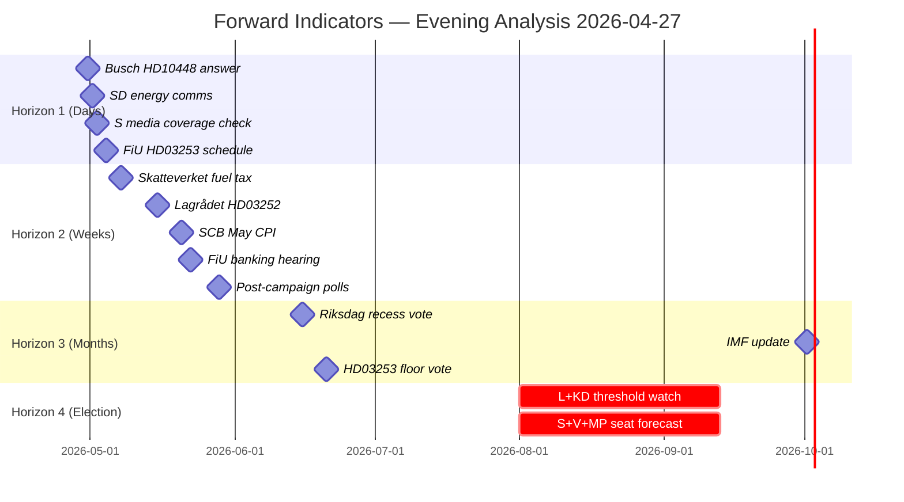

# Forward Indicators — Evening Analysis 2026-04-27

**Author**: James Pether Sörling
**Date**: 2026-04-27

---

## Horizon 1 — Days (28 April – 4 May 2026)

| Indicator | Source | Threshold | Why It Matters |
|-----------|--------|-----------|---------------|
| 1. Ebba Busch answer text on HD10448 | Riksdag debates | Defensive vs. diplomatic tone | Determines whether SD-KD energy friction escalates |
| 2. SD party communication on energy | SD press releases | Any statement distancing from Busch's answer | Confirms or denies coalition fracture |
| 3. Media coverage of S five-interpellation campaign | SVT/DN/SvD | Unified narrative vs. fragmented | Measures S's message discipline |
| 4. FiU committee scheduling announcement for HD03253 | Riksdag calendar | Public hearing date set | Banking package legislative timeline |

## Horizon 2 — Weeks (5–31 May 2026)

| Indicator | Source | Threshold | Why It Matters |
|-----------|--------|-----------|---------------|
| 5. Skatteverket fuel-tax implementation notice | Skatteverket | Implementation date confirmed | HD01FiU48 delivery timeline |
| 6. Lagrådet advisory on HD03252 | Lagrådet | Proportionality critique flagged? | ECHR challenge risk crystallises |
| 7. SCB monthly CPI reading (May) | SCB (statistics.scb.se) | CPI trend vs. IMF WEO 3.1% target | Fiscal context for June budget debate |
| 8. FiU committee hearing on HD03253 | Riksdag committee calendar | Banking lobby amendment demands | Determines final legislative shape |
| 9. New polls following S accountability campaign | IPSOS/Demoskop | Any ≥2pp movement in S vs. M+SD | Tests HD10449/HD10450 media effectiveness |

## Horizon 3 — Months (June–August 2026)

| Indicator | Source | Threshold | Why It Matters |
|-----------|--------|-----------|---------------|
| 10. Riksdag spring recess vote record | Riksdag chamber | Any surprise government defeat | Confirms/denies coalition stability |
| 11. IMF WEO October 2026 (update) | IMF DataMapper | Sweden GDP revision vs. +2.1% Apr-2026 baseline | Economic backdrop for election |
| 12. HD03253 Riksdag floor vote date | Riksdag calendar | Before or after election? | Banking package electoral timing |

## Horizon 4 — Election (September 2026)

| Indicator | Source | Threshold | Why It Matters |
|-----------|--------|-----------|---------------|
| 13. L and KD polling vs. 4% threshold | All major polling firms | Either party <4.5% = danger zone | Threshold risk for government majority |
| 14. S+V+MP combined seat estimate | Electoral modelling | ≥158 seats = S minority viable | Opposition bloc viability |

---

## Mermaid: Forward Indicator Timeline

