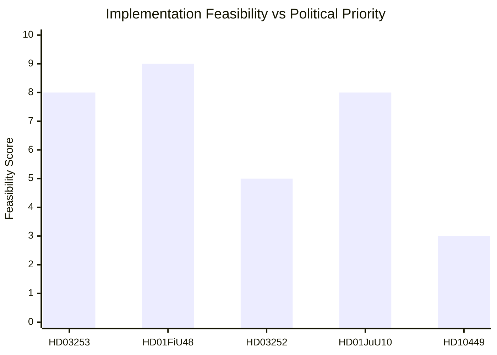

# Implementation Feasibility — Evening Analysis 2026-04-27

**Author**: James Pether Sörling
**Date**: 2026-04-27

---

## HD03253 — EU Banking Package (CRR3/CRD6)

| Dimension | Assessment |
|-----------|-----------|
| Legal basis | EU Regulation (direct effect) + national CRD6 transposition law — HIGH clarity |
| Timeline | 1 January 2025 EU effective; Sweden national law to enter force 1 July 2026 (proposed) |
| Implementation agency | **Finansinspektionen** (primary supervisor) + Riksbanken (macroprudential) |
| Budget impact | Compliance cost for banks: ~SEK 8–12 bn capital adjustment; NOT government budget cost |
| Statskontoret relevance | MEDIUM — FI has requested Statskontoret review on supervisory burden |
| Risk | MEDIUM — major banks will require transitional period for output floor |
| Stakeholder resistance | Banking lobby (Bankföreningen) — transitional phasing demand HIGH |

**Feasibility verdict**: HIGH. EU legal obligation; government has no discretion on transposition. Timeline achievable with standard FI implementation capacity.

---

## HD01FiU48 — Extra Budget Fuel-Tax Reversal

| Dimension | Assessment |
|-----------|-----------|
| Legal basis | Riksdag extra budget appropriation — HIGH clarity |
| Timeline | Immediate upon Riksdag approval; Skatteverket can implement within 60 days via tax table update |
| Implementation agency | **Skatteverket** (tax collection), **Transportstyrelsen** (fuel excise administration) |
| Budget impact | Revenue loss ~SEK 1.5–2.5 bn (estimated, actual figure in FiU48 not publicly specified) |
| Statskontoret relevance | LOW — routine tax table change, not a structural reform |
| Risk | LOW — technically simple; politically reversible |
| Stakeholder resistance | V and MP vocal but unable to block |

**Feasibility verdict**: VERY HIGH. Technically trivial; political will exists.

---

## HD03252 — Prisoner Social Insurance Restriction

| Dimension | Assessment |
|-----------|-----------|
| Legal basis | Socialförsäkringsbalken amendment — requires Riksdag majority |
| Timeline | Proposed 1 January 2027 entry into force |
| Implementation agency | **Försäkringskassan** (benefit administration) + **Kriminalvården** (prisoner data) |
| Budget impact | Government savings ~SEK 100–200 mn/year (estimated) |
| Statskontoret relevance | HIGH — Statskontoret has prior analysis on Försäkringskassan administrative capacity for prisoner cohort data integration |
| Risk | MEDIUM — ECHR Art. 8 proportionality challenge (Lagrådet review pending); Försäkringskassan IT integration with Kriminalvården requires new data sharing agreement |
| Stakeholder resistance | Civil liberties organisations (RFSL, Civil Rights Defenders) — challenge expected |

**Feasibility verdict**: MEDIUM. Legally contested; administrative integration requires lead time; ECHR risk is real.

---

## HD01JuU10 — Weapons Law Amendment

| Dimension | Assessment |
|-----------|-----------|
| Legal basis | Vapenlagen amendment — committee report passed |
| Timeline | Floor vote expected May 2026; entry into force 1 July 2026 |
| Implementation agency | **Polismyndigheten** (weapons permits), **Tullverket** (import) |
| Budget impact | LOW — primarily enforcement capacity |
| Statskontoret relevance | LOW |
| Risk | LOW — no significant constitutional or EU law complication |
| Stakeholder resistance | LOW |

**Feasibility verdict**: HIGH. Standard law amendment, clear agency mandate.

---

## HD10449 — Interpellation on Södra Stambanan

| Dimension | Assessment |
|-----------|-----------|
| Legal basis | Interpellation — no immediate legislative action required |
| Timeline | Minister's answer within standard interpellation window |
| Implementation agency | **Trafikverket** (infrastructure), **Infranord** (maintenance) |
| Budget impact | Any actual rail investment would require multi-year budget allocation |
| Statskontoret relevance | HIGH — Statskontoret has ongoing assessment of Trafikverket's investment planning capacity |
| Risk | HIGH — capital-intensive infrastructure; long lead times; government has not committed explicit Stambanan timeline |
| Stakeholder resistance | Regional governments (Skåne, Västra Götaland, Östergötland) pushing for faster delivery |

**Feasibility verdict**: UNCERTAIN — no concrete implementation plan exists as of April 2026. Political will is a blocking factor.

---

## Implementation Difficulty Summary

