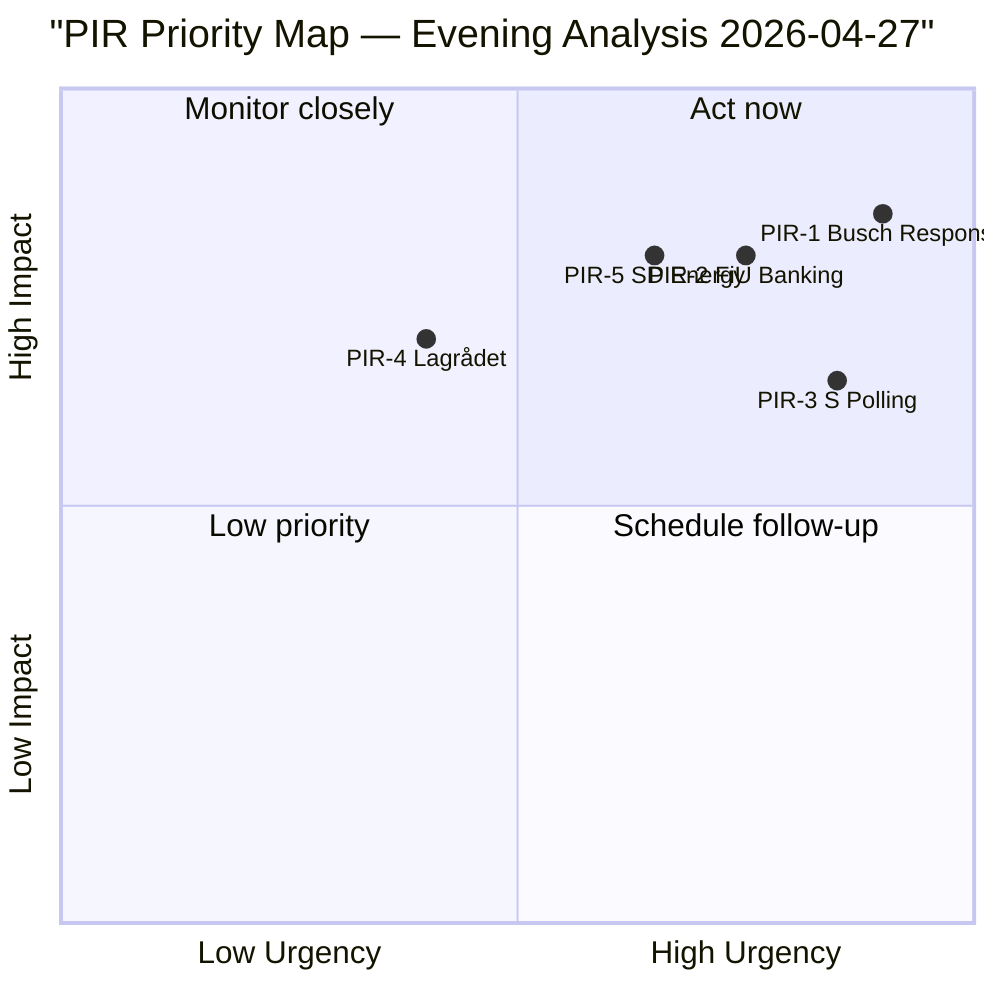

# Intelligence Assessment — Evening Analysis 2026-04-27

**Author**: James Pether Sörling
**Date**: 2026-04-27
**Admiralty Code**: [B2] HIGH

---

## Key Judgments

**KJ-1**: The SD-KD intra-coalition energy interpellation (HD10448) is the most significant anomaly of the legislative day and represents a **HIGH-confidence signal** of emerging coalition stress that, absent management, will become publicly visible during the election campaign. [HIGH confidence]

**KJ-2**: The Social Democrats' five-interpellation accountability campaign on 27 April 2026 represents a **sophisticated coordinated parliamentary strategy** rather than ad hoc individual queries — the synchronisation across four ministers and four policy domains (infrastructure, welfare, energy, finance) indicates strategic pre-election positioning. [VERY HIGH confidence]

**KJ-3**: Sweden's EU Banking Package (HD03253) transposition is proceeding on schedule with **LOW risk of significant amendment**, given the government's stable FiU committee majority and Sweden's history as a CRR3 first-mover. The output floor at 72.5% will require capital adjustment from Swedish mortgage-heavy banks by 2028. [HIGH confidence]

**KJ-4**: The extra budget's fuel-tax reversal (HD01FiU48) is likely to generate **MEDIUM electoral benefit** for the Tidö coalition among cost-of-living-anxious rural voters but will be actively countered by V and MP as a climate-consistency failure, limiting its net polling benefit. [MEDIUM confidence]

**KJ-5**: The prisoner social insurance restriction (HD03252) faces a **MEDIUM-probability constitutional challenge** via Lagrådet's proportionality review — the ECHR Art. 8 Hirst precedent is directly analogous and Lagrådet has been increasingly willing to flag proportionality concerns since 2022. [MEDIUM confidence]

---

## Priority Intelligence Requirements (PIRs) for Next Cycle

**PIR-1** (OPEN): What is the exact wording of Ebba Busch's response to HD10448? Does she defend wind energy expansion or deflect? → Answer expected: week of 4 May 2026.

**PIR-2** (OPEN): Does the FiU committee schedule HD03253 for formal hearing in May 2026, and do Swedish banking lobby submissions indicate amendment requests? → Answer expected: 5–15 May 2026.

**PIR-3** (OPEN): Does S's interpellation campaign achieve polling movement ≥ 2pp in any post-27 April tracking survey? → Answer expected: surveys published 3–7 May 2026.

**PIR-4** (OPEN): Does Lagrådet identify proportionality deficiency in HD03252 within its scheduled review window? → Answer expected: June 2026.

**PIR-5** (OPEN): How does SD's parliamentary group handle the energy messaging tension between coalition loyalty and rural voter protection between 27 April and the campaign start?

---

## Key Assumptions Check

| Assumption | Confidence | Sensitivity |
|------------|------------|-------------|
| Coalition survives to September 2026 | HIGH | KJ-1 and KJ-3 depend on this |
| FiU committee majority stable for banking package | HIGH | Based on stable coalition seat count |
| IMF growth forecast (+2.1%) holds for 2026 | MEDIUM | External shock could change fiscal context |
| S's accountability campaign is coordinated (not coincidental) | VERY HIGH | Five simultaneous interpellations — coincidence excluded |

---

## Carried-Forward Open PIRs from Prior Cycle

**PIR-C1** (from motions analysis 2026-04-27): What is the JuU committee's actual hearing schedule for V's HD024090 EU deportation challenge? → Still open.

**PIR-C2** (from committeeReports analysis 2026-04-27): When does Riksbanken submit its formal response to HD01FiU23 review? → Still open.

---

## Mermaid: PIR Status Dashboard

