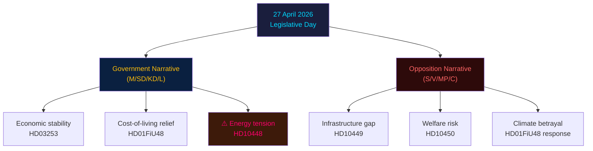

# Media Framing Analysis — Evening Analysis 2026-04-27

**Author**: James Pether Sörling
**Date**: 2026-04-27

---

## Government Party Framing

### Moderaterna (M)
**Expected frame**: "Responsible economic management; EU alignment on banking stability; rural cost-of-living relief via fuel-tax."
**Key message**: HD03253 as "Swedish banks are safe and internationally competitive"; HD01FiU48 as "government listens to working families."
**Vulnerability**: Unable to cleanly distance from HD10448 SD-KD energy tension without alienating either SD or KD.

### Sverigedemokraterna (SD)
**Expected frame**: "Protecting Swedish energy sovereignty and traditional landscape; coalition accountability on energy costs."
**Key message**: HD10448 framed as "SD holds government to cost-of-living commitments"; fuel-tax as "delivering for rural Sweden."
**Vulnerability**: Simultaneous filing of HD10448 and claiming coalition credit for HD01FiU48 is internally inconsistent — creates "we're both in and outside government" narrative.

### Kristdemokraterna (KD / Ebba Busch)
**Expected frame**: "Modern energy mix; Sweden needs both nuclear AND renewables for climate and costs."
**Key message**: Defensive on HD10448 — Busch must appear confident not rattled.
**Vulnerability**: If Busch over-defends wind energy, SD voter base energised against her. If she backs down, she appears weak.

### Liberalerna (L)
**Expected frame**: Silent on intra-coalition drama. Focus on banking stability (HD03253) as L's pro-business, pro-EU credentials.
**Vulnerability**: L's low profile may reinforce perception of irrelevance ahead of 4% threshold election.

---

## Opposition Party Framing

### Socialdemokraterna (S)
**Expected frame**: "Government divided, priorities wrong, infrastructure neglected, welfare under threat."
**Key messages**: HD10449 (Stambanan) as "broken rail promise"; HD10450 as "attack on sick workers"; all five interpellations framing "government has lost focus."
**Strength**: Multiple angles = media can pick any; breadth demonstrates opposition reach.
**Vulnerability**: See devil's advocate — fragmented message may dilute single narrative.

### Vänsterpartiet (V)
**Expected frame**: "EU Banking Package protects banks not people; prisoner welfare cuts are inhumane; deportation policy must be challenged."
**Key messages**: HD024090 (EU deportation) as V's flagship; counter-narrative to HD03252.
**Vulnerability**: V's banking critique requires technical explanation — difficult to land in media.

### Miljöpartiet (MP)
**Expected frame**: "Fuel-tax reversal is climate betrayal; government chooses polluters over future."
**Key messages**: HD01FiU48 as direct attack on Sweden's Paris Agreement commitments.
**Strength**: Clean, emotionally resonant single issue.
**Vulnerability**: MP polling near threshold — aggressive climate message may not reach swing voters.

### Centerpartiet (C)
**Expected frame**: "Rural Sweden needs real structural investment, not a fuel-tax patch; Stambanan is a regional equality issue."
**Key messages**: HD10449 Stambanan as C rural infrastructure credential.
**Vulnerability**: C supports government on some votes — ambiguous positioning.

---

## Swedish Press Framing Predictions

| Publication | Likely Angle | Headline Prediction |
|-------------|-------------|---------------------|
| Svenska Dagbladet | Coalition energy tension, financial stability | "SD utmanar Busch om vindkraft" |
| Dagens Nyheter | Accountability campaign, welfare | "S riktar fem interpellationer mot regeringen" |
| Aftonbladet | Fuel tax, cost of living | "Nu sänks bensinskatten" |
| Expressen | Coalition drama | "Sprickan i Tidö: SD mot KD om energin" |
| Göteborgs-Posten | Regional infrastructure | "Stambanan — S trycker på igen" |

---

## Mermaid: Media Framing Network

