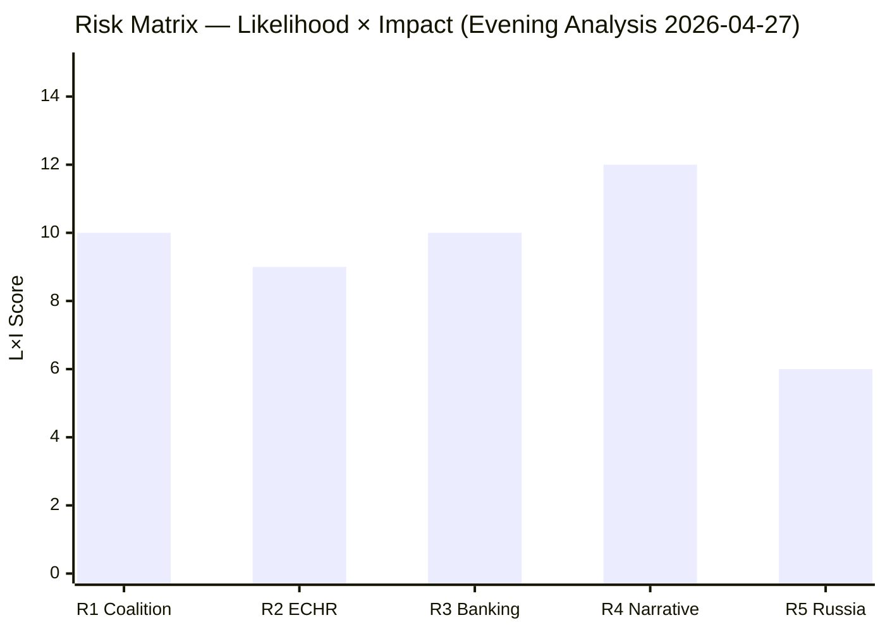

# Risk Assessment — Evening Analysis 2026-04-27

**Author**: James Pether Sörling
**Date**: 2026-04-27

---

## 5-Dimension Risk Register

| Risk ID | Description | Likelihood (1-5) | Impact (1-5) | L×I | Cascade |
|---------|-------------|-----------------|--------------|-----|---------|
| R1 | SD-KD coalition fracture on energy escalates to confidence vote threat | 2 | 5 | 10 | Minority government scenario, early election |
| R2 | ECHR challenge to HD03252 prisoner welfare restriction succeeds | 3 | 3 | 9 | Legislative rollback, government credibility loss |
| R3 | Banking sector HD03253 capital shortfall triggers Riksbank intervention | 2 | 5 | 10 | Systemic financial risk, Finansinspektionen emergency powers |
| R4 | S interpellation campaign dominates pre-election media narrative | 4 | 3 | 12 | Electoral damage to Tidö coalition, S gains polling |
| R5 | Russia overflying/visa motions escalate diplomatic friction | 2 | 3 | 6 | EU/Russia tensions, aviation disruption |

### Risk R1 — Coalition Fracture (HD10448)

**Likelihood**: LOW (2/5). Swedish coalition conventions are robust; SD has not used interpellations to directly challenge coalition partners before at this scale.
**Impact**: CRITICAL (5/5). If SD escalates to parliamentary vote against KD energy policy, the coalition could require confidence vote.
**Cascade chain**: SD public break on energy → Busch forced to choose between KD and coalition energy consensus → M forced to mediate → potential early Riksdag dissolution.
**Posterior probability of escalation**: ~12% (base rate for coalition fracture in Swedish coalition history: <10%; elevated by proximity to election).

### Risk R2 — Constitutional Challenge HD03252

**Likelihood**: MEDIUM (3/5). Lagrådet review pending; ECHR Art. 8 precedent (Hirst v UK) relevant but not binding on Swedish courts.
**Impact**: MEDIUM (3/5). Legislative rollback would embarrass government but not threaten coalition.
**Posterior**: ~28% conditional on Lagrådet identifying proportionality deficiency.

### Risk R4 — S Narrative Capture (High Priority)

**Likelihood**: HIGH (4/5). Five simultaneous interpellations targeting four ministers is a sophisticated accountability campaign with clear messaging ("the Tidö government fails on infrastructure, welfare, energy, and finance").
**Impact**: MEDIUM (3/5). Polling damage likely; seat-count impact depends on S execution quality.
**L×I**: 12 — highest current risk score.

---

## Mermaid: Risk Heat Map

