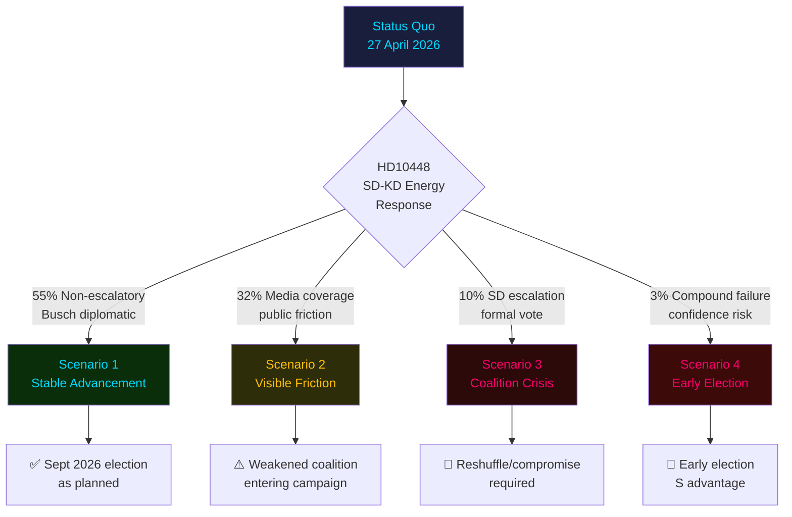

# Scenario Analysis — Evening Analysis 2026-04-27

**Author**: James Pether Sörling
**Date**: 2026-04-27

---

## Scenario Framework: Tidö Coalition Post-27 April Trajectories

### Scenario 1 — Stable Advancement (probability: 55%)

**Description**: Coalition manages energy dispute quietly; Busch gives a diplomatic non-committal answer to HD10448; SD accepts and pivots energy messaging to fuel-tax cut (HD01FiU48) victory. Banking package HD03253 passes FiU in June 2026 with minor amendments. S accountability campaign fails to achieve narrative breakthrough. Government enters summer recess intact with pre-election agenda largely delivered.

**Leading indicators**: Busch statement on HD10448 is non-escalatory; FiU committee hearing on HD03253 proceeds without banking-lobby revolt; polling gap between government bloc and S-led opposition remains within margin of error.

**Implications**: Tidö presents unified front for September 2026 election. IMF WEO Apr-2026 +2.1% growth confirms benign economic backdrop for incumbents.

### Scenario 2 — Coalition Friction Visible but Managed (probability: 32%)

**Description**: HD10448 generates public media coverage of SD-KD energy split. Busch defends wind energy; SD communicates continued skepticism. Coalition formally united but energy policy publicly contested. S accountability campaign achieves partial narrative success on infrastructure (HD10449 Stambanan gets regional media). Banking package delayed by FiU amendment request.

**Leading indicators**: Swedish media reports on coalition energy disagreement; FiU extends consultation timeline for HD03253; S polling uptick of >2pp in three consecutive surveys.

**Implications**: Election campaign opens with coalition appearing divided. Energy and infrastructure become contested election themes. IMF fiscal headroom reduces government's ability to claim economic credit.

### Scenario 3 — Coalition Crisis (probability: 10%)

**Description**: SD escalates HD10448 into a formal vote on energy policy; Busch faces confidence test. Coalition whips fail to prevent SD defection on a procedural vote. M forced to reshuffle energy portfolio or negotiate explicit KD-SD energy compromise. Government loses some votes but survives.

**Leading indicators**: SD party leadership statement distancing from KD's wind energy position; parliamentary vote on energy motion with SD abstention; M emergency coalition summit.

**Implications**: Government appears weak entering election period. S leads in polls. September 2026 election outcome highly uncertain.

### Scenario 4 — Early Election Trigger (probability: 3%)

**Description**: HD10448 combined with another coalition failure (e.g., ECHR ruling on HD03252 or banking package amendment defeat) triggers early election call. Riksdag dissolves ahead of scheduled September 2026 election.

**Leading indicators**: Multiple confidence-adjacent votes; M considers leading coalition with alternative partners; Riksdag speaker consulted on dissolution procedure.

**Implications**: S enters election from strong accountability narrative position; Tidö coalition forced to run on fractured record.

---

## Probability Sum Check: 55 + 32 + 10 + 3 = 100%

---

## Mermaid: Scenario Probability Decision Tree

