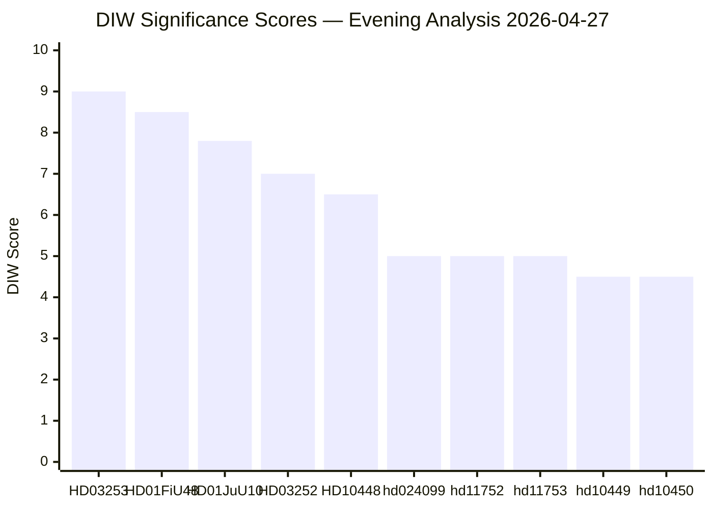

# Significance Scoring — Evening Analysis 2026-04-27

**Author**: James Pether Sörling
**Date**: 2026-04-27
**Riksmöte**: 2025/26

---

## DIW Significance Framework

D = Decision-depth (1-3): How significant is the decision-making power engaged?
I = Societal impact (1-3): How many citizens/institutions affected?
W = Cross-portfolio width (1-3): How many policy domains crossed?

---

## Priority Rankings

### Tier L2+ (DIW ≥ 8.0)

1. **HD03253** (propositions/analysis/daily/2026-04-27/propositions/) — EU Banking Package CRR3/CRD6 | DIW 9.0 | [B2 HIGH] | D:3 Fundamental financial law; I:3 Entire banking sector population; W:3 Finance/regulation/EU
2. **HD01FiU48** (committeeReports/analysis/daily/2026-04-27/committeeReports/) — Extra Budget Fuel Tax | DIW 8.5 | [B2 HIGH] | D:3 Budget amendment power; I:3 All Swedish drivers and households; W:3 Finance/climate/energy

### Tier L2+ (DIW 7.0–7.9)

3. **HD01JuU10** (committeeReports/analysis/daily/2026-04-27/committeeReports/) — New Weapons Law | DIW 7.8 | [B2 HIGH] | D:3 Criminal/regulatory reform; I:3 All licensed firearms holders and police; W:2 Security/justice
4. **HD03252** (propositions/analysis/daily/2026-04-27/propositions/) — Prisoner Social Insurance | DIW 7.0 | [B2 HIGH] | D:3 Welfare law change; I:2 ~3,000/yr directly affected; W:2 Social/justice

### Tier L2 (DIW 5.0–6.9)

5. **HD10448** (interpellations/analysis/daily/2026-04-27/interpellations/) — SD-KD Energy Interpellation | DIW 6.5 | [B2 HIGH] | D:2 Accountability only; I:3 Energy policy for all Swedes; W:3 Energy/coalition/election
6. **hd024099** — Motion re civil servant accountability prop. | DIW 5.0 | [B2 MEDIUM] | D:2 Reactive motion; I:2 Public sector employees; W:2 Justice/governance
7. **hd11752** — Overflying rights withdrawal Russia | DIW 5.0 | [B2 MEDIUM] | D:2 Foreign policy motion; I:2 Security/aviation; W:2 Defence/EU
8. **hd11753** — Russian soldiers' EU visa ban | DIW 5.0 | [B2 MEDIUM] | D:2 EU policy motion; I:2 Diplomatic/security; W:2 Foreign/security

### Tier L1 (DIW < 5.0)

9. **hd10449** — Södra stambanan interpellation | DIW 4.5 | [B2 MEDIUM] | Infrastructure accountability
10. **hd10450** — Sjukförsäkring dag 180 interpellation | DIW 4.5 | [B2 MEDIUM] | Social insurance accountability
11. **hd11756** — Water rights/environment motion | DIW 3.5 | [C2 MEDIUM] | Environmental regulation
12. **hd01cu40** — Cadastral system motion | DIW 2.5 | [C2 LOW] | Administrative/technical

---

## Sensitivity Analysis

If HD03253 (Banking Package) is delayed at FiU, DIW significance drops from 9.0 to 6.0 (D:2) — reduced urgency but sustained relevance. If HD10448 results in a published coalition disagreement on energy (Busch statement), DIW rises from 6.5 to 8.0 (I:3, W:3).

---

## Mermaid: Significance Distribution

