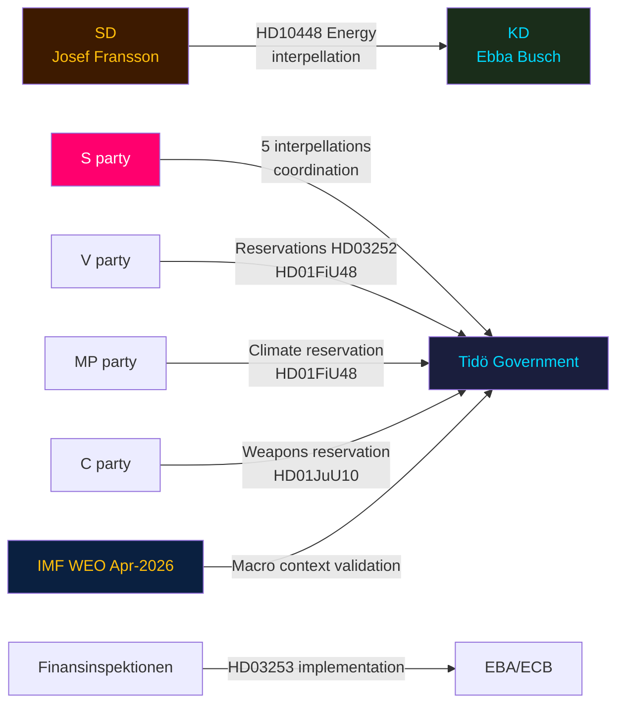

# Stakeholder Perspectives — Evening Analysis 2026-04-27

**Author**: James Pether Sörling
**Date**: 2026-04-27

---

## 6-Lens Stakeholder Matrix

### 1. Governing Coalition (M, SD, KD, L)

**Moderaterna (M)**: Erik Slottner (Finansdepartementet) leads HD03252 prisoner welfare restriction — aligned with M's welfare conditionality values. Risk from SD-KD fracture is primarily for M as mediator. Position: advance security and fiscal agenda; neutralise energy coalition dispute.

**Sverigedemokraterna (SD)**: Josef Fransson's HD10448 interpellation reveals SD's strategic calculation — differentiate from KD on wind energy to protect rural and energy-cost-anxious voter bloc before September 2026. SD supports fuel-tax cut (HD01FiU48) but is skeptical of wind energy expansion. Coalition-loyal on security; energy-independent positioning.

**Kristdemokraterna (KD)**: Ebba Busch (Energy Minister) facing dual pressure from SD interpellation and environmental lobby. KD also leads civil-servant accountability agenda (prop. 2025/26:217 referenced in hd024099). Under the most scrutiny of any coalition partner today.

**Liberalerna (L)**: Low profile in today's legislative activity. Risk of being overshadowed by SD-M-KD agenda-setting.

### 2. Opposition Parties

**Socialdemokraterna (S)**: Executing sophisticated 5-interpellation accountability strategy targeting infrastructure (HD10449), social insurance (HD10450), energy, and finance simultaneously. S is using parliamentary instruments for pre-election narrative construction. High competence signal to Swedish political media.

**Vänsterpartiet (V)**: Filed reservations on HD03252 (prisoner welfare), HD01FiU48 (fuel tax), weapons law. Legal-rights challenge strategy. HD11752 and HD11753 Russia motions align with V's hard stance on Russia.

**Miljöpartiet (MP)**: Filed reservations on HD01FiU48 (climate consistency). Most exposed party if Sweden abandons climate commitments — party's survival depends on climate differentiation.

**Centerpartiet (C)**: Reservation on HD01JuU10 semi-automatic hunting weapons — rural constituency protection. C is the pivotal party on agricultural and rural policies.

### 3. Civil Society and Unions

**LO/TCO/SACO**: HD10450 sjukförsäkring interpellation targets union-constituency welfare rights. HD01JuU10 weapons law affects rural communities.

**Swedish Bankers Association**: HD03253 banking package directly affects all Swedish systemically important banks. Industry submissions expected at FiU in May.

**Firearms industry/hunting associations**: HD01JuU10 and Centre Party reservation on semi-automatic weapons directly affects this constituency.

### 4. Regulatory and Administrative Actors

**Finansinspektionen**: Implementing HD03253 EU Banking Package — will require significant regulatory update to supervisory framework.

**Riksgälden**: Referenced in HD03104 debt management evaluation. Positive review maintains institutional credibility.

**Polismyndigheten**: HD01JuU31 (police reform audit) referenced in today's committee reports context — accountability scrutiny ongoing.

### 5. International/EU Actors

**European Banking Authority (EBA)**: HD03253 creates new EBA-Finansinspektionen coordination on non-Eurozone bank supervision.

**EU Commission**: HD11752 and HD11753 motions ask for EU-level action on Russian overflying and visa policy — Sweden seeking EU coordinated response.

**NATO/Partner states**: Swedish Russia motions signal alignment with NATO's Russia posture.

### 6. Electoral Segments (September 2026)

**Rural voters**: Cost-of-living relief (HD01FiU48 fuel tax), firearms rights (HD01JuU10 C reservation) — key battleground between M/KD/SD and C.

**Urban professionals**: Banking reform (HD03253), climate consistency (against HD01FiU48) — S and MP targeting.

**Welfare-dependent voters**: HD03252, HD10450 — S/V/MP framing vs M/SD framing of conditionality.

---

## Influence Network Diagram

